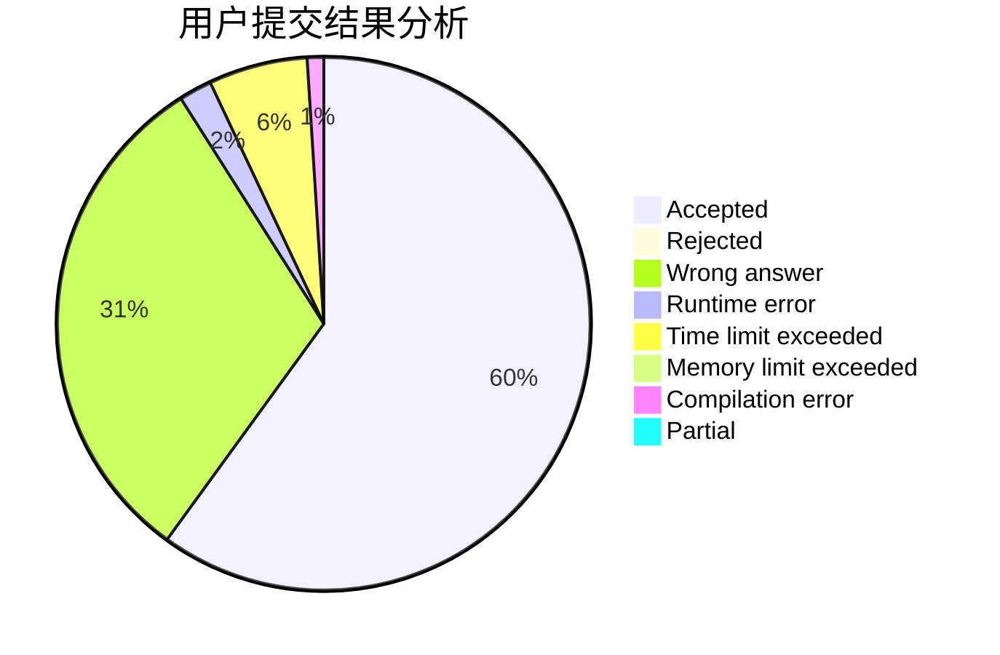
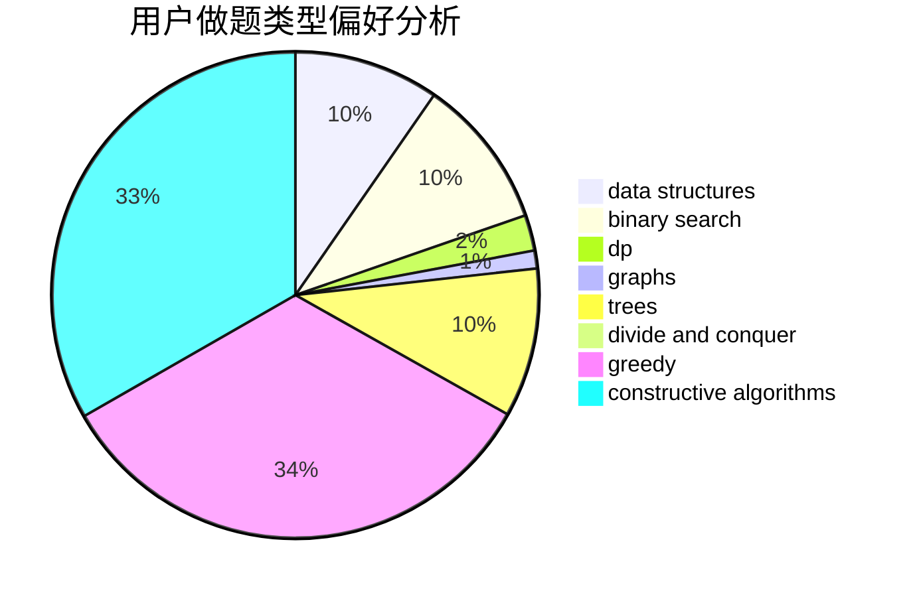
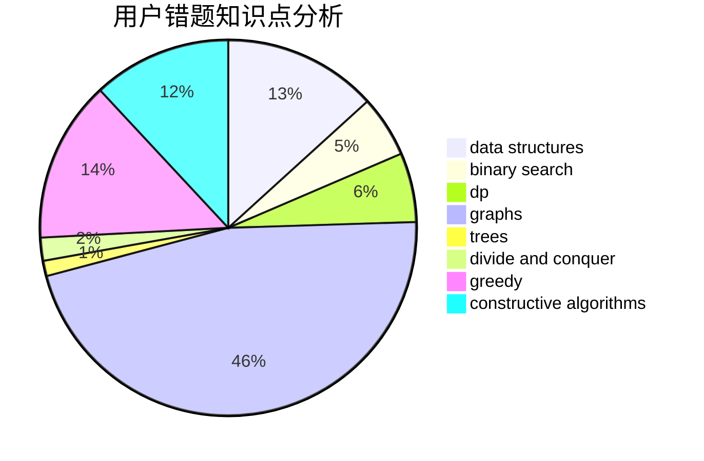

# reboot_restart

<!-- tabs:start -->

#### **用户提交结果分析**

#### **用户做题类型偏好分析**

#### **用户错题知识点分析**

<!-- tabs:end -->
# 推荐题目
[1106F](https://codeforces.com/contest/1106/problem/F)		math,
                        matrices,
                        number theory		  
[805A](https://codeforces.com/contest/805/problem/A)		greedy,
                        math		  
[782A](https://codeforces.com/contest/782/problem/A)		dsu,graphs,sortings,trees		  
[1131A](https://codeforces.com/contest/1131/problem/A)		math		  
[1334F](https://codeforces.com/contest/1334/problem/F)		binary search,
                        data structures,
                        dp,
                        greedy		  
[351B](https://codeforces.com/contest/351/problem/B)		combinatorics,
                        dp,
                        probabilities		  
[691A](https://codeforces.com/contest/691/problem/A)		implementation		  
[463D](https://codeforces.com/contest/463/problem/D)		dfs and similar,
                        dp,
                        graphs,
                        implementation		  
[1216C](https://codeforces.com/contest/1216/problem/C)		geometry,
                        math		  
[17E](https://codeforces.com/contest/17/problem/E)		strings		  
