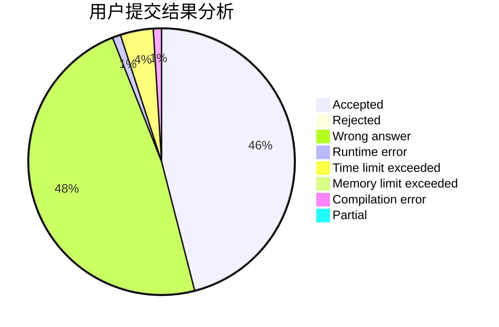
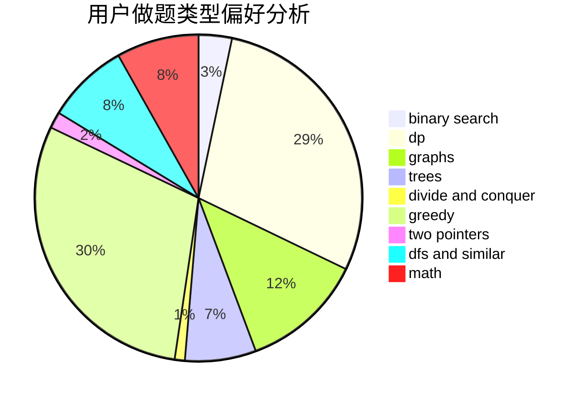

# reborn.chris

<!-- tabs:start -->

#### **用户提交结果分析**

#### **用户做题类型偏好分析**

<!-- tabs:end -->
# 推荐题目
[935B](https://codeforces.com/contest/935/problem/B)
[940A](https://codeforces.com/contest/940/problem/A)
[1223A](https://codeforces.com/contest/1223/problem/A)
[1173A](https://codeforces.com/contest/1173/problem/A)
[238C](https://codeforces.com/contest/238/problem/C)
[540C](https://codeforces.com/contest/540/problem/C)
[621B](https://codeforces.com/contest/621/problem/B)
[1240A](https://codeforces.com/contest/1240/problem/A)
[591D](https://codeforces.com/contest/591/problem/D)
[841D](https://codeforces.com/contest/841/problem/D)
