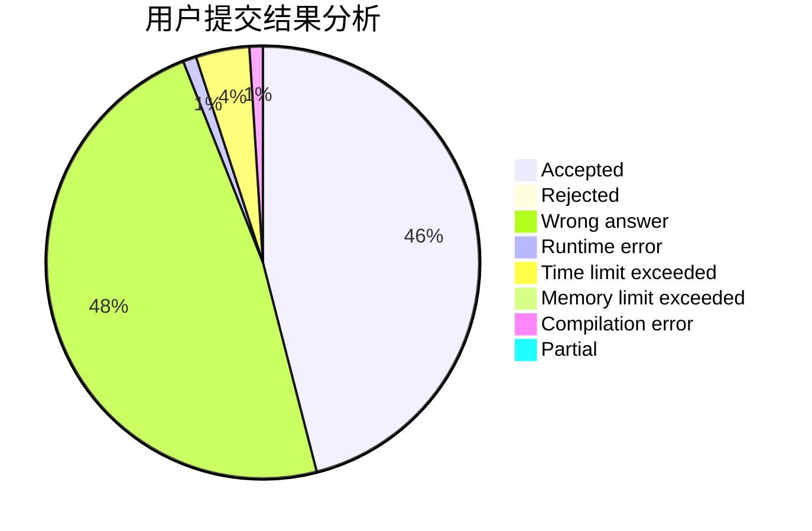
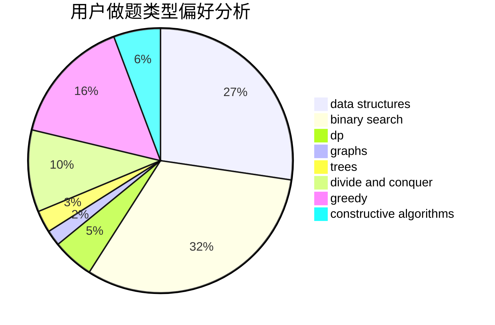
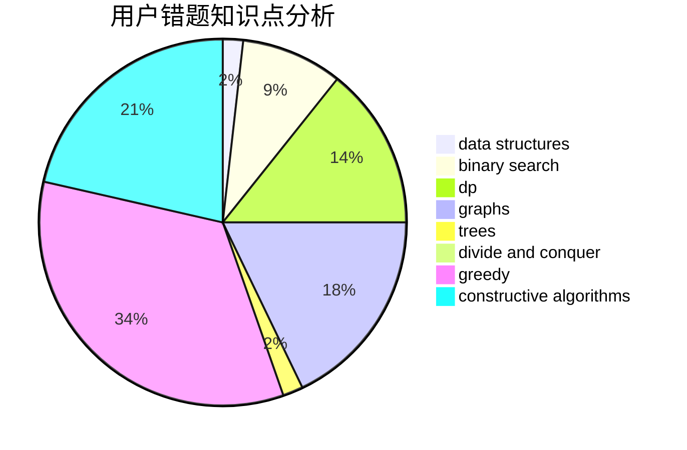

# reborn.chris

<!-- tabs:start -->

#### **用户提交结果分析**

#### **用户做题类型偏好分析**

#### **用户错题知识点分析**

<!-- tabs:end -->
# 推荐题目
[915C](https://codeforces.com/contest/915/problem/C)		dp,
                        greedy		  
[920A](https://codeforces.com/contest/920/problem/A)		implementation		  
[1216D](https://codeforces.com/contest/1216/problem/D)		math		  
[1168E](https://codeforces.com/contest/1168/problem/E)		constructive algorithms,
                        math		  
[219A](https://codeforces.com/contest/219/problem/A)		implementation,
                        strings		  
[514E](https://codeforces.com/contest/514/problem/E)		dp,
                        matrices		  
[602A](https://codeforces.com/contest/602/problem/A)		brute force,
                        implementation		  
[1234D](https://codeforces.com/contest/1234/problem/D)		data structures		  
[571C](https://codeforces.com/contest/571/problem/C)		constructive algorithms,
                        dfs and similar,
                        graphs,
                        greedy		  
[822A](https://codeforces.com/contest/822/problem/A)		implementation,
                        math,
                        number theory		  
