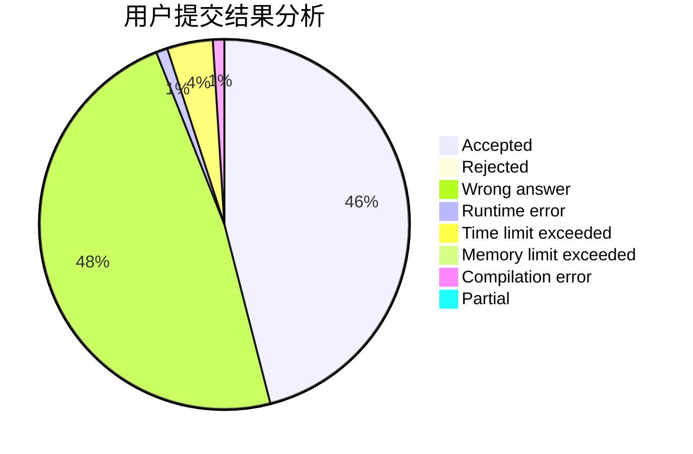
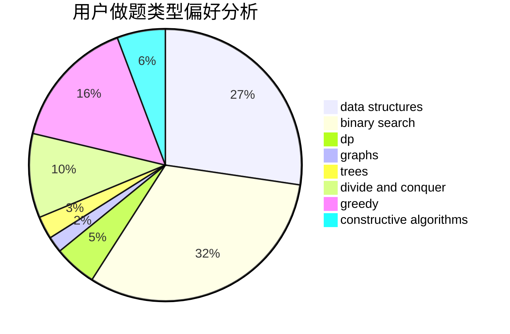
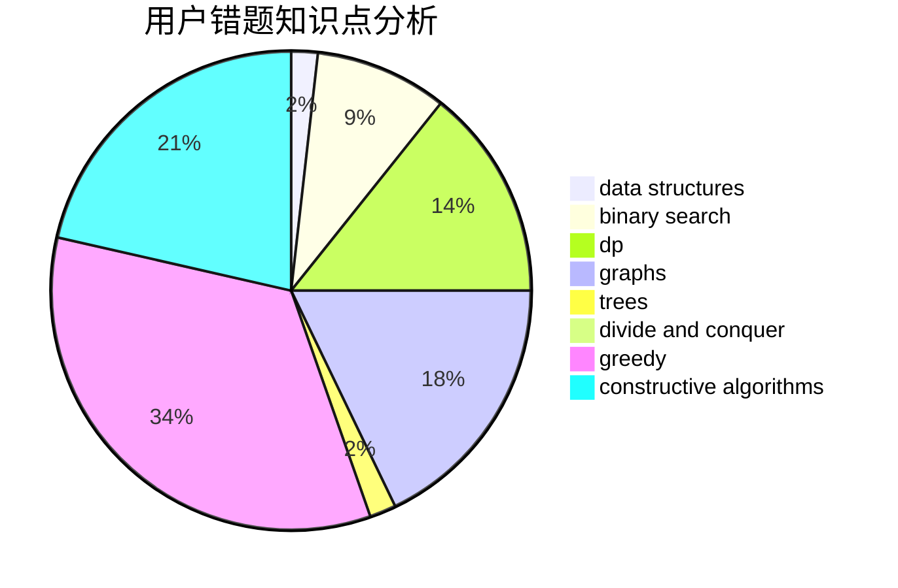

# reborn.chris
<!-- tabs:start -->
#### **用户提交结果分析**

#### **用户做题类型偏好分析**

#### **用户错题知识点分析**

<!-- tabs:end -->
# 推荐题目
[Monopole Magnets](http://codeforces.com/problemset/problem/1344/B)		constructive algorithms,
                        dfs and similar,
                        dsu,
                        graphs		  
[Permute Digits](http://codeforces.com/problemset/problem/915/C)		dp,
                        greedy		  
[Xor Permutations](http://codeforces.com/problemset/problem/1168/E)		constructive algorithms,
                        math		  
[Water The Garden](http://codeforces.com/problemset/problem/920/A)		implementation		  
[k-String](http://codeforces.com/problemset/problem/219/A)		implementation,
                        strings		  
[Heidi Learns Hashing (Easy)](http://codeforces.com/problemset/problem/1184/A1)		brute force,
                        math,
                        number theory		  
[Darth Vader and Tree](http://codeforces.com/problemset/problem/514/E)		dp,
                        matrices		  
[Wonder Room](http://codeforces.com/problemset/problem/466/B)		brute force,
                        math		  
[Lasers and Mirrors](http://codeforces.com/problemset/problem/1063/E)		constructive algorithms,
                        math		  
[Moodular Arithmetic](http://codeforces.com/problemset/problem/603/B)		combinatorics,
                        dfs and similar,
                        dsu,
                        math,
                        number theory		  
<!-- tabs:start -->
#### **data structures**
[Monopole Magnets](http://codeforces.com/problemset/problem/837/G)		data structures		  
[Permute Digits](http://codeforces.com/problemset/problem/1420/D)		combinatorics,
                        data structures,
                        sortings		  
[Xor Permutations](http://codeforces.com/problemset/problem/1083/F)		data structures		  
[Water The Garden](http://codeforces.com/problemset/problem/930/C)		data structures,
                        dp		  
[k-String](http://codeforces.com/problemset/problem/173/E)		data structures,
                        sortings		  
[Heidi Learns Hashing (Easy)](http://codeforces.com/problemset/problem/1234/D)		data structures		  
[Darth Vader and Tree](http://codeforces.com/problemset/problem/1416/D)		data structures,
                        dsu,
                        graphs,
                        implementation,
                        trees		  
[Wonder Room](http://codeforces.com/problemset/problem/1039/D)		data structures,
                        dp,
                        trees		  
[Lasers and Mirrors](http://codeforces.com/problemset/problem/1493/D)		brute force,
                        data structures,
                        hashing,
                        implementation,
                        math,
                        number theory,
                        sortings,
                        two pointers		  
[Moodular Arithmetic](http://codeforces.com/problemset/problem/1503/C)		binary search,
                        data structures,
                        dp,
                        greedy,
                        shortest paths,
                        sortings,
                        two pointers		  
#### **binary search**
[Monopole Magnets](http://codeforces.com/problemset/problem/1195/B)		binary search,
                        brute force,
                        math		  
[Permute Digits](http://codeforces.com/problemset/problem/348/A)		binary search,
                        math,
                        sortings		  
[Xor Permutations](http://codeforces.com/problemset/problem/1370/D)		binary search,
                        dp,
                        dsu,
                        greedy,
                        implementation		  
[Water The Garden](http://codeforces.com/problemset/problem/73/B)		binary search,
                        greedy,
                        sortings		  
[k-String](http://codeforces.com/problemset/problem/932/D)		binary search,
                        dp,
                        trees		  
[Heidi Learns Hashing (Easy)](https://codeforces.com/contest/781/problem/F)		binary search,
                        geometry,
                        implementation,
                        two pointers		  
[Darth Vader and Tree](http://codeforces.com/problemset/problem/1315/B)		binary search,
                        dp,
                        greedy,
                        strings		  
[Wonder Room](http://codeforces.com/problemset/problem/883/D)		binary search,
                        dp,
                        math		  
[Lasers and Mirrors](http://codeforces.com/problemset/problem/1503/C)		binary search,
                        data structures,
                        dp,
                        greedy,
                        shortest paths,
                        sortings,
                        two pointers		  
[Moodular Arithmetic](http://codeforces.com/problemset/problem/1492/C)		binary search,
                        data structures,
                        dp,
                        greedy,
                        two pointers		  
#### **dp**
[Monopole Magnets](http://codeforces.com/problemset/problem/915/C)		dp,
                        greedy		  
[Permute Digits](http://codeforces.com/problemset/problem/514/E)		dp,
                        matrices		  
[Xor Permutations](http://codeforces.com/problemset/problem/930/C)		data structures,
                        dp		  
[Water The Garden](http://codeforces.com/problemset/problem/1370/D)		binary search,
                        dp,
                        dsu,
                        greedy,
                        implementation		  
[k-String](http://codeforces.com/problemset/problem/507/E)		dfs and similar,
                        dp,
                        graphs,
                        shortest paths		  
[Heidi Learns Hashing (Easy)](http://codeforces.com/problemset/problem/398/B)		dp,
                        probabilities		  
[Darth Vader and Tree](https://codeforces.com/contest/1269/problem/D)		dp,
                        greedy,
                        math		  
[Wonder Room](http://codeforces.com/problemset/problem/932/D)		binary search,
                        dp,
                        trees		  
[Lasers and Mirrors](http://codeforces.com/problemset/problem/1282/B1)		dp,
                        greedy,
                        sortings		  
[Moodular Arithmetic](http://codeforces.com/problemset/problem/1315/B)		binary search,
                        dp,
                        greedy,
                        strings		  
#### **graph**
[Monopole Magnets](http://codeforces.com/problemset/problem/1344/B)		constructive algorithms,
                        dfs and similar,
                        dsu,
                        graphs		  
[Permute Digits](http://codeforces.com/problemset/problem/770/C)		*special problem,
                        dfs and similar,
                        graphs,
                        implementation		  
[Xor Permutations](http://codeforces.com/problemset/problem/507/E)		dfs and similar,
                        dp,
                        graphs,
                        shortest paths		  
[Water The Garden](http://codeforces.com/problemset/problem/571/C)		constructive algorithms,
                        dfs and similar,
                        graphs,
                        greedy		  
[k-String](http://codeforces.com/problemset/problem/832/D)		dfs and similar,
                        graphs,
                        trees		  
[Heidi Learns Hashing (Easy)](http://codeforces.com/problemset/problem/830/E)		constructive algorithms,
                        dp,
                        graphs,
                        implementation,
                        math,
                        trees		  
[Darth Vader and Tree](http://codeforces.com/problemset/problem/744/A)		dfs and similar,
                        graphs		  
[Wonder Room](http://codeforces.com/problemset/problem/1416/D)		data structures,
                        dsu,
                        graphs,
                        implementation,
                        trees		  
[Lasers and Mirrors](http://codeforces.com/problemset/problem/1487/C)		brute force,
                        constructive algorithms,
                        dfs and similar,
                        graphs,
                        greedy,
                        implementation,
                        math		  
[Moodular Arithmetic](http://codeforces.com/problemset/problem/1437/C)		dp,
                        flows,
                        graph matchings,
                        greedy,
                        math,
                        sortings		  
#### **trees**
[Monopole Magnets](http://codeforces.com/problemset/problem/832/D)		dfs and similar,
                        graphs,
                        trees		  
[Permute Digits](http://codeforces.com/problemset/problem/932/D)		binary search,
                        dp,
                        trees		  
[Xor Permutations](http://codeforces.com/problemset/problem/830/E)		constructive algorithms,
                        dp,
                        graphs,
                        implementation,
                        math,
                        trees		  
[Water The Garden](http://codeforces.com/problemset/problem/1416/D)		data structures,
                        dsu,
                        graphs,
                        implementation,
                        trees		  
[k-String](http://codeforces.com/problemset/problem/1039/D)		data structures,
                        dp,
                        trees		  
[Heidi Learns Hashing (Easy)](http://codeforces.com/problemset/problem/1073/F)		dfs and similar,
                        dp,
                        greedy,
                        trees		  
[Darth Vader and Tree](http://codeforces.com/problemset/problem/1479/D)		binary search,
                        bitmasks,
                        brute force,
                        data structures,
                        probabilities,
                        trees		  
[Wonder Room](http://codeforces.com/problemset/problem/1511/C)		brute force,
                        data structures,
                        implementation,
                        trees		  
[Lasers and Mirrors](http://codeforces.com/problemset/problem/1499/F)		combinatorics,
                        dfs and similar,
                        dp,
                        trees		  
[Moodular Arithmetic](http://codeforces.com/problemset/problem/1491/E)		brute force,
                        dfs and similar,
                        divide and conquer,
                        number theory,
                        trees		  
#### **divide and conquer**
[Monopole Magnets](http://codeforces.com/problemset/problem/1461/D)		binary search,
                        brute force,
                        data structures,
                        divide and conquer,
                        implementation,
                        sortings		  
[Permute Digits](http://codeforces.com/problemset/problem/1466/G)		combinatorics,
                        divide and conquer,
                        hashing,
                        math,
                        string suffix structures,
                        strings		  
[Xor Permutations](http://codeforces.com/problemset/problem/1490/D)		dfs and similar,
                        divide and conquer,
                        implementation		  
[Water The Garden](https://codeforces.com/contest/1483/problem/C)		data structures,
                        divide and conquer,
                        dp		  
[k-String](http://codeforces.com/problemset/problem/1491/E)		brute force,
                        dfs and similar,
                        divide and conquer,
                        number theory,
                        trees		  
[Heidi Learns Hashing (Easy)](http://codeforces.com/problemset/problem/1303/G)		data structures,
                        divide and conquer,
                        geometry,
                        trees		  
[Darth Vader and Tree](http://codeforces.com/problemset/problem/1494/D)		constructive algorithms,
                        data structures,
                        dfs and similar,
                        divide and conquer,
                        dsu,
                        greedy,
                        sortings,
                        trees		  
[Wonder Room](http://codeforces.com/problemset/problem/1482/E)		data structures,
                        divide and conquer,
                        dp		  
[Lasers and Mirrors](http://codeforces.com/problemset/problem/566/C)		dfs and similar,
                        divide and conquer,
                        trees		  
[Moodular Arithmetic](http://codeforces.com/problemset/problem/1428/F)		binary search,
                        data structures,
                        divide and conquer,
                        dp,
                        two pointers		  
#### **greedy**
[Monopole Magnets](http://codeforces.com/problemset/problem/915/C)		dp,
                        greedy		  
[Permute Digits](http://codeforces.com/problemset/problem/1370/D)		binary search,
                        dp,
                        dsu,
                        greedy,
                        implementation		  
[Xor Permutations](http://codeforces.com/problemset/problem/73/B)		binary search,
                        greedy,
                        sortings		  
[Water The Garden](http://codeforces.com/problemset/problem/571/C)		constructive algorithms,
                        dfs and similar,
                        graphs,
                        greedy		  
[k-String](https://codeforces.com/contest/1269/problem/D)		dp,
                        greedy,
                        math		  
[Heidi Learns Hashing (Easy)](http://codeforces.com/problemset/problem/1282/B1)		dp,
                        greedy,
                        sortings		  
[Darth Vader and Tree](http://codeforces.com/problemset/problem/1315/B)		binary search,
                        dp,
                        greedy,
                        strings		  
[Wonder Room](https://codeforces.com/contest/736/problem/A)		combinatorics,
                        constructive algorithms,
                        greedy,
                        math		  
[Lasers and Mirrors](http://codeforces.com/problemset/problem/1073/F)		dfs and similar,
                        dp,
                        greedy,
                        trees		  
[Moodular Arithmetic](http://codeforces.com/problemset/problem/1503/C)		binary search,
                        data structures,
                        dp,
                        greedy,
                        shortest paths,
                        sortings,
                        two pointers		  
#### **constructive algorithms**
[Monopole Magnets](http://codeforces.com/problemset/problem/1344/B)		constructive algorithms,
                        dfs and similar,
                        dsu,
                        graphs		  
[Permute Digits](http://codeforces.com/problemset/problem/1168/E)		constructive algorithms,
                        math		  
[Xor Permutations](http://codeforces.com/problemset/problem/1063/E)		constructive algorithms,
                        math		  
[Water The Garden](http://codeforces.com/problemset/problem/282/C)		constructive algorithms,
                        implementation,
                        math		  
[k-String](http://codeforces.com/problemset/problem/571/C)		constructive algorithms,
                        dfs and similar,
                        graphs,
                        greedy		  
[Heidi Learns Hashing (Easy)](http://codeforces.com/problemset/problem/622/D)		constructive algorithms		  
[Darth Vader and Tree](https://codeforces.com/contest/736/problem/A)		combinatorics,
                        constructive algorithms,
                        greedy,
                        math		  
[Wonder Room](http://codeforces.com/problemset/problem/830/E)		constructive algorithms,
                        dp,
                        graphs,
                        implementation,
                        math,
                        trees		  
[Lasers and Mirrors](http://codeforces.com/problemset/problem/1493/A)		constructive algorithms,
                        greedy		  
[Moodular Arithmetic](http://codeforces.com/problemset/problem/1463/D)		binary search,
                        constructive algorithms,
                        greedy,
                        two pointers		  
#### **sortings**
[Monopole Magnets](http://codeforces.com/problemset/problem/1420/D)		combinatorics,
                        data structures,
                        sortings		  
[Permute Digits](http://codeforces.com/problemset/problem/348/A)		binary search,
                        math,
                        sortings		  
[Xor Permutations](http://codeforces.com/problemset/problem/173/E)		data structures,
                        sortings		  
[Water The Garden](http://codeforces.com/problemset/problem/73/B)		binary search,
                        greedy,
                        sortings		  
[k-String](http://codeforces.com/problemset/problem/1282/B1)		dp,
                        greedy,
                        sortings		  
[Heidi Learns Hashing (Easy)](http://codeforces.com/problemset/problem/1493/D)		brute force,
                        data structures,
                        hashing,
                        implementation,
                        math,
                        number theory,
                        sortings,
                        two pointers		  
[Darth Vader and Tree](http://codeforces.com/problemset/problem/1503/C)		binary search,
                        data structures,
                        dp,
                        greedy,
                        shortest paths,
                        sortings,
                        two pointers		  
[Wonder Room](https://codeforces.com/contest/1496/problem/C)		geometry,
                        greedy,
                        math,
                        sortings		  
[Lasers and Mirrors](http://codeforces.com/problemset/problem/1495/A)		geometry,
                        greedy,
                        math,
                        sortings		  
[Moodular Arithmetic](http://codeforces.com/problemset/problem/1497/A)		brute force,
                        data structures,
                        greedy,
                        sortings		  
<!-- tabs:end -->
