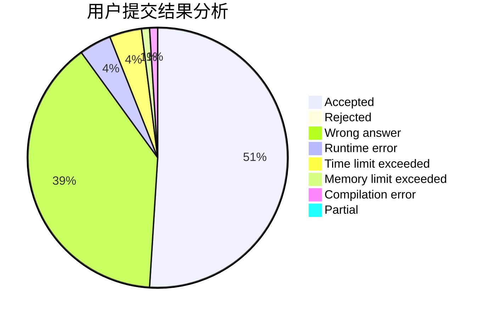
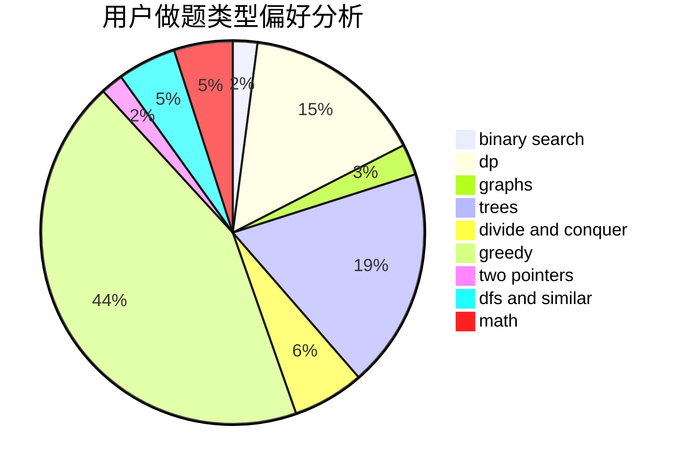

# register-Gen

<!-- tabs:start -->

#### **用户提交结果分析**

#### **用户做题类型偏好分析**

<!-- tabs:end -->
# 推荐题目
[1405B](https://codeforces.com/contest/1405/problem/B)
[1041C](https://codeforces.com/contest/1041/problem/C)
[1016G](https://codeforces.com/contest/1016/problem/G)
[666A](https://codeforces.com/contest/666/problem/A)
[899E](https://codeforces.com/contest/899/problem/E)
[815D](https://codeforces.com/contest/815/problem/D)
[13561](https://codeforces.com/contest/1356/problem/1)
[1292F](https://codeforces.com/contest/1292/problem/F)
[1153E](https://codeforces.com/contest/1153/problem/E)
[652D](https://codeforces.com/contest/652/problem/D)
