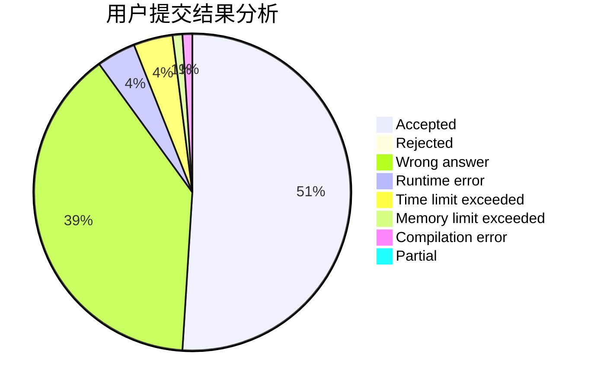
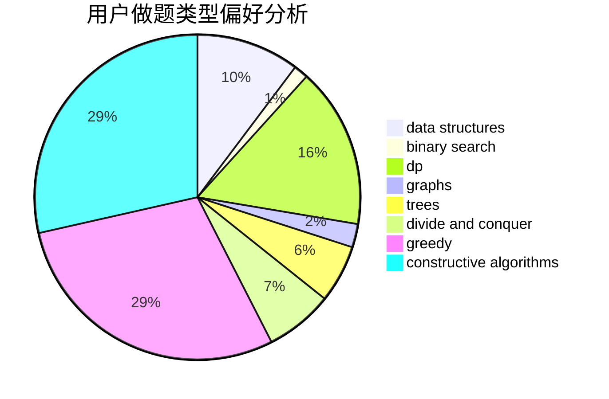
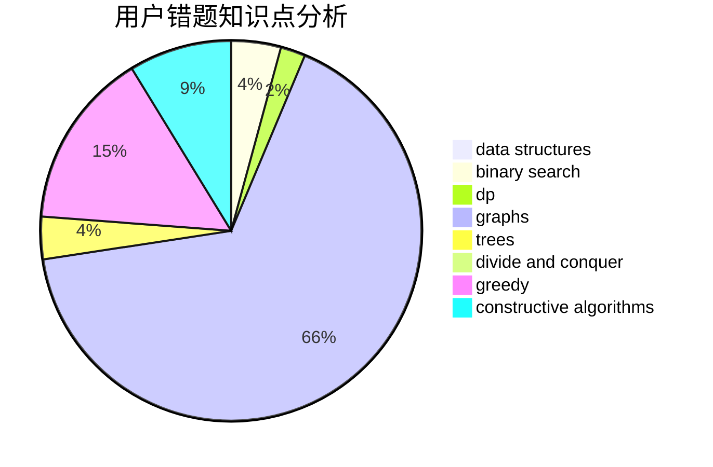

# register-Gen

<!-- tabs:start -->

#### **用户提交结果分析**

#### **用户做题类型偏好分析**

#### **用户错题知识点分析**

<!-- tabs:end -->
# 推荐题目
[1405B](https://codeforces.com/contest/1405/problem/B)		constructive algorithms,
                        implementation		  
[1041C](https://codeforces.com/contest/1041/problem/C)		binary search,
                        data structures,
                        greedy,
                        two pointers		  
[1016G](https://codeforces.com/contest/1016/problem/G)		bitmasks,
                        math,
                        number theory		  
[666A](https://codeforces.com/contest/666/problem/A)		dp,
                        implementation,
                        strings		  
[899E](https://codeforces.com/contest/899/problem/E)		data structures,
                        dsu,
                        flows,
                        implementation,
                        two pointers		  
[815D](https://codeforces.com/contest/815/problem/D)		binary search,
                        combinatorics,
                        data structures,
                        geometry		  
[13561](https://codeforces.com/contest/1356/problem/1)		dsu,graphs,sortings,trees		  
[1292F](https://codeforces.com/contest/1292/problem/F)		bitmasks,
                        combinatorics,
                        dp		  
[1153E](https://codeforces.com/contest/1153/problem/E)		binary search,
                        brute force,
                        interactive		  
[652D](https://codeforces.com/contest/652/problem/D)		data structures,
                        sortings		  
