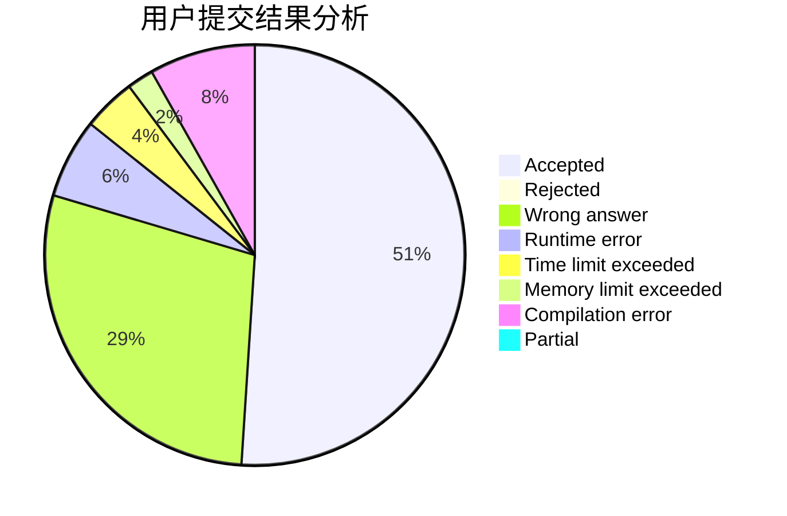
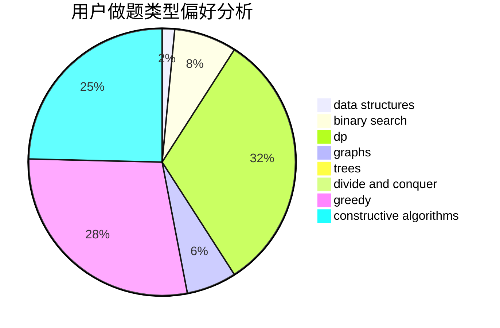
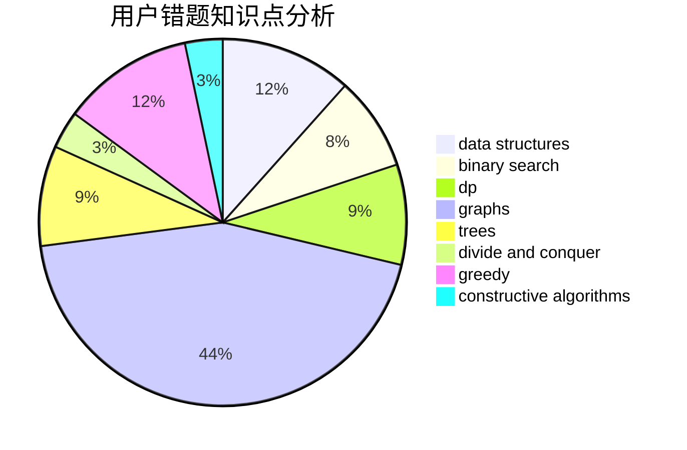

# renascencepjw0510

<!-- tabs:start -->

#### **用户提交结果分析**

#### **用户做题类型偏好分析**

#### **用户错题知识点分析**

<!-- tabs:end -->
# 推荐题目
[1352B](https://codeforces.com/contest/1352/problem/B)		constructive algorithms,
                        math		  
[950B](https://codeforces.com/contest/950/problem/B)		greedy,
                        implementation		  
[955C](https://codeforces.com/contest/955/problem/C)		binary search,
                        math,
                        number theory		  
[698C](https://codeforces.com/contest/698/problem/C)		bitmasks,
                        dp,
                        math,
                        probabilities		  
[313E](https://codeforces.com/contest/313/problem/E)		constructive algorithms,
                        data structures,
                        dsu,
                        greedy		  
[888C](https://codeforces.com/contest/888/problem/C)		binary search,
                        implementation,
                        two pointers		  
[918A](https://codeforces.com/contest/918/problem/A)		brute force,
                        implementation		  
[300B](https://codeforces.com/contest/300/problem/B)		brute force,
                        dfs and similar,
                        graphs		  
[122A](https://codeforces.com/contest/122/problem/A)		brute force,
                        number theory		  
[465D](https://codeforces.com/contest/465/problem/D)		dsu,graphs,sortings,trees		  
