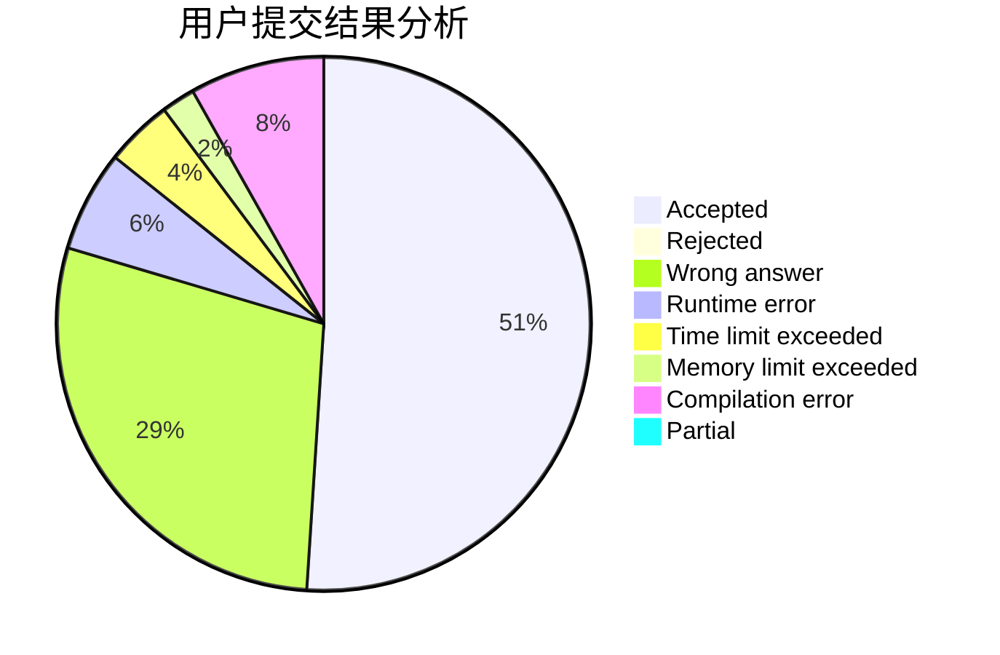
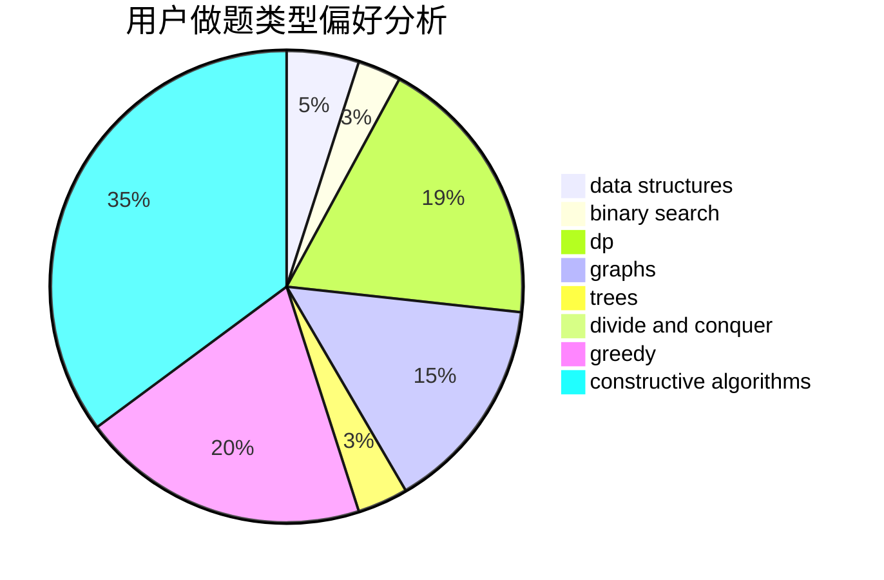
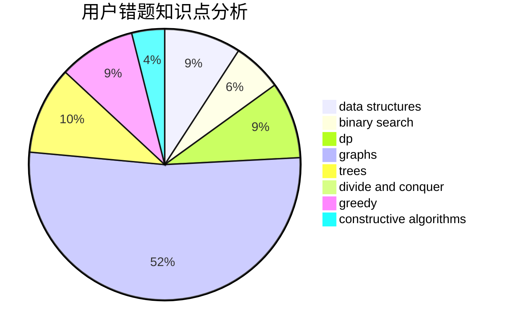

# renascencepjw0510

<!-- tabs:start -->

#### **用户提交结果分析**

#### **用户做题类型偏好分析**

#### **用户错题知识点分析**

<!-- tabs:end -->
# 推荐题目
[1358F](https://codeforces.com/contest/1358/problem/F)		binary search,
                        constructive algorithms,
                        greedy,
                        implementation		  
[967D](https://codeforces.com/contest/967/problem/D)		dsu,graphs,sortings,trees		  
[977C](https://codeforces.com/contest/977/problem/C)		sortings		  
[715A](https://codeforces.com/contest/715/problem/A)		constructive algorithms,
                        math		  
[338D](https://codeforces.com/contest/338/problem/D)		chinese remainder theorem,
                        math,
                        number theory		  
[908A](https://codeforces.com/contest/908/problem/A)		brute force,
                        implementation		  
[938D](https://codeforces.com/contest/938/problem/D)		data structures,
                        graphs,
                        shortest paths		  
[318D](https://codeforces.com/contest/318/problem/D)		dsu,graphs,sortings,trees		  
[1238B](https://codeforces.com/contest/1238/problem/B)		greedy,
                        sortings		  
[484E](https://codeforces.com/contest/484/problem/E)		binary search,
                        constructive algorithms,
                        data structures		  
