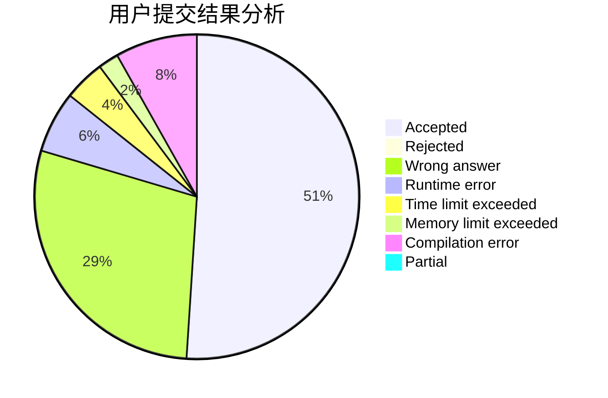
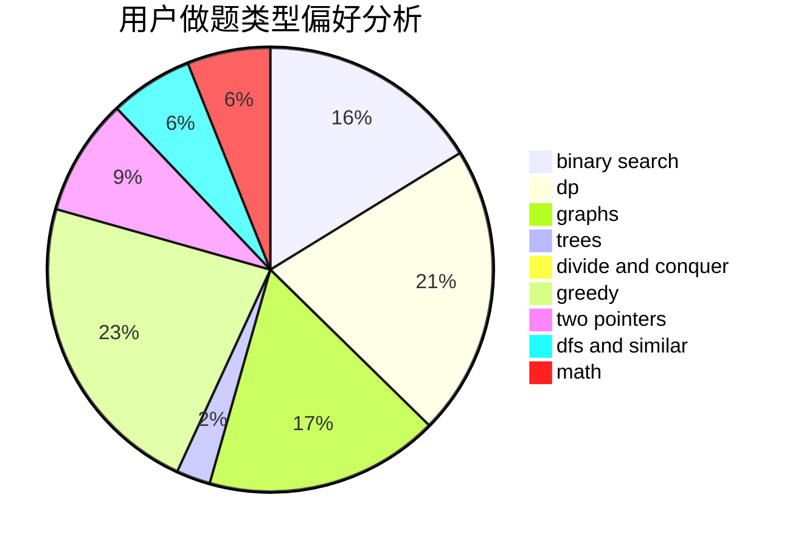

# renascencepjw0510

<!-- tabs:start -->

#### **用户提交结果分析**

#### **用户做题类型偏好分析**

<!-- tabs:end -->
# 推荐题目
[1358F](https://codeforces.com/contest/1358/problem/F)
[967D](https://codeforces.com/contest/967/problem/D)
[977C](https://codeforces.com/contest/977/problem/C)
[715A](https://codeforces.com/contest/715/problem/A)
[338D](https://codeforces.com/contest/338/problem/D)
[908A](https://codeforces.com/contest/908/problem/A)
[938D](https://codeforces.com/contest/938/problem/D)
[318D](https://codeforces.com/contest/318/problem/D)
[1238B](https://codeforces.com/contest/1238/problem/B)
[484E](https://codeforces.com/contest/484/problem/E)
