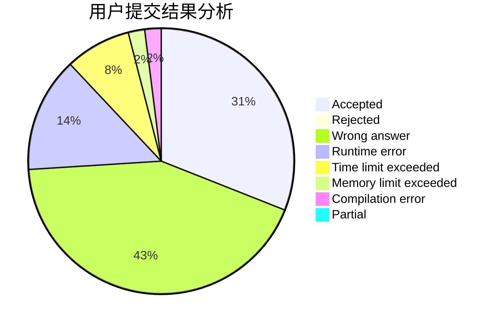
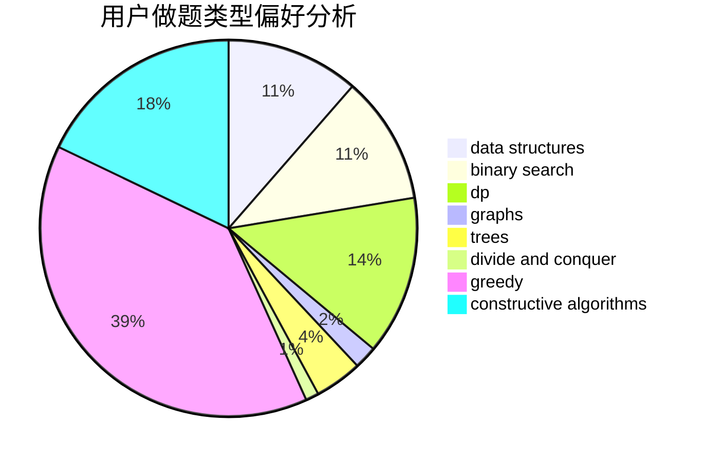
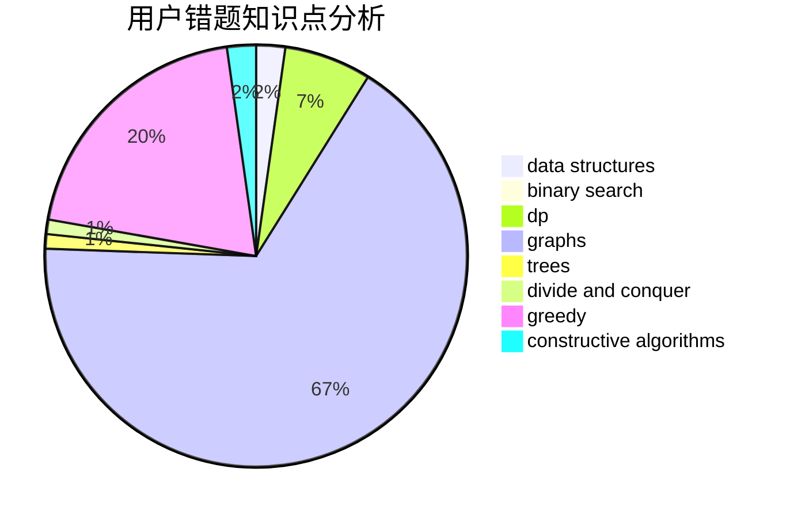

# renjied

<!-- tabs:start -->

#### **用户提交结果分析**

#### **用户做题类型偏好分析**

#### **用户错题知识点分析**

<!-- tabs:end -->
# 推荐题目
[600F](https://codeforces.com/contest/600/problem/F)		graphs		  
[1321A](https://codeforces.com/contest/1321/problem/A)		greedy		  
[198B](https://codeforces.com/contest/198/problem/B)		shortest paths		  
[707B](https://codeforces.com/contest/707/problem/B)		graphs		  
[1234E](https://codeforces.com/contest/1234/problem/E)		math		  
[131A](https://codeforces.com/contest/131/problem/A)		implementation,
                        strings		  
[144D](https://codeforces.com/contest/144/problem/D)		data structures,
                        dfs and similar,
                        graphs,
                        shortest paths		  
[1408I](https://codeforces.com/contest/1408/problem/I)		dp,
                        math		  
[1283E](https://codeforces.com/contest/1283/problem/E)		dp,
                        greedy		  
[1144A](https://codeforces.com/contest/1144/problem/A)		implementation,
                        strings		  
