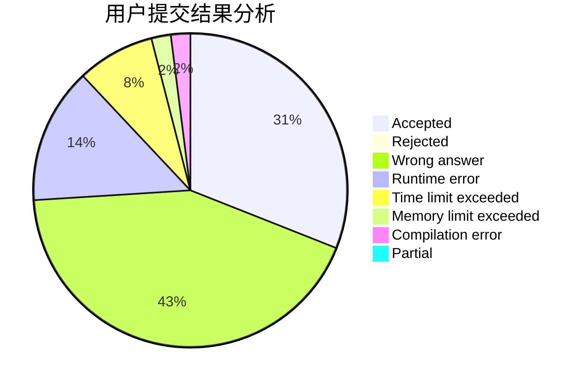
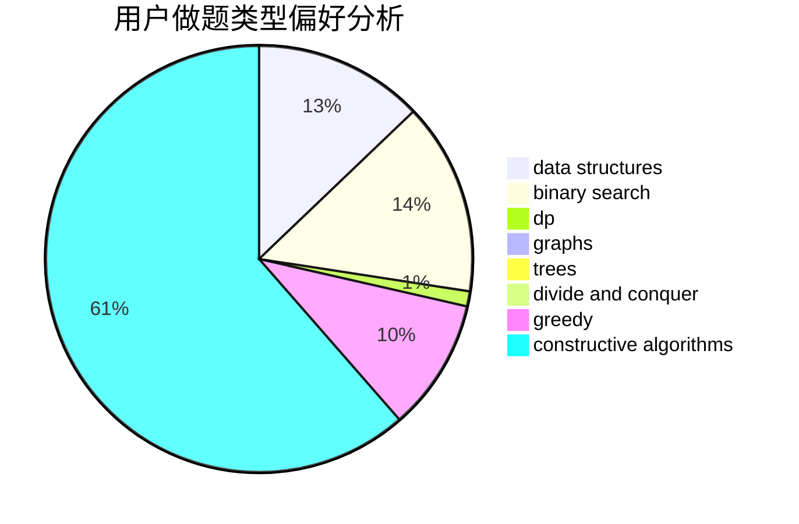
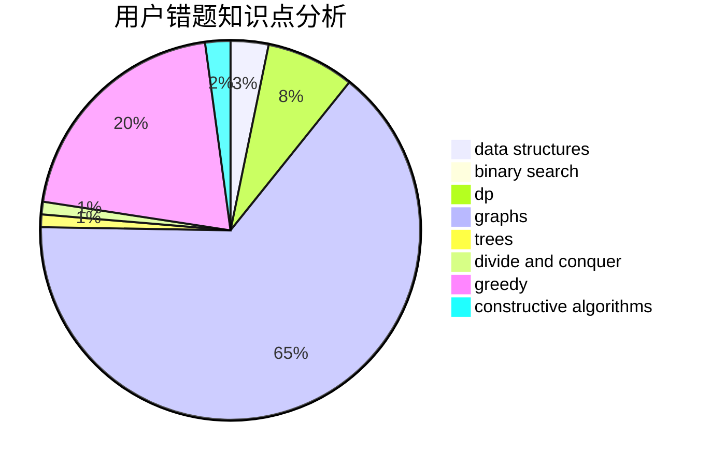

# renjied

<!-- tabs:start -->

#### **用户提交结果分析**

#### **用户做题类型偏好分析**

#### **用户错题知识点分析**

<!-- tabs:end -->
# 推荐题目
[580D](https://codeforces.com/contest/580/problem/D)		bitmasks,
                        dp		  
[1311E](https://codeforces.com/contest/1311/problem/E)		brute force,
                        constructive algorithms,
                        trees		  
[171B](https://codeforces.com/contest/171/problem/B)		*special problem,
                        combinatorics		  
[683A](https://codeforces.com/contest/683/problem/A)		*special problem,
                        geometry		  
[1227A](https://codeforces.com/contest/1227/problem/A)		math		  
[1310D](https://codeforces.com/contest/1310/problem/D)		dp,
                        graphs,
                        probabilities		  
[1438C](https://codeforces.com/contest/1438/problem/C)		2-sat,
                        chinese remainder theorem,
                        constructive algorithms,
                        fft,
                        flows		  
[139A](https://codeforces.com/contest/139/problem/A)		implementation		  
[1277C](https://codeforces.com/contest/1277/problem/C)		dsu,graphs,sortings,trees		  
[1141F2](https://codeforces.com/contest/1141F/problem/2)		data structures,
                        greedy		  
