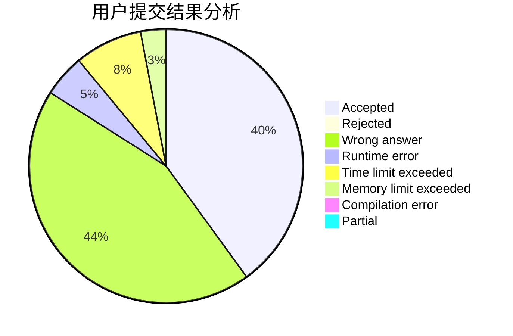
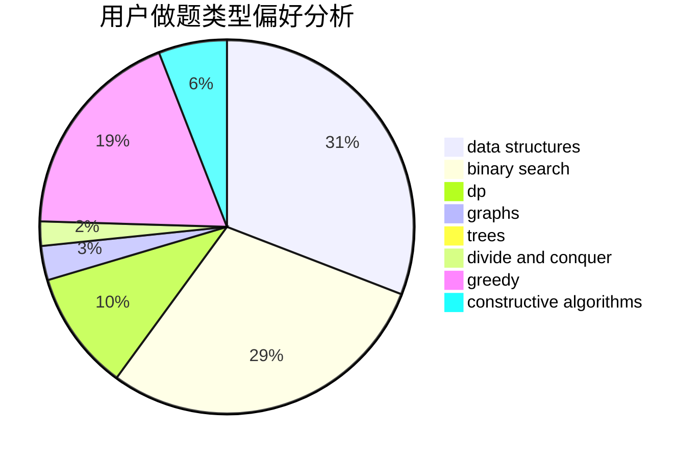
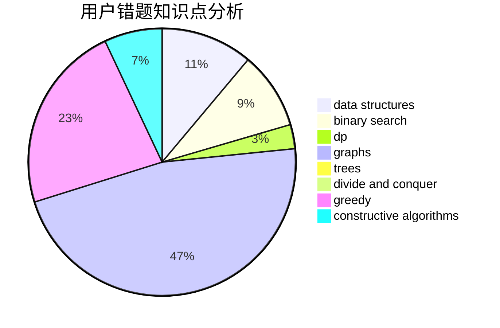

# renshubing

<!-- tabs:start -->

#### **用户提交结果分析**

#### **用户做题类型偏好分析**

#### **用户错题知识点分析**

<!-- tabs:end -->
# 推荐题目
[1411F](https://codeforces.com/contest/1411/problem/F)		greedy,
                        math		  
[1201A](https://codeforces.com/contest/1201/problem/A)		implementation,
                        strings		  
[274C](https://codeforces.com/contest/274/problem/C)		brute force,
                        geometry		  
[779A](https://codeforces.com/contest/779/problem/A)		constructive algorithms,
                        math		  
[1006D](https://codeforces.com/contest/1006/problem/D)		implementation		  
[809B](https://codeforces.com/contest/809/problem/B)		binary search,
                        interactive		  
[975A](https://codeforces.com/contest/975/problem/A)		implementation,
                        strings		  
[392B](https://codeforces.com/contest/392/problem/B)		dp		  
[739D](https://codeforces.com/contest/739/problem/D)		graph matchings		  
[1313E](https://codeforces.com/contest/1313/problem/E)		data structures,
                        hashing,
                        strings,
                        two pointers		  
