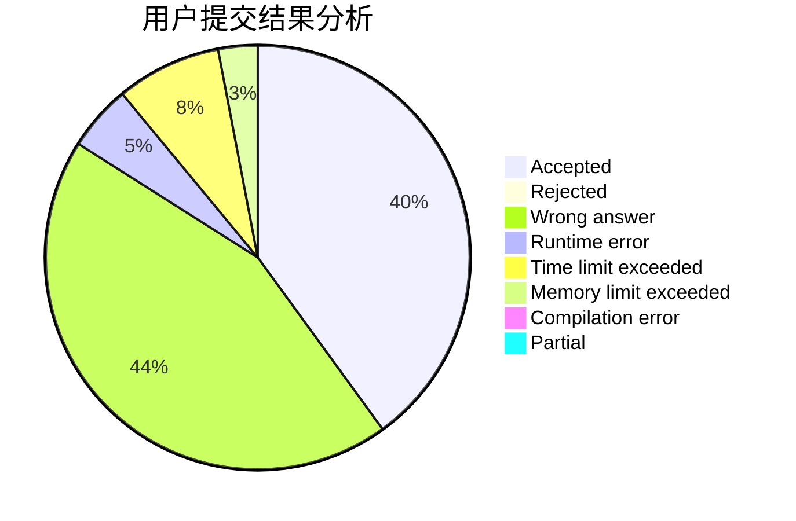
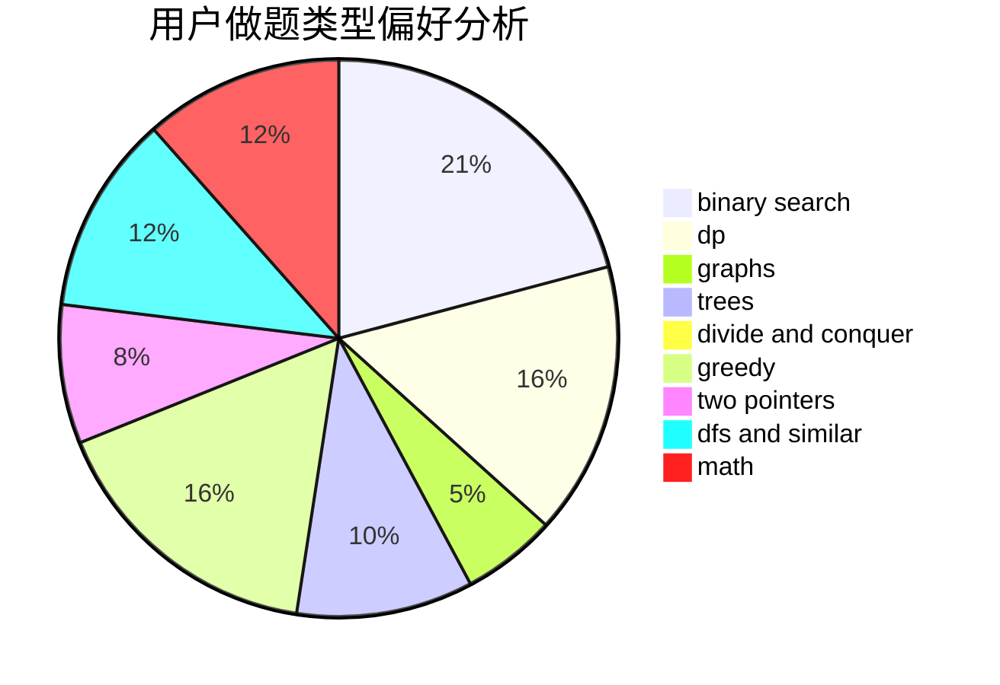

# renshubing

<!-- tabs:start -->

#### **用户提交结果分析**

#### **用户做题类型偏好分析**

<!-- tabs:end -->
# 推荐题目
[1422A](https://codeforces.com/contest/1422/problem/A)
[1205E](https://codeforces.com/contest/1205/problem/E)
[28B](https://codeforces.com/contest/28/problem/B)
[797C](https://codeforces.com/contest/797/problem/C)
[1007A](https://codeforces.com/contest/1007/problem/A)
[827A](https://codeforces.com/contest/827/problem/A)
[989E](https://codeforces.com/contest/989/problem/E)
[421A](https://codeforces.com/contest/421/problem/A)
[75D](https://codeforces.com/contest/75/problem/D)
[1323C](https://codeforces.com/contest/1323/problem/C)
