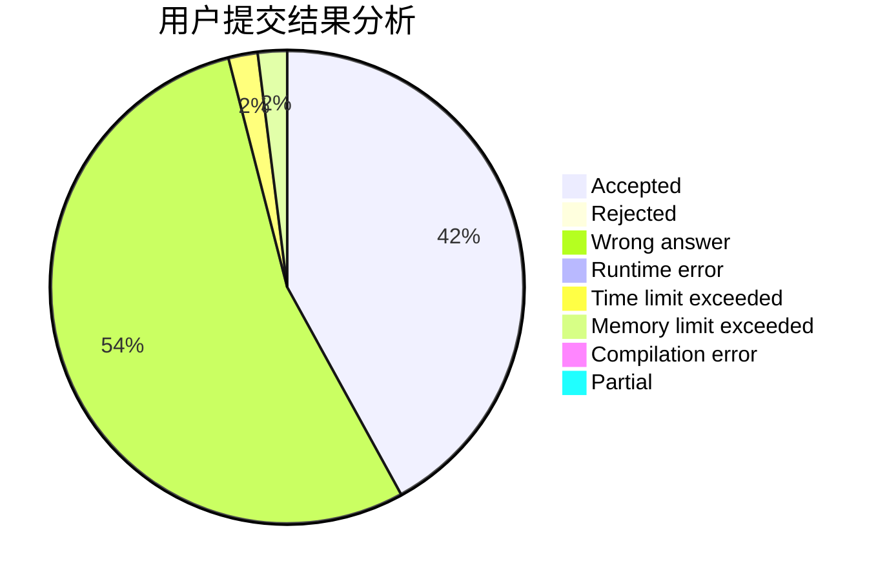
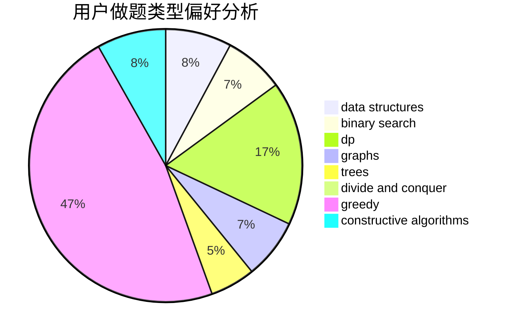
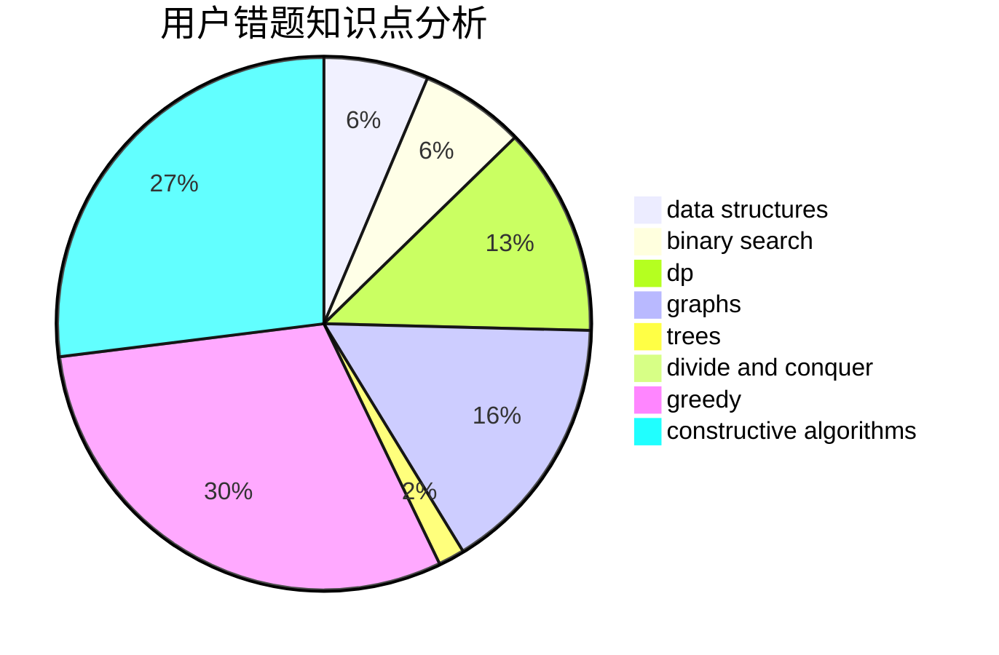

# retsamyxd

<!-- tabs:start -->

#### **用户提交结果分析**

#### **用户做题类型偏好分析**

#### **用户错题知识点分析**

<!-- tabs:end -->
# 推荐题目
[1483B](https://codeforces.com/contest/1483/problem/B)		dsu,graphs,sortings,trees		  
[1315B](https://codeforces.com/contest/1315/problem/B)		binary search,
                        dp,
                        greedy,
                        strings		  
[366D](https://codeforces.com/contest/366/problem/D)		binary search,
                        data structures,
                        dfs and similar,
                        dsu,
                        shortest paths,
                        two pointers		  
[864C](https://codeforces.com/contest/864/problem/C)		greedy,
                        implementation,
                        math		  
[1334B](https://codeforces.com/contest/1334/problem/B)		greedy,
                        sortings		  
[1506E](https://codeforces.com/contest/1506/problem/E)		constructive algorithms,
                        implementation		  
[1221D](https://codeforces.com/contest/1221/problem/D)		dp		  
[543A](https://codeforces.com/contest/543/problem/A)		dp		  
[538H](https://codeforces.com/contest/538/problem/H)		2-sat,
                        data structures,
                        dfs and similar,
                        greedy		  
[662A](https://codeforces.com/contest/662/problem/A)		bitmasks,
                        math,
                        matrices,
                        probabilities		  
