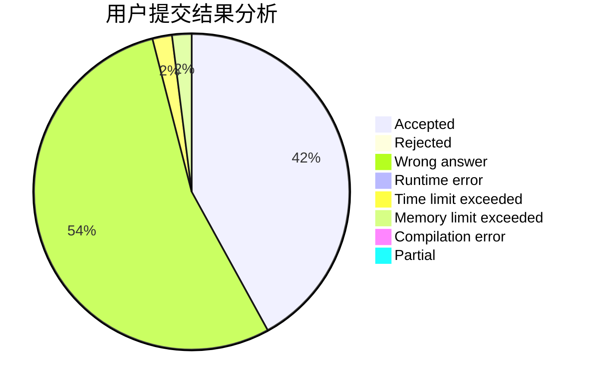
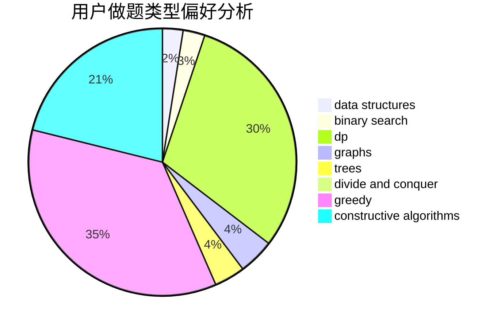
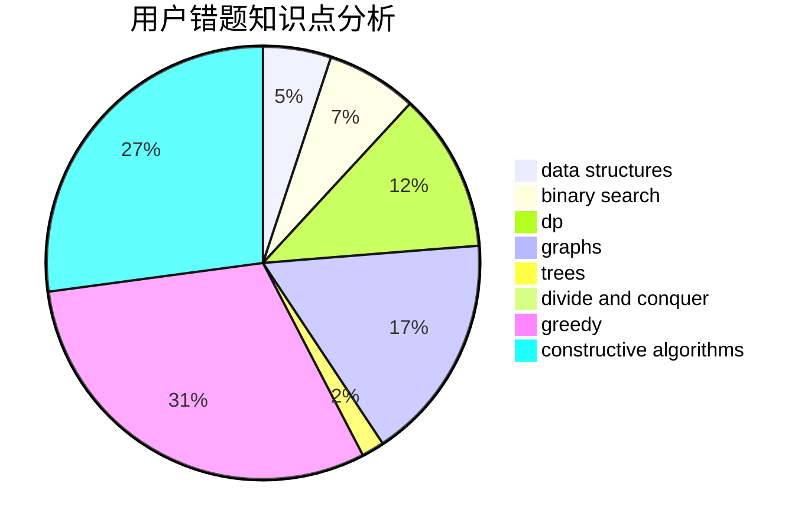

# retsamyxd

<!-- tabs:start -->

#### **用户提交结果分析**

#### **用户做题类型偏好分析**

#### **用户错题知识点分析**

<!-- tabs:end -->
# 推荐题目
[1490G](https://codeforces.com/contest/1490/problem/G)		binary search,
                        data structures,
                        math		  
[1325A](https://codeforces.com/contest/1325/problem/A)		constructive algorithms,
                        greedy,
                        number theory		  
[396C](https://codeforces.com/contest/396/problem/C)		data structures,
                        graphs,
                        trees		  
[883M](https://codeforces.com/contest/883/problem/M)		greedy,
                        math		  
[1341A](https://codeforces.com/contest/1341/problem/A)		math		  
[158B](https://codeforces.com/contest/158/problem/B)		*special problem,
                        greedy,
                        implementation		  
[1229F](https://codeforces.com/contest/1229/problem/F)		dsu,graphs,sortings,trees		  
[567C](https://codeforces.com/contest/567/problem/C)		binary search,
                        data structures,
                        dp		  
[55C](https://codeforces.com/contest/55/problem/C)		games		  
[682A](https://codeforces.com/contest/682/problem/A)		constructive algorithms,
                        math,
                        number theory		  
