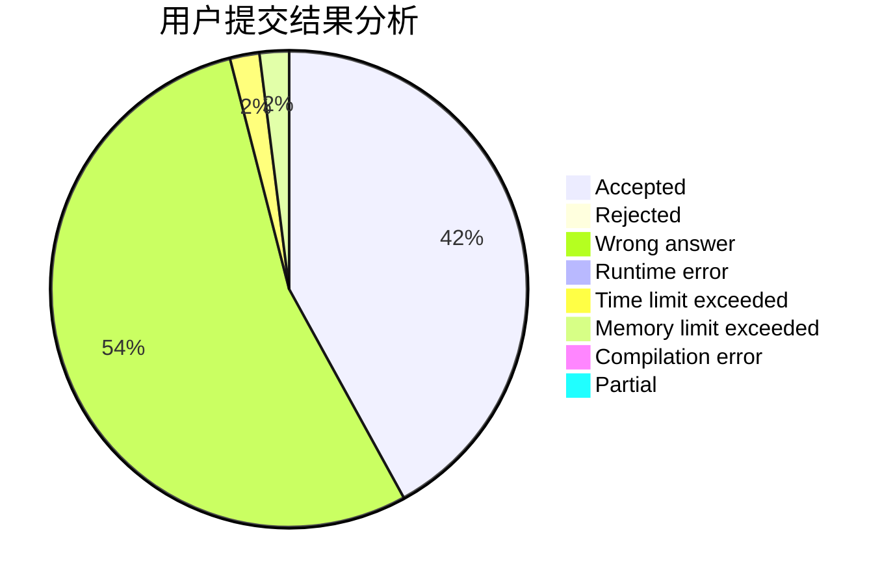
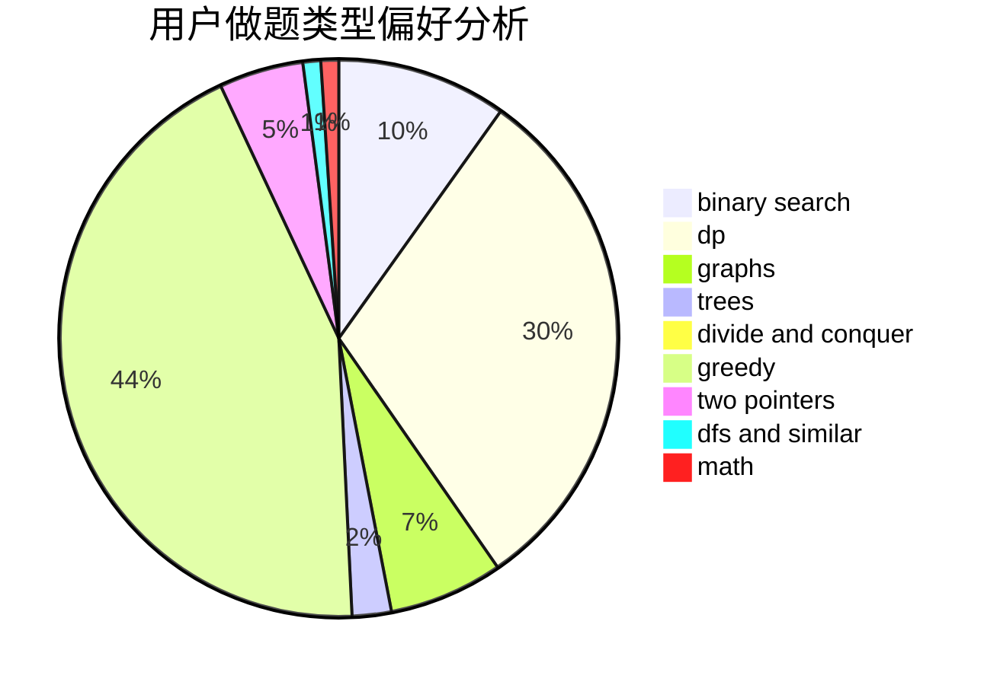

# retsamyxd

<!-- tabs:start -->

#### **用户提交结果分析**

#### **用户做题类型偏好分析**

<!-- tabs:end -->
# 推荐题目
[1490G](https://codeforces.com/contest/1490/problem/G)
[1325A](https://codeforces.com/contest/1325/problem/A)
[396C](https://codeforces.com/contest/396/problem/C)
[883M](https://codeforces.com/contest/883/problem/M)
[1341A](https://codeforces.com/contest/1341/problem/A)
[158B](https://codeforces.com/contest/158/problem/B)
[1229F](https://codeforces.com/contest/1229/problem/F)
[567C](https://codeforces.com/contest/567/problem/C)
[55C](https://codeforces.com/contest/55/problem/C)
[682A](https://codeforces.com/contest/682/problem/A)
