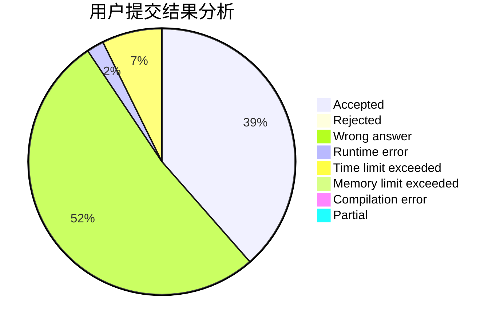
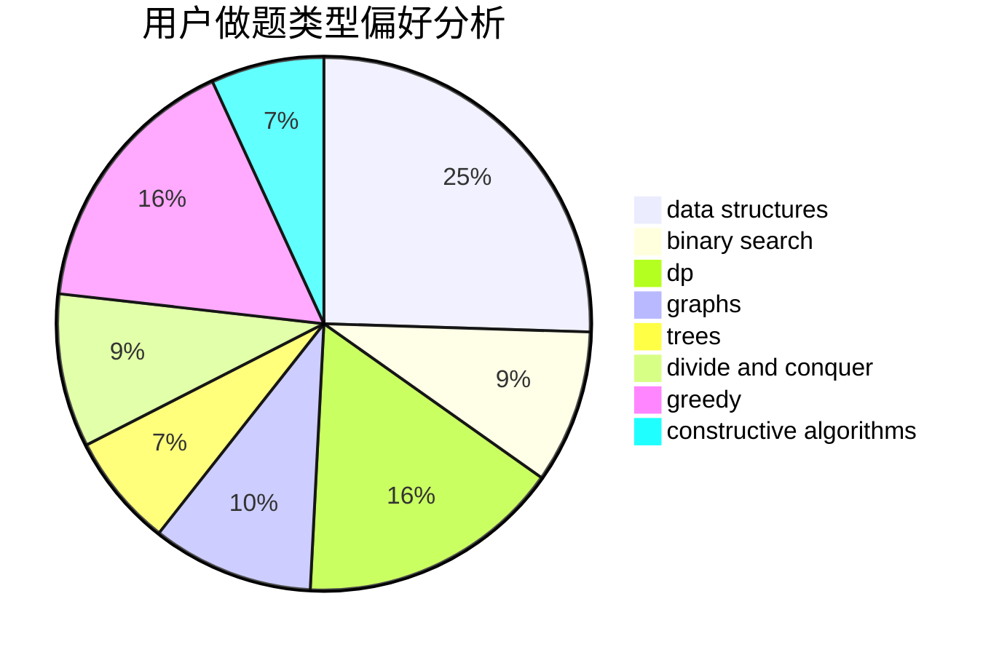
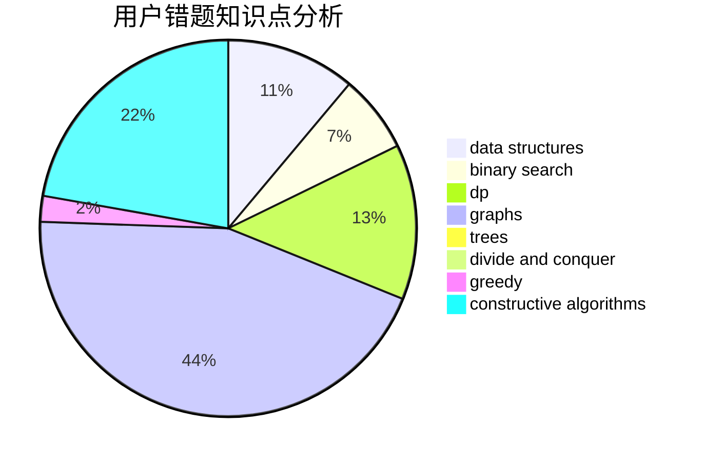

# return--1

<!-- tabs:start -->

#### **用户提交结果分析**

#### **用户做题类型偏好分析**

#### **用户错题知识点分析**

<!-- tabs:end -->
# 推荐题目
[1499C](https://codeforces.com/contest/1499/problem/C)		brute force,
                        data structures,
                        greedy,
                        math		  
[673B](https://codeforces.com/contest/673/problem/B)		greedy,
                        implementation		  
[915C](https://codeforces.com/contest/915/problem/C)		dp,
                        greedy		  
[1497A](https://codeforces.com/contest/1497/problem/A)		brute force,
                        data structures,
                        greedy,
                        sortings		  
[1165B](https://codeforces.com/contest/1165/problem/B)		data structures,
                        greedy,
                        sortings		  
[1344B](https://codeforces.com/contest/1344/problem/B)		constructive algorithms,
                        dfs and similar,
                        dsu,
                        graphs		  
[863B](https://codeforces.com/contest/863/problem/B)		brute force,
                        greedy,
                        sortings		  
[44G](https://codeforces.com/contest/44/problem/G)		data structures,
                        implementation		  
[414C](https://codeforces.com/contest/414/problem/C)		combinatorics,
                        divide and conquer		  
[696A](https://codeforces.com/contest/696/problem/A)		brute force,
                        data structures,
                        implementation,
                        trees		  
