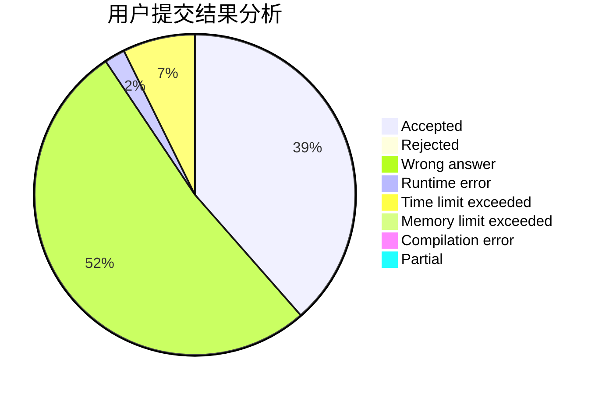
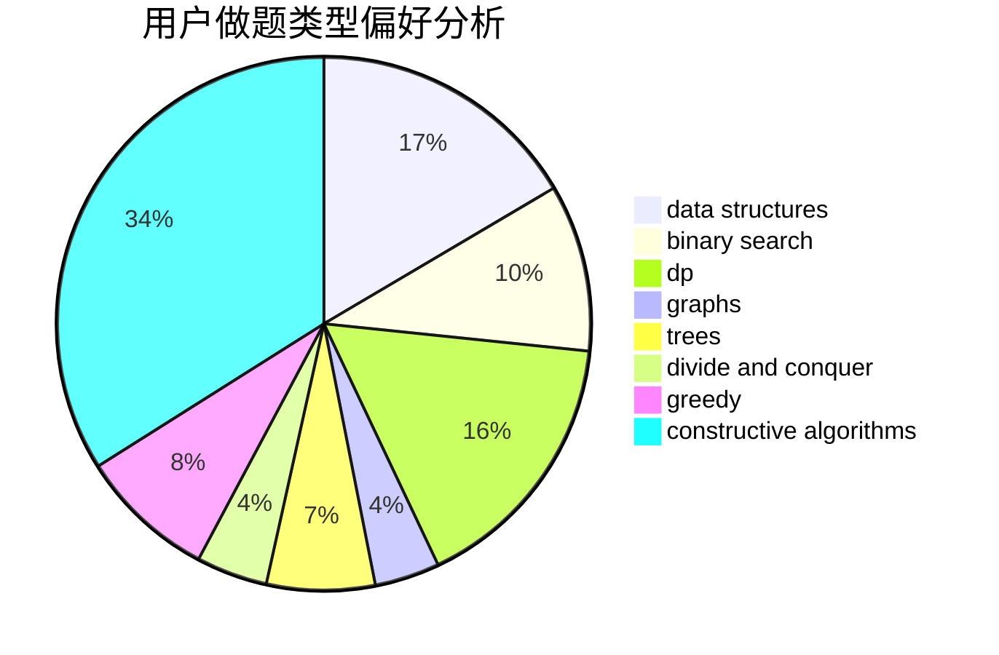
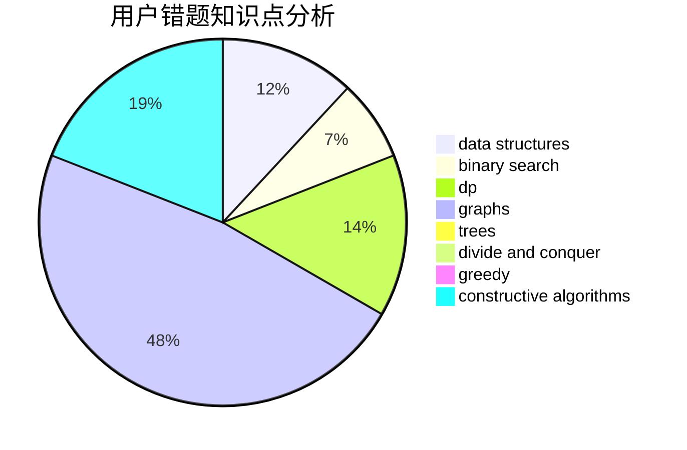

# return--1

<!-- tabs:start -->

#### **用户提交结果分析**

#### **用户做题类型偏好分析**

#### **用户错题知识点分析**

<!-- tabs:end -->
# 推荐题目
[1509C](https://codeforces.com/contest/1509/problem/C)		dp,
                        greedy		  
[699A](https://codeforces.com/contest/699/problem/A)		implementation		  
[935B](https://codeforces.com/contest/935/problem/B)		implementation		  
[1505G](https://codeforces.com/contest/1505/problem/G)		implementation		  
[1167D](https://codeforces.com/contest/1167/problem/D)		constructive algorithms,
                        greedy		  
[1351A](https://codeforces.com/contest/1351/problem/A)		implementation		  
[883D](https://codeforces.com/contest/883/problem/D)		binary search,
                        dp,
                        math		  
[472A](https://codeforces.com/contest/472/problem/A)		math,
                        number theory		  
[439E](https://codeforces.com/contest/439/problem/E)		combinatorics,
                        dp,
                        math		  
[712C](https://codeforces.com/contest/712/problem/C)		greedy,
                        math		  
