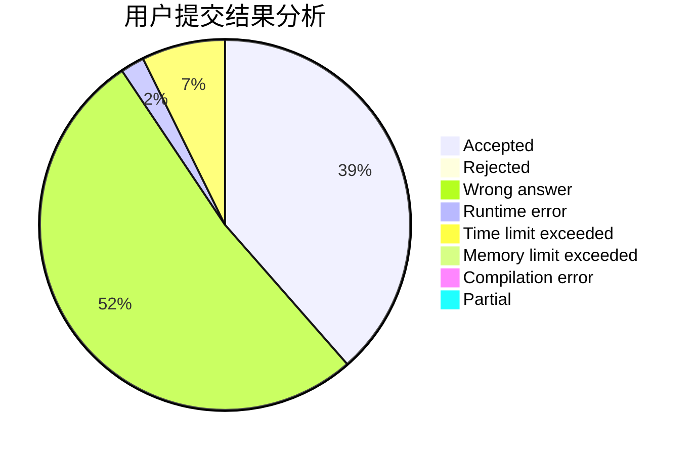
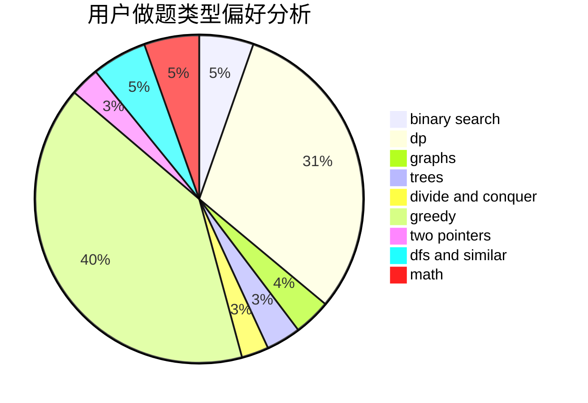

# return--1

<!-- tabs:start -->

#### **用户提交结果分析**

#### **用户做题类型偏好分析**

<!-- tabs:end -->
# 推荐题目
[1509C](https://codeforces.com/contest/1509/problem/C)
[699A](https://codeforces.com/contest/699/problem/A)
[935B](https://codeforces.com/contest/935/problem/B)
[1505G](https://codeforces.com/contest/1505/problem/G)
[1167D](https://codeforces.com/contest/1167/problem/D)
[1351A](https://codeforces.com/contest/1351/problem/A)
[883D](https://codeforces.com/contest/883/problem/D)
[472A](https://codeforces.com/contest/472/problem/A)
[439E](https://codeforces.com/contest/439/problem/E)
[712C](https://codeforces.com/contest/712/problem/C)
