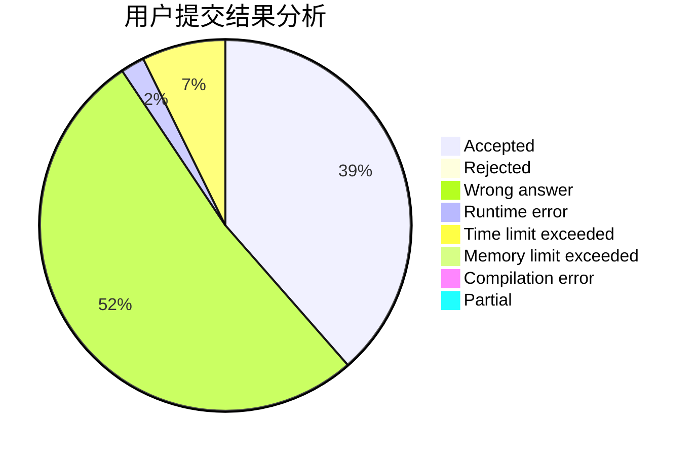
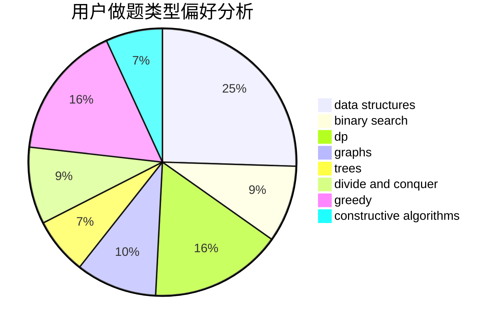
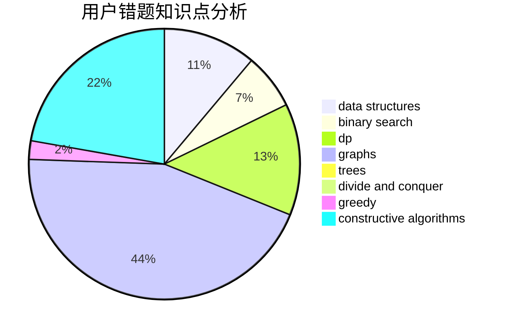

# return--1
<!-- tabs:start -->
#### **用户提交结果分析**

#### **用户做题类型偏好分析**

#### **用户错题知识点分析**

<!-- tabs:end -->
# 推荐题目
[Monopole Magnets](http://codeforces.com/problemset/problem/1344/B)		constructive algorithms,
                        dfs and similar,
                        dsu,
                        graphs		  
[Letters Shop](http://codeforces.com/problemset/problem/1187/B)		binary search,
                        implementation,
                        strings		  
[Eating Soup](http://codeforces.com/problemset/problem/1163/A)		greedy,
                        math		  
[Problems for Round](http://codeforces.com/problemset/problem/673/B)		greedy,
                        implementation		  
[Number of Components](http://codeforces.com/problemset/problem/1151/E)		combinatorics,
                        data structures,
                        dp,
                        math		  
[Sum of Prefix Sums](http://codeforces.com/problemset/problem/1303/G)		data structures,
                        divide and conquer,
                        geometry,
                        trees		  
[Isolation](http://codeforces.com/problemset/problem/1129/D)		data structures,
                        dp		  
[Kayaking](http://codeforces.com/problemset/problem/863/B)		brute force,
                        greedy,
                        sortings		  
[Lorenzo Von Matterhorn](http://codeforces.com/problemset/problem/696/A)		brute force,
                        data structures,
                        implementation,
                        trees		  
[Permute Digits](http://codeforces.com/problemset/problem/915/C)		dp,
                        greedy		  
<!-- tabs:start -->
#### **data structures**
[Monopole Magnets](http://codeforces.com/problemset/problem/1151/E)		combinatorics,
                        data structures,
                        dp,
                        math		  
[Letters Shop](http://codeforces.com/problemset/problem/1303/G)		data structures,
                        divide and conquer,
                        geometry,
                        trees		  
[Eating Soup](http://codeforces.com/problemset/problem/1129/D)		data structures,
                        dp		  
[Problems for Round](http://codeforces.com/problemset/problem/696/A)		brute force,
                        data structures,
                        implementation,
                        trees		  
[Number of Components](http://codeforces.com/problemset/problem/1146/E)		bitmasks,
                        data structures,
                        divide and conquer,
                        implementation		  
[Sum of Prefix Sums](http://codeforces.com/problemset/problem/1165/B)		data structures,
                        greedy,
                        sortings		  
[Isolation](http://codeforces.com/problemset/problem/1196/D2)		data structures,
                        dp,
                        implementation,
                        two pointers		  
[Kayaking](http://codeforces.com/problemset/problem/44/G)		data structures,
                        implementation		  
[Lorenzo Von Matterhorn](http://codeforces.com/problemset/problem/1469/F)		binary search,
                        data structures,
                        greedy		  
[Permute Digits](http://codeforces.com/problemset/problem/1455/G)		data structures,
                        dp		  
#### **binary search**
[Monopole Magnets](http://codeforces.com/problemset/problem/1187/B)		binary search,
                        implementation,
                        strings		  
[Letters Shop](http://codeforces.com/problemset/problem/198/C)		binary search,
                        geometry		  
[Eating Soup](http://codeforces.com/problemset/problem/607/E)		binary search,
                        geometry		  
[Problems for Round](http://codeforces.com/problemset/problem/939/C)		binary search,
                        two pointers		  
[Number of Components](http://codeforces.com/problemset/problem/1394/C)		binary search,
                        geometry,
                        ternary search		  
[Sum of Prefix Sums](http://codeforces.com/problemset/problem/1469/F)		binary search,
                        data structures,
                        greedy		  
[Isolation](https://codeforces.com/contest/957/problem/C)		binary search,
                        greedy,
                        two pointers		  
[Kayaking](http://codeforces.com/problemset/problem/11/E)		binary search,
                        dp,
                        greedy		  
[Lorenzo Von Matterhorn](http://codeforces.com/problemset/problem/889/E)		binary search,
                        dp,
                        math		  
[Permute Digits](https://codeforces.com/contest/1011/problem/C)		binary search,
                        math		  
#### **dp**
[Monopole Magnets](http://codeforces.com/problemset/problem/1151/E)		combinatorics,
                        data structures,
                        dp,
                        math		  
[Letters Shop](http://codeforces.com/problemset/problem/1129/D)		data structures,
                        dp		  
[Eating Soup](http://codeforces.com/problemset/problem/915/C)		dp,
                        greedy		  
[Problems for Round](https://codeforces.com/contest/1113/problem/F)		brute force,
                        combinatorics,
                        dp,
                        math,
                        trees		  
[Number of Components](http://codeforces.com/problemset/problem/132/C)		dp		  
[Sum of Prefix Sums](http://codeforces.com/problemset/problem/1196/D2)		data structures,
                        dp,
                        implementation,
                        two pointers		  
[Isolation](http://codeforces.com/problemset/problem/1286/A)		dp,
                        greedy,
                        sortings		  
[Kayaking](http://codeforces.com/problemset/problem/839/D)		combinatorics,
                        dp,
                        math,
                        number theory		  
[Lorenzo Von Matterhorn](http://codeforces.com/problemset/problem/1455/G)		data structures,
                        dp		  
[Permute Digits](http://codeforces.com/problemset/problem/730/J)		dp		  
#### **graph**
[Monopole Magnets](http://codeforces.com/problemset/problem/1344/B)		constructive algorithms,
                        dfs and similar,
                        dsu,
                        graphs		  
[Letters Shop](http://codeforces.com/problemset/problem/1033/A)		dfs and similar,
                        graphs,
                        implementation		  
[Eating Soup](http://codeforces.com/problemset/problem/864/F)		dfs and similar,
                        graphs,
                        trees		  
[Problems for Round](http://codeforces.com/problemset/problem/1156/G)		graphs,
                        greedy,
                        hashing,
                        implementation		  
[Number of Components](http://codeforces.com/problemset/problem/1487/C)		brute force,
                        constructive algorithms,
                        dfs and similar,
                        graphs,
                        greedy,
                        implementation,
                        math		  
[Sum of Prefix Sums](http://codeforces.com/problemset/problem/1437/C)		dp,
                        flows,
                        graph matchings,
                        greedy,
                        math,
                        sortings		  
[Isolation](http://codeforces.com/problemset/problem/1470/D)		constructive algorithms,
                        dfs and similar,
                        graph matchings,
                        graphs,
                        greedy		  
[Kayaking](http://codeforces.com/problemset/problem/1476/C)		dp,
                        graphs,
                        greedy		  
[Lorenzo Von Matterhorn](http://codeforces.com/problemset/problem/1304/D)		constructive algorithms,
                        graphs,
                        greedy,
                        two pointers		  
[Permute Digits](http://codeforces.com/problemset/problem/1475/C)		combinatorics,
                        graphs,
                        math		  
#### **trees**
[Monopole Magnets](http://codeforces.com/problemset/problem/1303/G)		data structures,
                        divide and conquer,
                        geometry,
                        trees		  
[Letters Shop](http://codeforces.com/problemset/problem/696/A)		brute force,
                        data structures,
                        implementation,
                        trees		  
[Eating Soup](https://codeforces.com/contest/1113/problem/F)		brute force,
                        combinatorics,
                        dp,
                        math,
                        trees		  
[Problems for Round](http://codeforces.com/problemset/problem/864/F)		dfs and similar,
                        graphs,
                        trees		  
[Number of Components](http://codeforces.com/problemset/problem/1479/D)		binary search,
                        bitmasks,
                        brute force,
                        data structures,
                        probabilities,
                        trees		  
[Sum of Prefix Sums](http://codeforces.com/problemset/problem/1511/C)		brute force,
                        data structures,
                        implementation,
                        trees		  
[Isolation](http://codeforces.com/problemset/problem/1499/F)		combinatorics,
                        dfs and similar,
                        dp,
                        trees		  
[Kayaking](http://codeforces.com/problemset/problem/1491/E)		brute force,
                        dfs and similar,
                        divide and conquer,
                        number theory,
                        trees		  
[Lorenzo Von Matterhorn](http://codeforces.com/problemset/problem/1466/D)		data structures,
                        greedy,
                        sortings,
                        trees		  
[Permute Digits](http://codeforces.com/problemset/problem/1495/D)		combinatorics,
                        dfs and similar,
                        graphs,
                        math,
                        shortest paths,
                        trees		  
#### **divide and conquer**
[Monopole Magnets](http://codeforces.com/problemset/problem/1303/G)		data structures,
                        divide and conquer,
                        geometry,
                        trees		  
[Letters Shop](http://codeforces.com/problemset/problem/1146/E)		bitmasks,
                        data structures,
                        divide and conquer,
                        implementation		  
[Eating Soup](http://codeforces.com/problemset/problem/414/C)		combinatorics,
                        divide and conquer		  
[Problems for Round](http://codeforces.com/problemset/problem/1461/D)		binary search,
                        brute force,
                        data structures,
                        divide and conquer,
                        implementation,
                        sortings		  
[Number of Components](http://codeforces.com/problemset/problem/1466/G)		combinatorics,
                        divide and conquer,
                        hashing,
                        math,
                        string suffix structures,
                        strings		  
[Sum of Prefix Sums](http://codeforces.com/problemset/problem/1490/D)		dfs and similar,
                        divide and conquer,
                        implementation		  
[Isolation](https://codeforces.com/contest/1483/problem/C)		data structures,
                        divide and conquer,
                        dp		  
[Kayaking](http://codeforces.com/problemset/problem/1491/E)		brute force,
                        dfs and similar,
                        divide and conquer,
                        number theory,
                        trees		  
[Lorenzo Von Matterhorn](http://codeforces.com/problemset/problem/1303/G)		data structures,
                        divide and conquer,
                        geometry,
                        trees		  
[Permute Digits](http://codeforces.com/problemset/problem/1494/D)		constructive algorithms,
                        data structures,
                        dfs and similar,
                        divide and conquer,
                        dsu,
                        greedy,
                        sortings,
                        trees		  
#### **greedy**
[Monopole Magnets](http://codeforces.com/problemset/problem/1163/A)		greedy,
                        math		  
[Letters Shop](http://codeforces.com/problemset/problem/673/B)		greedy,
                        implementation		  
[Eating Soup](http://codeforces.com/problemset/problem/863/B)		brute force,
                        greedy,
                        sortings		  
[Problems for Round](http://codeforces.com/problemset/problem/915/C)		dp,
                        greedy		  
[Number of Components](http://codeforces.com/problemset/problem/802/A)		greedy		  
[Sum of Prefix Sums](http://codeforces.com/problemset/problem/903/A)		greedy,
                        implementation		  
[Isolation](http://codeforces.com/problemset/problem/1165/B)		data structures,
                        greedy,
                        sortings		  
[Kayaking](http://codeforces.com/problemset/problem/1156/G)		graphs,
                        greedy,
                        hashing,
                        implementation		  
[Lorenzo Von Matterhorn](http://codeforces.com/problemset/problem/1286/A)		dp,
                        greedy,
                        sortings		  
[Permute Digits](http://codeforces.com/problemset/problem/1469/F)		binary search,
                        data structures,
                        greedy		  
#### **constructive algorithms**
[Monopole Magnets](http://codeforces.com/problemset/problem/1344/B)		constructive algorithms,
                        dfs and similar,
                        dsu,
                        graphs		  
[Letters Shop](http://codeforces.com/problemset/problem/672/B)		constructive algorithms,
                        implementation,
                        strings		  
[Eating Soup](http://codeforces.com/problemset/problem/878/A)		bitmasks,
                        constructive algorithms		  
[Problems for Round](http://codeforces.com/problemset/problem/1455/B)		constructive algorithms,
                        math		  
[Number of Components](http://codeforces.com/problemset/problem/1493/A)		constructive algorithms,
                        greedy		  
[Sum of Prefix Sums](http://codeforces.com/problemset/problem/1463/D)		binary search,
                        constructive algorithms,
                        greedy,
                        two pointers		  
[Isolation](https://codeforces.com/contest/1456/problem/B)		bitmasks,
                        brute force,
                        constructive algorithms		  
[Kayaking](http://codeforces.com/problemset/problem/1492/D)		bitmasks,
                        constructive algorithms,
                        greedy,
                        math		  
[Lorenzo Von Matterhorn](https://codeforces.com/contest/1504/problem/D)		constructive algorithms,
                        games,
                        interactive		  
[Permute Digits](https://codeforces.com/contest/1483/problem/A)		brute force,
                        constructive algorithms,
                        greedy,
                        implementation		  
#### **sortings**
[Monopole Magnets](http://codeforces.com/problemset/problem/863/B)		brute force,
                        greedy,
                        sortings		  
[Letters Shop](http://codeforces.com/problemset/problem/272/D)		combinatorics,
                        math,
                        sortings		  
[Eating Soup](http://codeforces.com/problemset/problem/1165/B)		data structures,
                        greedy,
                        sortings		  
[Problems for Round](http://codeforces.com/problemset/problem/817/B)		combinatorics,
                        implementation,
                        math,
                        sortings		  
[Number of Components](http://codeforces.com/problemset/problem/1286/A)		dp,
                        greedy,
                        sortings		  
[Sum of Prefix Sums](http://codeforces.com/problemset/problem/1497/A)		brute force,
                        data structures,
                        greedy,
                        sortings		  
[Isolation](https://codeforces.com/contest/1496/problem/C)		geometry,
                        greedy,
                        math,
                        sortings		  
[Kayaking](http://codeforces.com/problemset/problem/1495/A)		geometry,
                        greedy,
                        math,
                        sortings		  
[Lorenzo Von Matterhorn](http://codeforces.com/problemset/problem/1497/A)		brute force,
                        data structures,
                        greedy,
                        sortings		  
[Permute Digits](http://codeforces.com/problemset/problem/1427/A)		math,
                        sortings		  
<!-- tabs:end -->
