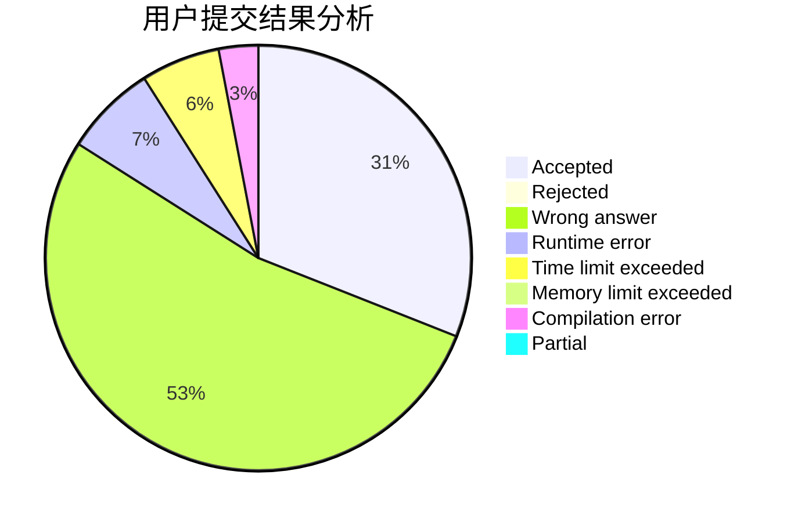
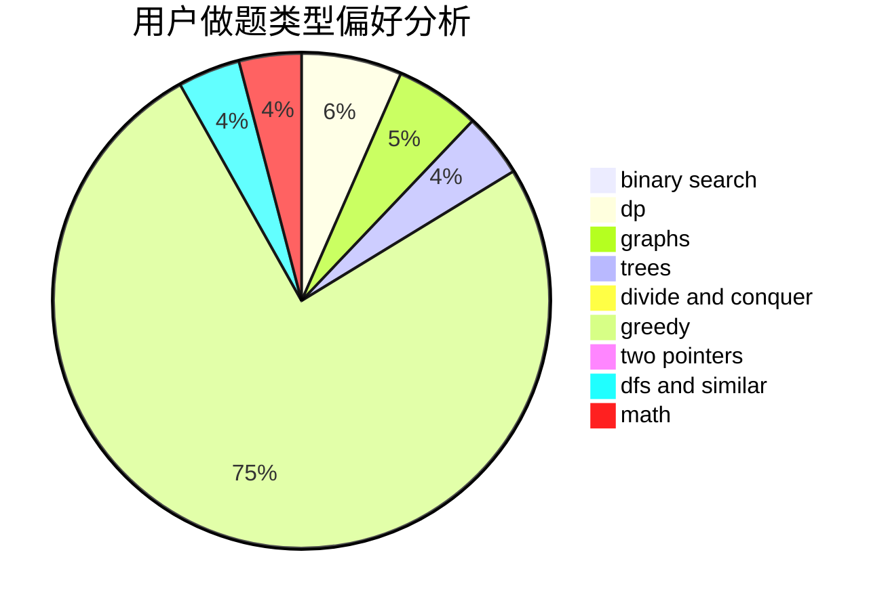

# revuestarlight

<!-- tabs:start -->

#### **用户提交结果分析**

#### **用户做题类型偏好分析**

<!-- tabs:end -->
# 推荐题目
[734D](https://codeforces.com/contest/734/problem/D)
[1220E](https://codeforces.com/contest/1220/problem/E)
[1310B](https://codeforces.com/contest/1310/problem/B)
[1120B](https://codeforces.com/contest/1120/problem/B)
[369B](https://codeforces.com/contest/369/problem/B)
[762A](https://codeforces.com/contest/762/problem/A)
[1342F](https://codeforces.com/contest/1342/problem/F)
[1190C](https://codeforces.com/contest/1190/problem/C)
[1397B](https://codeforces.com/contest/1397/problem/B)
[979B](https://codeforces.com/contest/979/problem/B)
