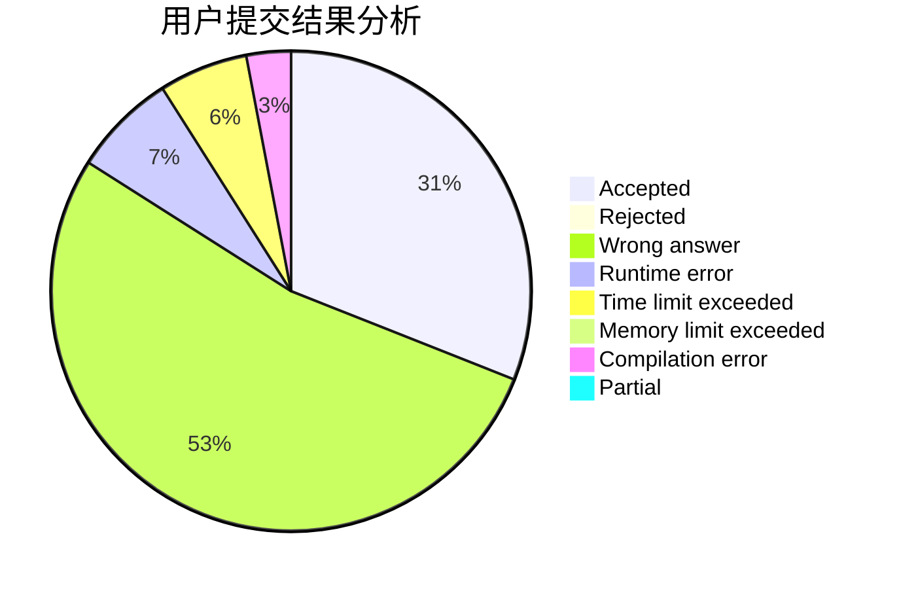
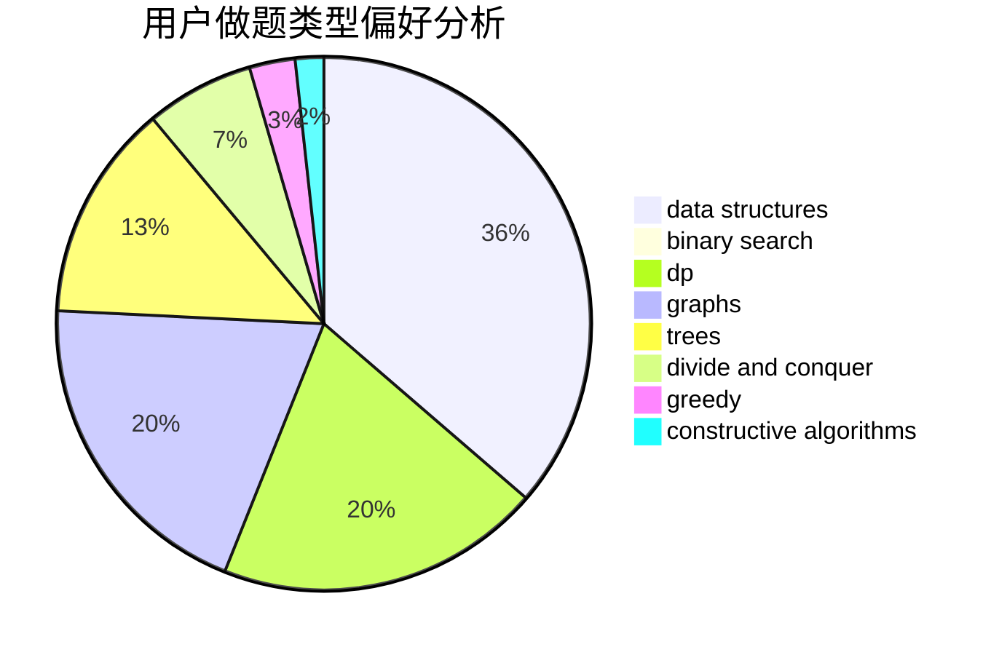

# revuestarlight

<!-- tabs:start -->

#### **用户提交结果分析**

#### **用户做题类型偏好分析**

#### **用户错题知识点分析**

<!-- tabs:end -->
# 推荐题目
[717A](https://codeforces.com/contest/717/problem/A)		math,
                        number theory		  
[1215A](https://codeforces.com/contest/1215/problem/A)		greedy,
                        implementation,
                        math		  
[1300D](https://codeforces.com/contest/1300/problem/D)		dsu,graphs,sortings,trees		  
[1118D2](https://codeforces.com/contest/1118D/problem/2)		binary search,
                        greedy		  
[341E](https://codeforces.com/contest/341/problem/E)		constructive algorithms,
                        greedy		  
[741A](https://codeforces.com/contest/741/problem/A)		dfs and similar,
                        math		  
[1335E2](https://codeforces.com/contest/1335E/problem/2)		brute force,
                        data structures,
                        dp,
                        two pointers		  
[1187A](https://codeforces.com/contest/1187/problem/A)		math		  
[1387B2](https://codeforces.com/contest/1387B/problem/2)		*special problem,
                        dfs and similar,
                        trees		  
[958A1](https://codeforces.com/contest/958A/problem/1)		implementation		  
