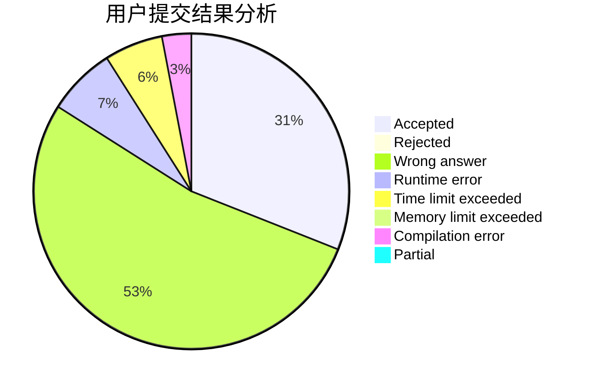
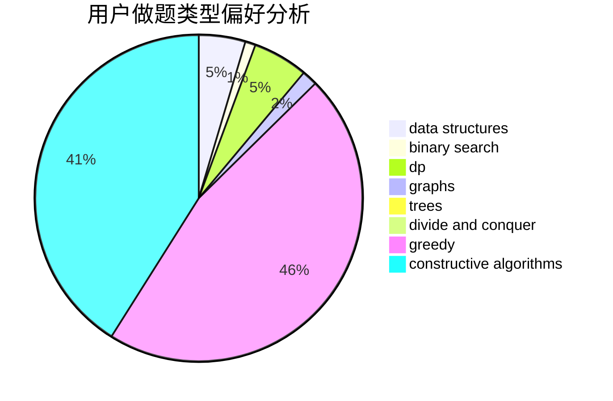

# revuestarlight

<!-- tabs:start -->

#### **用户提交结果分析**

#### **用户做题类型偏好分析**

#### **用户错题知识点分析**

<!-- tabs:end -->
# 推荐题目
[734D](https://codeforces.com/contest/734/problem/D)		implementation		  
[1220E](https://codeforces.com/contest/1220/problem/E)		dfs and similar,
                        dp,
                        dsu,
                        graphs,
                        greedy,
                        trees		  
[1310B](https://codeforces.com/contest/1310/problem/B)		dp,
                        implementation		  
[1120B](https://codeforces.com/contest/1120/problem/B)		constructive algorithms,
                        greedy,
                        implementation,
                        math		  
[369B](https://codeforces.com/contest/369/problem/B)		constructive algorithms,
                        implementation,
                        math		  
[762A](https://codeforces.com/contest/762/problem/A)		math,
                        number theory		  
[1342F](https://codeforces.com/contest/1342/problem/F)		bitmasks,
                        brute force,
                        dp		  
[1190C](https://codeforces.com/contest/1190/problem/C)		brute force,
                        games,
                        greedy		  
[1397B](https://codeforces.com/contest/1397/problem/B)		brute force,
                        math,
                        number theory,
                        sortings		  
[979B](https://codeforces.com/contest/979/problem/B)		greedy		  
