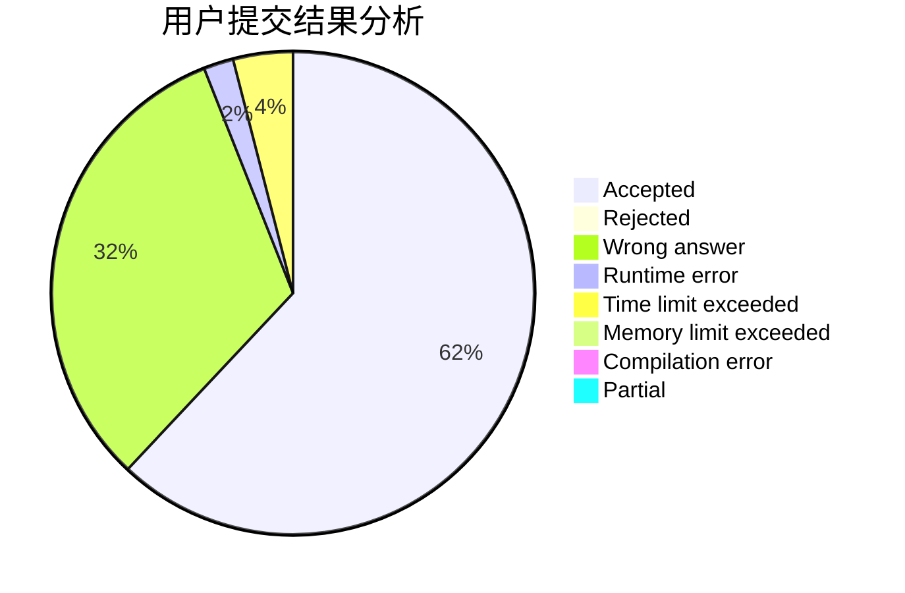
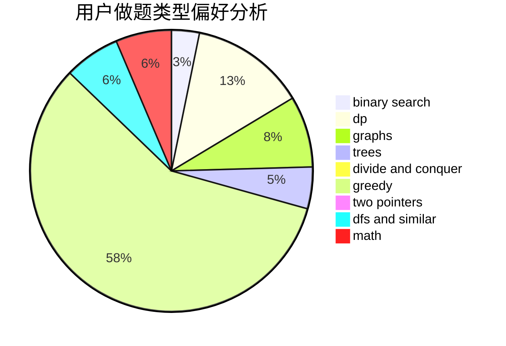

# rhdeng

<!-- tabs:start -->

#### **用户提交结果分析**

#### **用户做题类型偏好分析**

<!-- tabs:end -->
# 推荐题目
[14621](https://codeforces.com/contest/1462/problem/1)
[999E](https://codeforces.com/contest/999/problem/E)
[849B](https://codeforces.com/contest/849/problem/B)
[710D](https://codeforces.com/contest/710/problem/D)
[208A](https://codeforces.com/contest/208/problem/A)
[120H](https://codeforces.com/contest/120/problem/H)
[11412](https://codeforces.com/contest/1141/problem/2)
[44C](https://codeforces.com/contest/44/problem/C)
[86B](https://codeforces.com/contest/86/problem/B)
[294D](https://codeforces.com/contest/294/problem/D)
