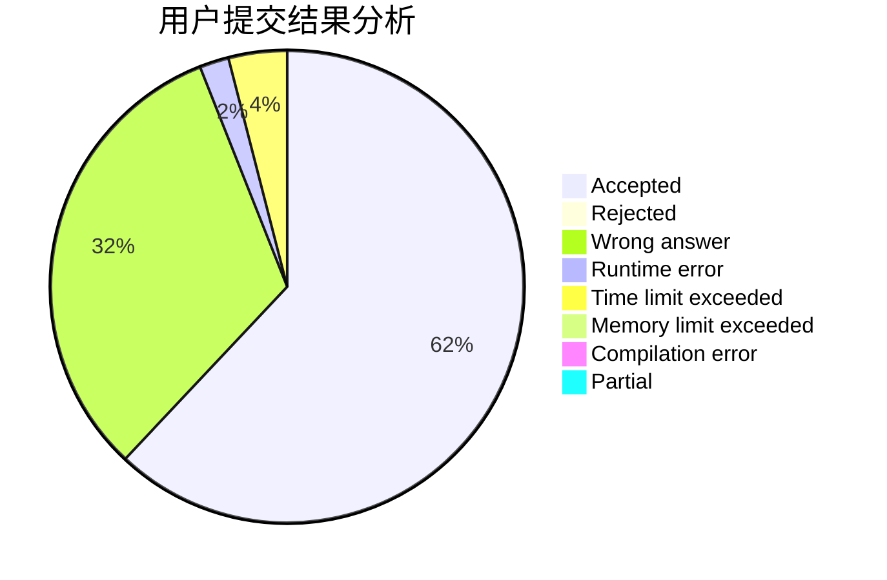
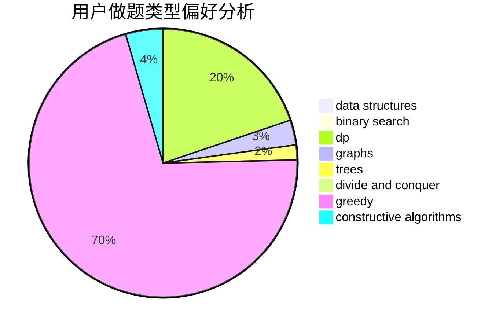

# rhdeng

<!-- tabs:start -->

#### **用户提交结果分析**

#### **用户做题类型偏好分析**

#### **用户错题知识点分析**

<!-- tabs:end -->
# 推荐题目
[14621](https://codeforces.com/contest/1462/problem/1)		dsu,graphs,sortings,trees		  
[999E](https://codeforces.com/contest/999/problem/E)		dfs and similar,
                        graphs,
                        greedy		  
[849B](https://codeforces.com/contest/849/problem/B)		brute force,
                        geometry		  
[710D](https://codeforces.com/contest/710/problem/D)		math,
                        number theory		  
[208A](https://codeforces.com/contest/208/problem/A)		strings		  
[120H](https://codeforces.com/contest/120/problem/H)		graph matchings		  
[11412](https://codeforces.com/contest/1141/problem/2)		dsu,graphs,sortings,trees		  
[44C](https://codeforces.com/contest/44/problem/C)		implementation		  
[86B](https://codeforces.com/contest/86/problem/B)		constructive algorithms,
                        graph matchings,
                        greedy,
                        math		  
[294D](https://codeforces.com/contest/294/problem/D)		brute force,
                        implementation,
                        number theory		  
