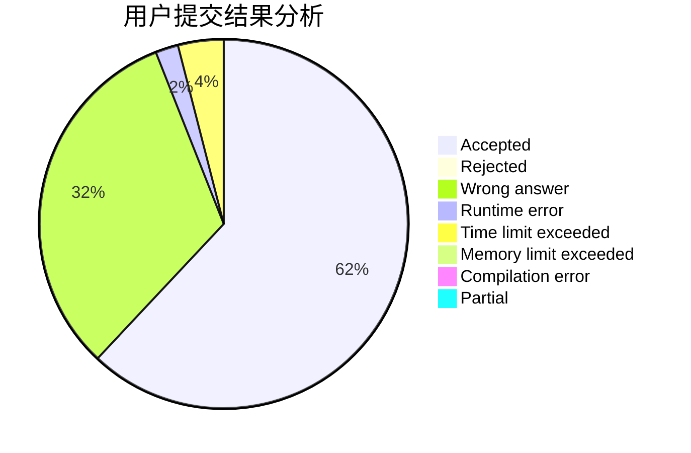
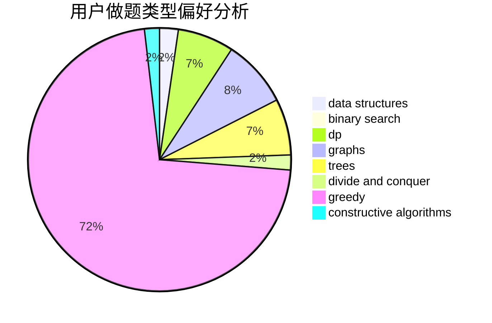

# rhdeng

<!-- tabs:start -->

#### **用户提交结果分析**

#### **用户做题类型偏好分析**

#### **用户错题知识点分析**

<!-- tabs:end -->
# 推荐题目
[1452D](https://codeforces.com/contest/1452/problem/D)		combinatorics,
                        dp,
                        math		  
[984A](https://codeforces.com/contest/984/problem/A)		sortings		  
[831B](https://codeforces.com/contest/831/problem/B)		implementation,
                        strings		  
[690D1](https://codeforces.com/contest/690D/problem/1)		nan		  
[180D](https://codeforces.com/contest/180/problem/D)		greedy,
                        strings		  
[1205E](https://codeforces.com/contest/1205/problem/E)		combinatorics,
                        strings		  
[1139E](https://codeforces.com/contest/1139/problem/E)		flows,
                        graph matchings,
                        graphs		  
[427D](https://codeforces.com/contest/427/problem/D)		dp,
                        string suffix structures,
                        strings		  
[851A](https://codeforces.com/contest/851/problem/A)		implementation,
                        math		  
[279E](https://codeforces.com/contest/279/problem/E)		dp,
                        games,
                        greedy,
                        number theory		  
