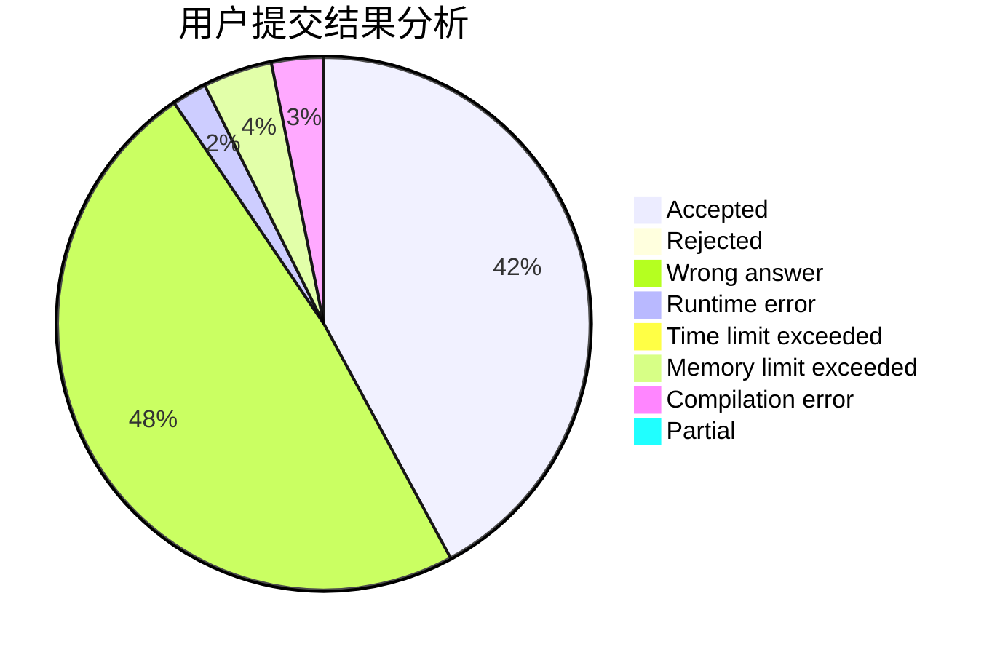
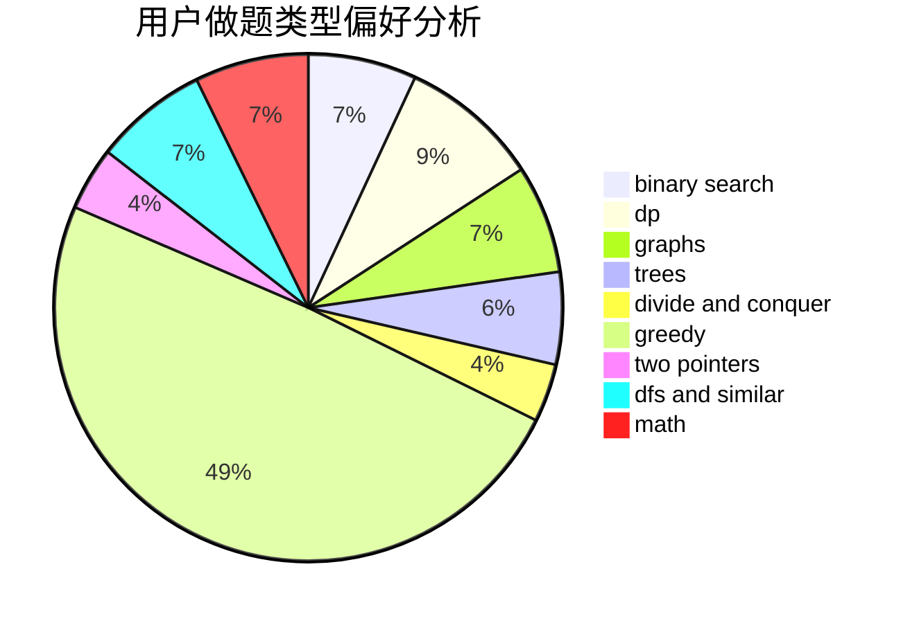

# CCPSDCGK

<!-- tabs:start -->

#### **用户提交结果分析**

#### **用户做题类型偏好分析**

<!-- tabs:end -->
# 推荐题目
[551B](https://codeforces.com/contest/551/problem/B)
[1350E](https://codeforces.com/contest/1350/problem/E)
[608D](https://codeforces.com/contest/608/problem/D)
[260B](https://codeforces.com/contest/260/problem/B)
[11571](https://codeforces.com/contest/1157/problem/1)
[238D](https://codeforces.com/contest/238/problem/D)
[238E](https://codeforces.com/contest/238/problem/E)
[609A](https://codeforces.com/contest/609/problem/A)
[28A](https://codeforces.com/contest/28/problem/A)
[1105B](https://codeforces.com/contest/1105/problem/B)
