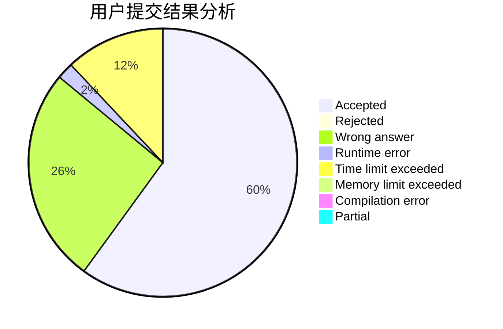
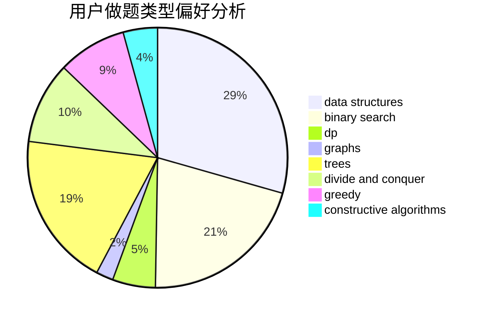
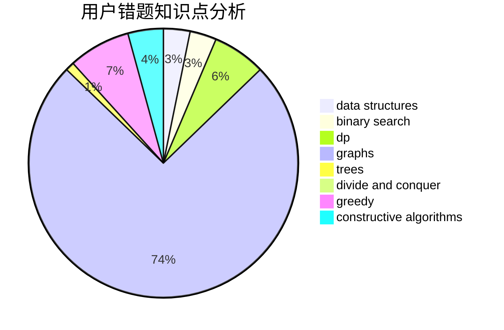

# richardjcy

<!-- tabs:start -->

#### **用户提交结果分析**

#### **用户做题类型偏好分析**

#### **用户错题知识点分析**

<!-- tabs:end -->
# 推荐题目
[750G](https://codeforces.com/contest/750/problem/G)		bitmasks,
                        brute force,
                        combinatorics,
                        dp		  
[976A](https://codeforces.com/contest/976/problem/A)		implementation		  
[741A](https://codeforces.com/contest/741/problem/A)		dfs and similar,
                        math		  
[866D](https://codeforces.com/contest/866/problem/D)		dsu,graphs,sortings,trees		  
[1083C](https://codeforces.com/contest/1083/problem/C)		data structures,
                        trees		  
[886F](https://codeforces.com/contest/886/problem/F)		geometry		  
[884F](https://codeforces.com/contest/884/problem/F)		flows,
                        graphs,
                        greedy		  
[932B](https://codeforces.com/contest/932/problem/B)		binary search,
                        data structures,
                        dfs and similar		  
[877F](https://codeforces.com/contest/877/problem/F)		data structures,
                        flows,
                        hashing		  
[297A](https://codeforces.com/contest/297/problem/A)		constructive algorithms		  
