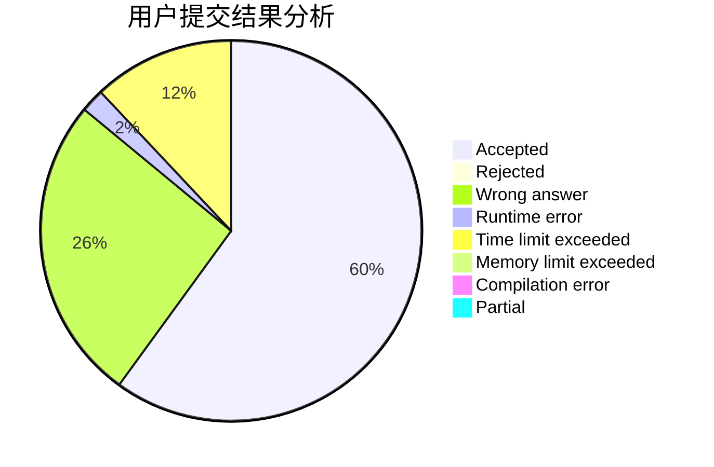
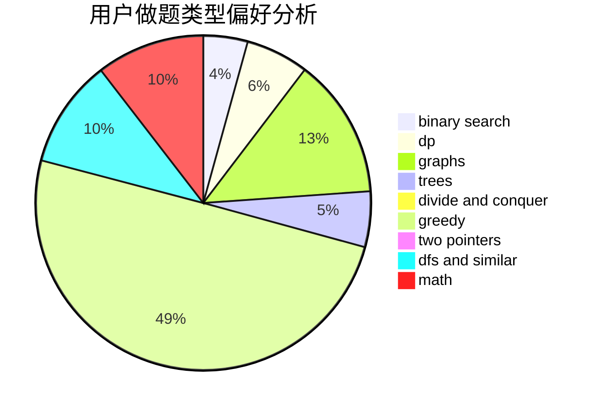

# richardjcy

<!-- tabs:start -->

#### **用户提交结果分析**

#### **用户做题类型偏好分析**

<!-- tabs:end -->
# 推荐题目
[771C](https://codeforces.com/contest/771/problem/C)
[98E](https://codeforces.com/contest/98/problem/E)
[762A](https://codeforces.com/contest/762/problem/A)
[886F](https://codeforces.com/contest/886/problem/F)
[1083F](https://codeforces.com/contest/1083/problem/F)
[906A](https://codeforces.com/contest/906/problem/A)
[903B](https://codeforces.com/contest/903/problem/B)
[954B](https://codeforces.com/contest/954/problem/B)
[898E](https://codeforces.com/contest/898/problem/E)
[313E](https://codeforces.com/contest/313/problem/E)
