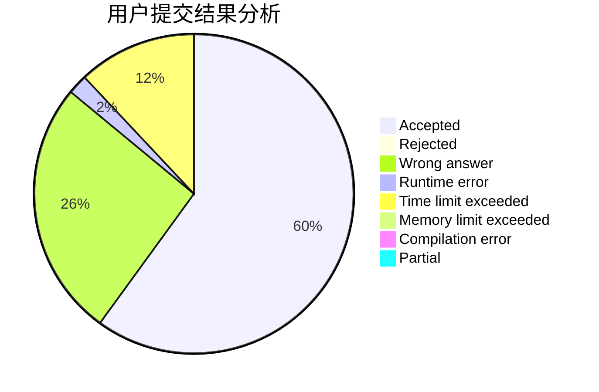
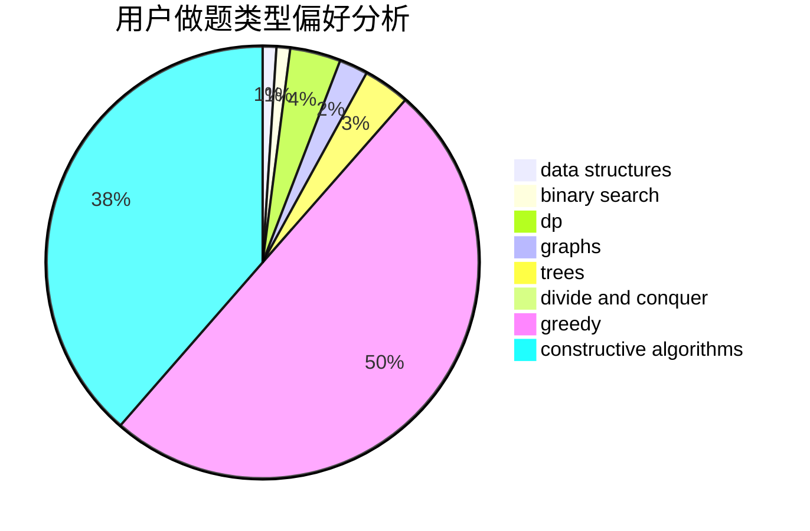
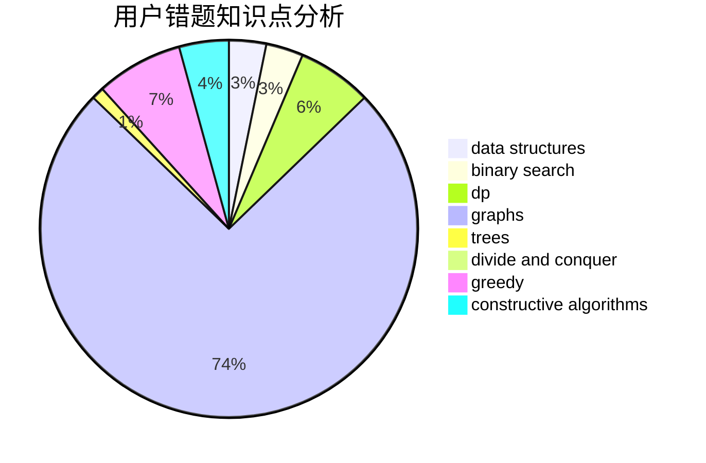

# richardjcy

<!-- tabs:start -->

#### **用户提交结果分析**

#### **用户做题类型偏好分析**

#### **用户错题知识点分析**

<!-- tabs:end -->
# 推荐题目
[771C](https://codeforces.com/contest/771/problem/C)		dfs and similar,
                        dp,
                        trees		  
[98E](https://codeforces.com/contest/98/problem/E)		dp,
                        games,
                        math,
                        probabilities		  
[762A](https://codeforces.com/contest/762/problem/A)		math,
                        number theory		  
[886F](https://codeforces.com/contest/886/problem/F)		geometry		  
[1083F](https://codeforces.com/contest/1083/problem/F)		data structures		  
[906A](https://codeforces.com/contest/906/problem/A)		implementation,
                        strings		  
[903B](https://codeforces.com/contest/903/problem/B)		greedy,
                        implementation		  
[954B](https://codeforces.com/contest/954/problem/B)		implementation,
                        strings		  
[898E](https://codeforces.com/contest/898/problem/E)		constructive algorithms,
                        greedy		  
[313E](https://codeforces.com/contest/313/problem/E)		constructive algorithms,
                        data structures,
                        dsu,
                        greedy		  
