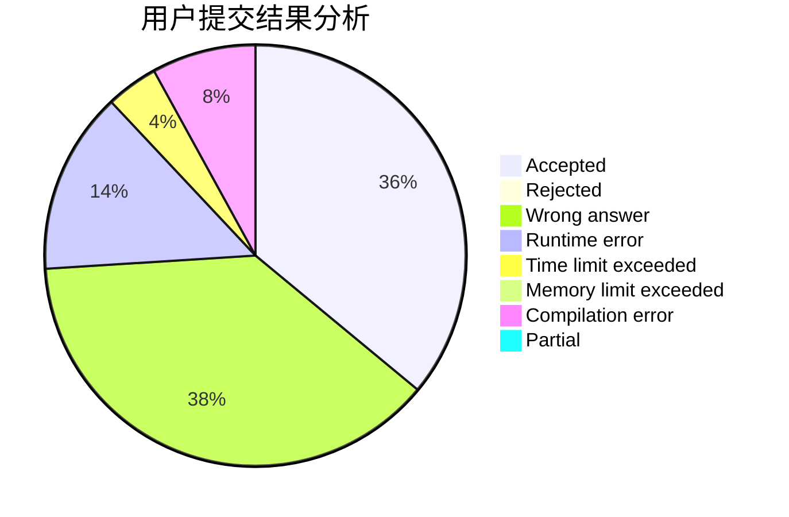
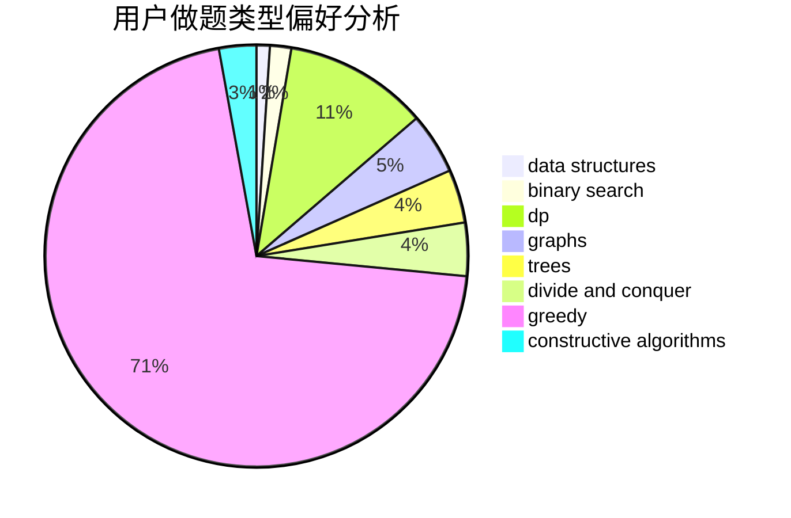
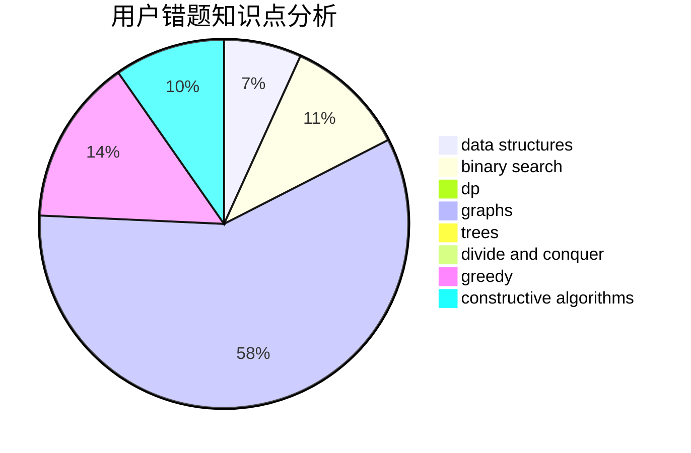

# rolling

<!-- tabs:start -->

#### **用户提交结果分析**

#### **用户做题类型偏好分析**

#### **用户错题知识点分析**

<!-- tabs:end -->
# 推荐题目
[180D](https://codeforces.com/contest/180/problem/D)		greedy,
                        strings		  
[171H](https://codeforces.com/contest/171/problem/H)		*special problem,
                        implementation		  
[914F](https://codeforces.com/contest/914/problem/F)		bitmasks,
                        brute force,
                        data structures,
                        string suffix structures,
                        strings		  
[859E](https://codeforces.com/contest/859/problem/E)		combinatorics,
                        dfs and similar,
                        dsu,
                        graphs,
                        trees		  
[851B](https://codeforces.com/contest/851/problem/B)		geometry,
                        math		  
[773D](https://codeforces.com/contest/773/problem/D)		dp,
                        graphs,
                        shortest paths		  
[1325A](https://codeforces.com/contest/1325/problem/A)		constructive algorithms,
                        greedy,
                        number theory		  
[1349F2](https://codeforces.com/contest/1349F/problem/2)		dp,
                        fft,
                        math		  
[891A](https://codeforces.com/contest/891/problem/A)		brute force,
                        dp,
                        greedy,
                        math,
                        number theory		  
[534F](https://codeforces.com/contest/534/problem/F)		bitmasks,
                        dp,
                        hashing,
                        meet-in-the-middle		  
