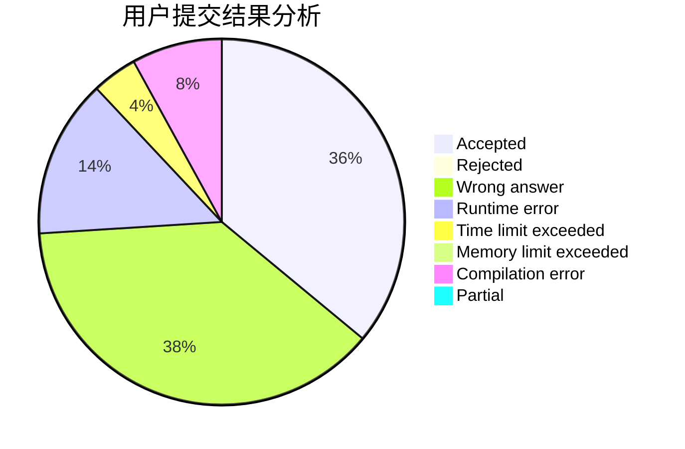
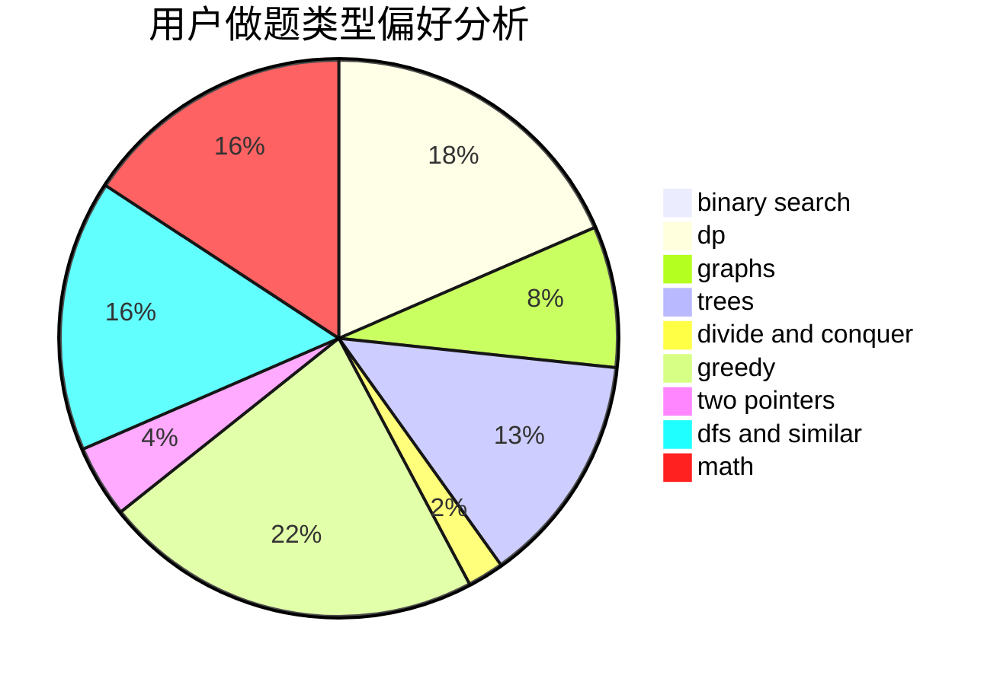

# rolling

<!-- tabs:start -->

#### **用户提交结果分析**

#### **用户做题类型偏好分析**

<!-- tabs:end -->
# 推荐题目
[208A](https://codeforces.com/contest/208/problem/A)
[19A](https://codeforces.com/contest/19/problem/A)
[934B](https://codeforces.com/contest/934/problem/B)
[877B](https://codeforces.com/contest/877/problem/B)
[86C](https://codeforces.com/contest/86/problem/C)
[792D](https://codeforces.com/contest/792/problem/D)
[1331E](https://codeforces.com/contest/1331/problem/E)
[13572](https://codeforces.com/contest/1357/problem/2)
[909E](https://codeforces.com/contest/909/problem/E)
[557B](https://codeforces.com/contest/557/problem/B)
