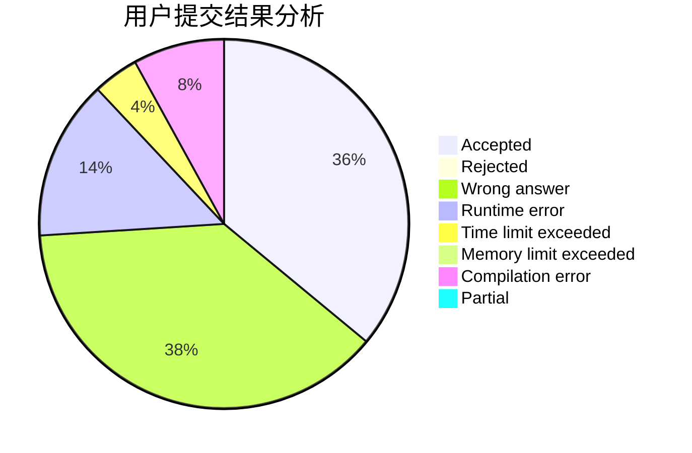
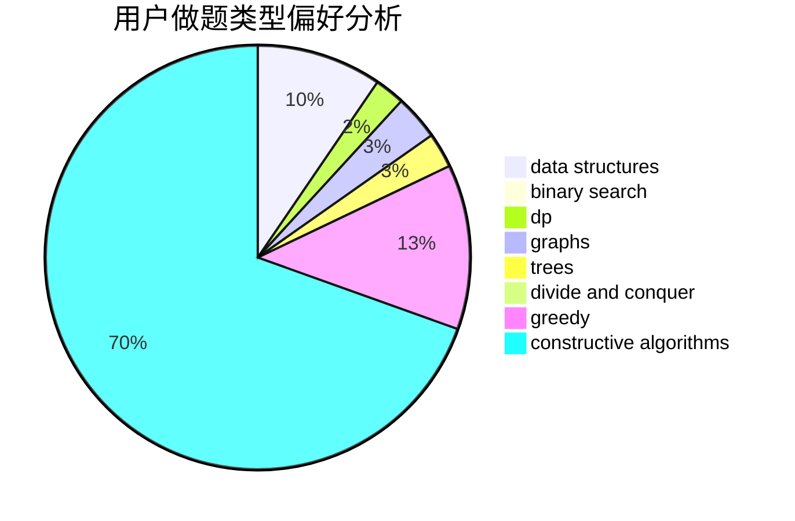
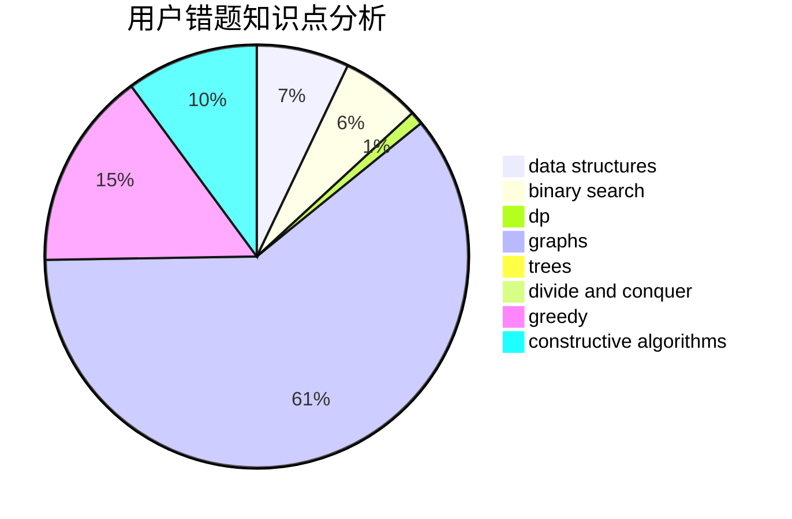

# rolling

<!-- tabs:start -->

#### **用户提交结果分析**

#### **用户做题类型偏好分析**

#### **用户错题知识点分析**

<!-- tabs:end -->
# 推荐题目
[208A](https://codeforces.com/contest/208/problem/A)		strings		  
[19A](https://codeforces.com/contest/19/problem/A)		implementation		  
[934B](https://codeforces.com/contest/934/problem/B)		constructive algorithms,
                        implementation		  
[877B](https://codeforces.com/contest/877/problem/B)		brute force,
                        dp		  
[86C](https://codeforces.com/contest/86/problem/C)		dp,
                        string suffix structures,
                        trees		  
[792D](https://codeforces.com/contest/792/problem/D)		bitmasks,
                        trees		  
[1331E](https://codeforces.com/contest/1331/problem/E)		dfs and similar,
                        geometry,
                        implementation		  
[13572](https://codeforces.com/contest/1357/problem/2)		dsu,graphs,sortings,trees		  
[909E](https://codeforces.com/contest/909/problem/E)		dfs and similar,
                        dp,
                        graphs,
                        greedy		  
[557B](https://codeforces.com/contest/557/problem/B)		constructive algorithms,
                        implementation,
                        math,
                        sortings		  
