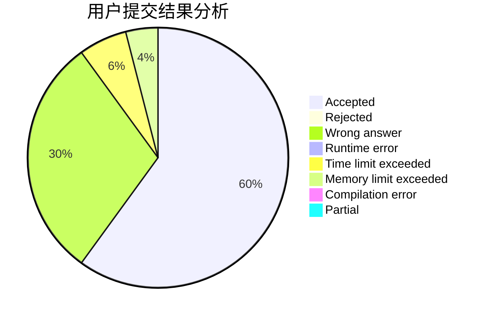
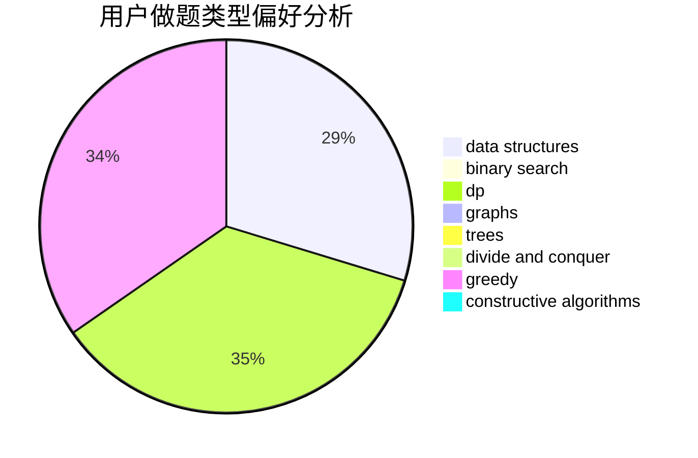

# rong_nian

<!-- tabs:start -->

#### **用户提交结果分析**

#### **用户做题类型偏好分析**

#### **用户错题知识点分析**

<!-- tabs:end -->
# 推荐题目
[1513C](https://codeforces.com/contest/1513/problem/C)		dp,
                        matrices		  
[1322C](https://codeforces.com/contest/1322/problem/C)		graphs,
                        hashing,
                        math,
                        number theory		  
[441E](https://codeforces.com/contest/441/problem/E)		bitmasks,
                        dp,
                        math,
                        probabilities		  
[845E](https://codeforces.com/contest/845/problem/E)		binary search,
                        data structures		  
[668A](https://codeforces.com/contest/668/problem/A)		dsu,graphs,sortings,trees		  
[272E](https://codeforces.com/contest/272/problem/E)		combinatorics,
                        constructive algorithms,
                        graphs		  
[25B](https://codeforces.com/contest/25/problem/B)		implementation		  
[984B](https://codeforces.com/contest/984/problem/B)		implementation		  
[1016G](https://codeforces.com/contest/1016/problem/G)		bitmasks,
                        math,
                        number theory		  
[605D](https://codeforces.com/contest/605/problem/D)		data structures,
                        dfs and similar		  
