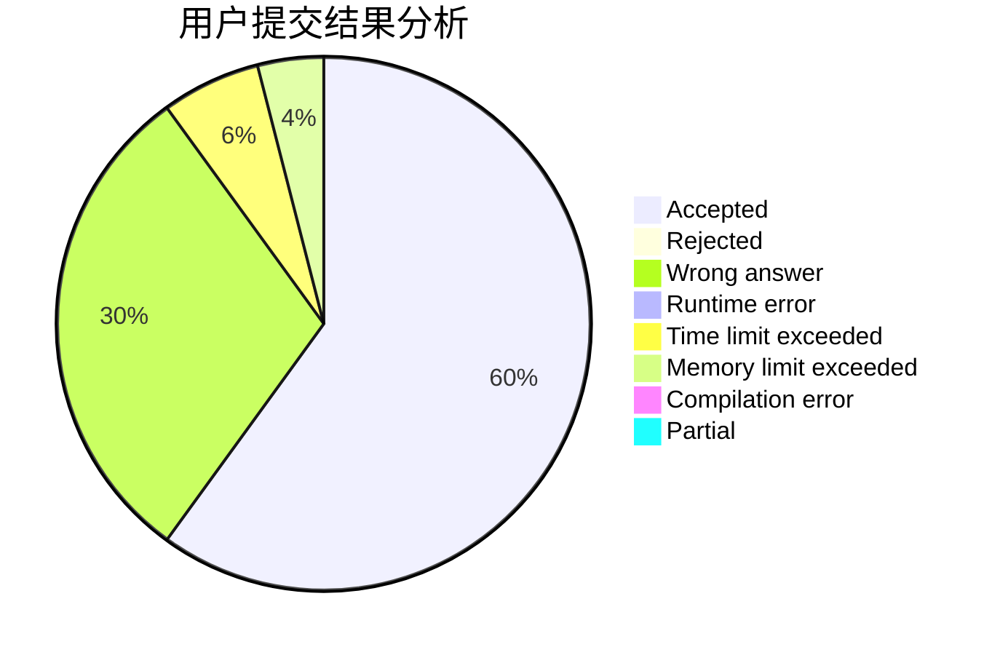
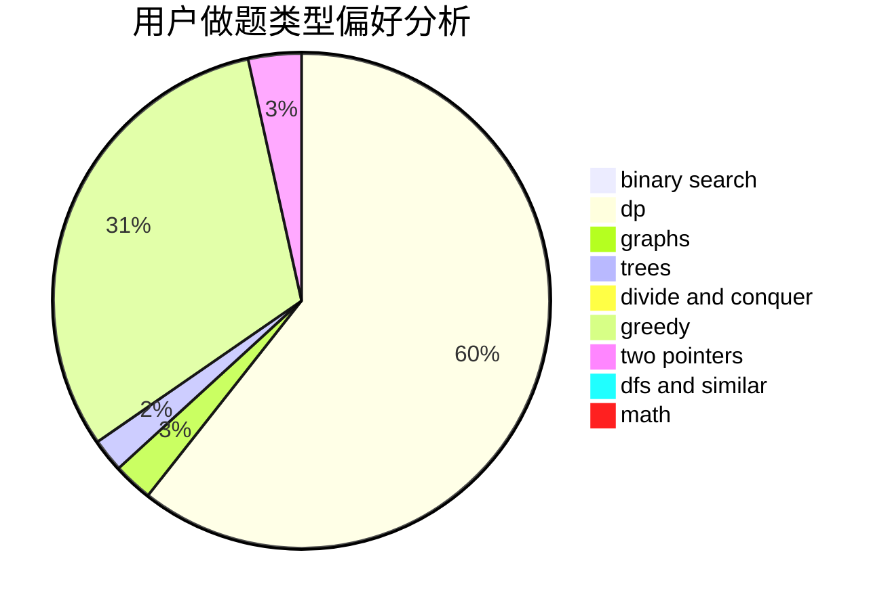

# rong_nian

<!-- tabs:start -->

#### **用户提交结果分析**

#### **用户做题类型偏好分析**

<!-- tabs:end -->
# 推荐题目
[1513C](https://codeforces.com/contest/1513/problem/C)
[1322C](https://codeforces.com/contest/1322/problem/C)
[441E](https://codeforces.com/contest/441/problem/E)
[845E](https://codeforces.com/contest/845/problem/E)
[668A](https://codeforces.com/contest/668/problem/A)
[272E](https://codeforces.com/contest/272/problem/E)
[25B](https://codeforces.com/contest/25/problem/B)
[984B](https://codeforces.com/contest/984/problem/B)
[1016G](https://codeforces.com/contest/1016/problem/G)
[605D](https://codeforces.com/contest/605/problem/D)
