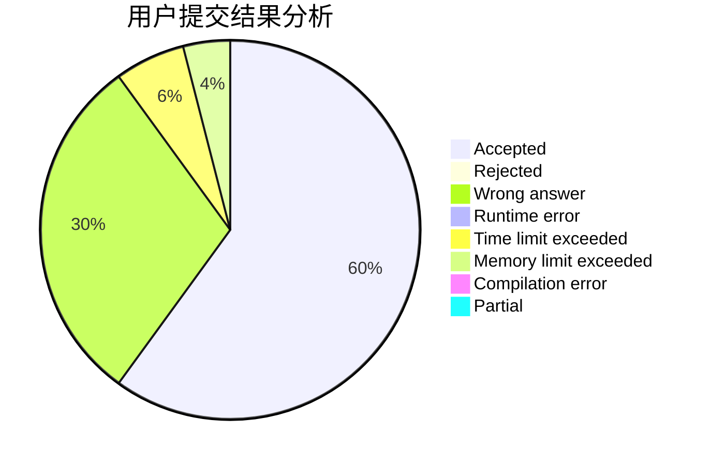
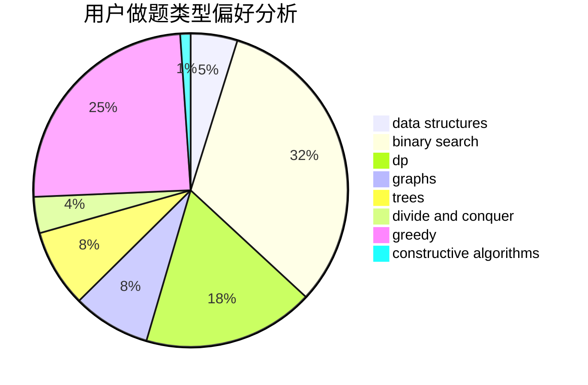
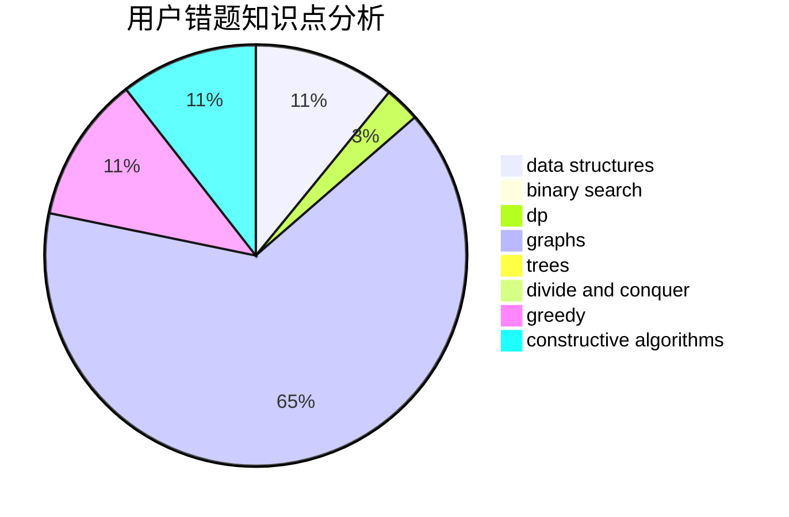

# rong_nian

<!-- tabs:start -->

#### **用户提交结果分析**

#### **用户做题类型偏好分析**

#### **用户错题知识点分析**

<!-- tabs:end -->
# 推荐题目
[1504D](https://codeforces.com/contest/1504/problem/D)		dsu,graphs,sortings,trees		  
[1312G](https://codeforces.com/contest/1312/problem/G)		data structures,
                        dfs and similar,
                        dp		  
[416E](https://codeforces.com/contest/416/problem/E)		dp,
                        graphs,
                        shortest paths		  
[827B](https://codeforces.com/contest/827/problem/B)		constructive algorithms,
                        greedy,
                        implementation,
                        trees		  
[637B](https://codeforces.com/contest/637/problem/B)		*special problem,
                        binary search,
                        constructive algorithms,
                        data structures,
                        sortings		  
[254C](https://codeforces.com/contest/254/problem/C)		greedy,
                        strings		  
[237A](https://codeforces.com/contest/237/problem/A)		implementation		  
[961F](https://codeforces.com/contest/961/problem/F)		binary search,
                        hashing,
                        string suffix structures		  
[1016D](https://codeforces.com/contest/1016/problem/D)		constructive algorithms,
                        flows,
                        math		  
[585C](https://codeforces.com/contest/585/problem/C)		number theory		  
