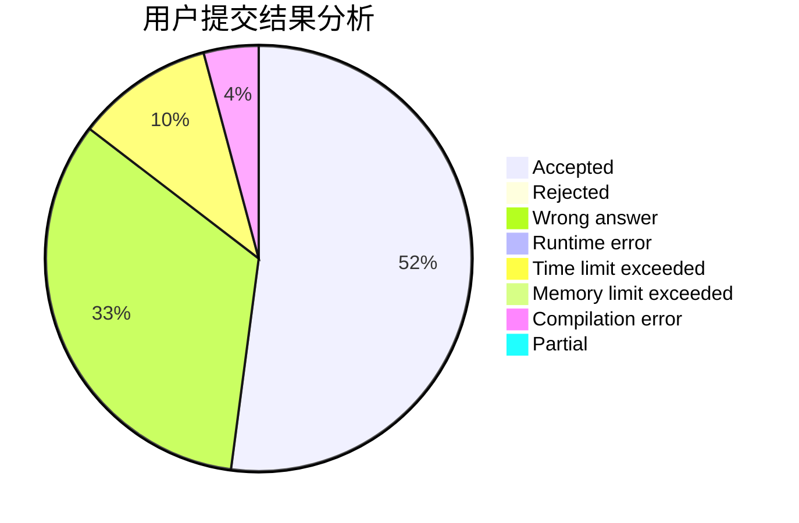
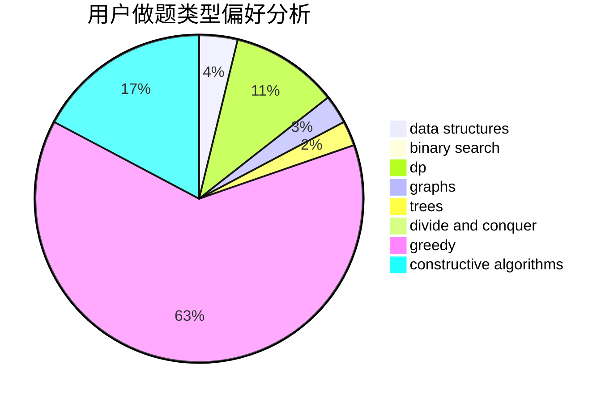
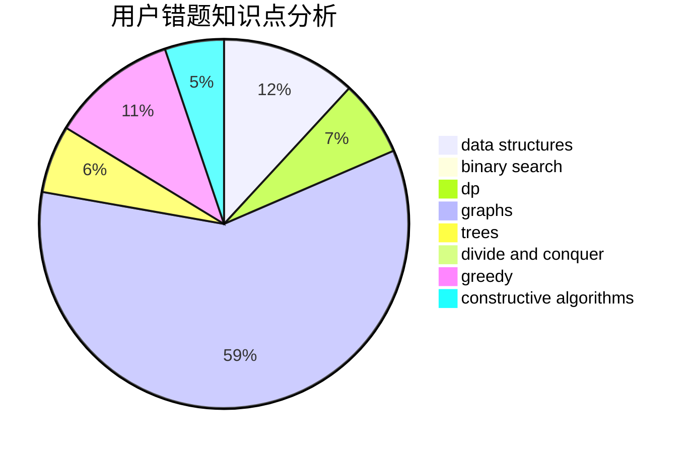

# royo_sea

<!-- tabs:start -->

#### **用户提交结果分析**

#### **用户做题类型偏好分析**

#### **用户错题知识点分析**

<!-- tabs:end -->
# 推荐题目
[1352B](https://codeforces.com/contest/1352/problem/B)		constructive algorithms,
                        math		  
[165C](https://codeforces.com/contest/165/problem/C)		binary search,
                        brute force,
                        dp,
                        math,
                        strings,
                        two pointers		  
[1370B](https://codeforces.com/contest/1370/problem/B)		constructive algorithms,
                        math,
                        number theory		  
[1271C](https://codeforces.com/contest/1271/problem/C)		brute force,
                        geometry,
                        greedy,
                        implementation		  
[797D](https://codeforces.com/contest/797/problem/D)		data structures,
                        dfs and similar		  
[293E](https://codeforces.com/contest/293/problem/E)		data structures,
                        divide and conquer,
                        trees		  
[964C](https://codeforces.com/contest/964/problem/C)		dsu,graphs,sortings,trees		  
[1017B](https://codeforces.com/contest/1017/problem/B)		implementation,
                        math		  
[611A](https://codeforces.com/contest/611/problem/A)		implementation		  
[672A](https://codeforces.com/contest/672/problem/A)		implementation		  
