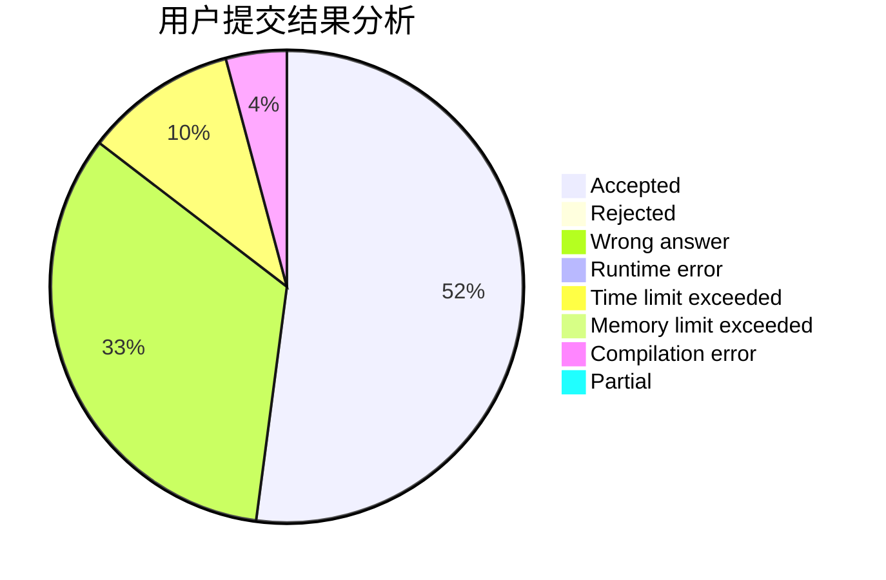
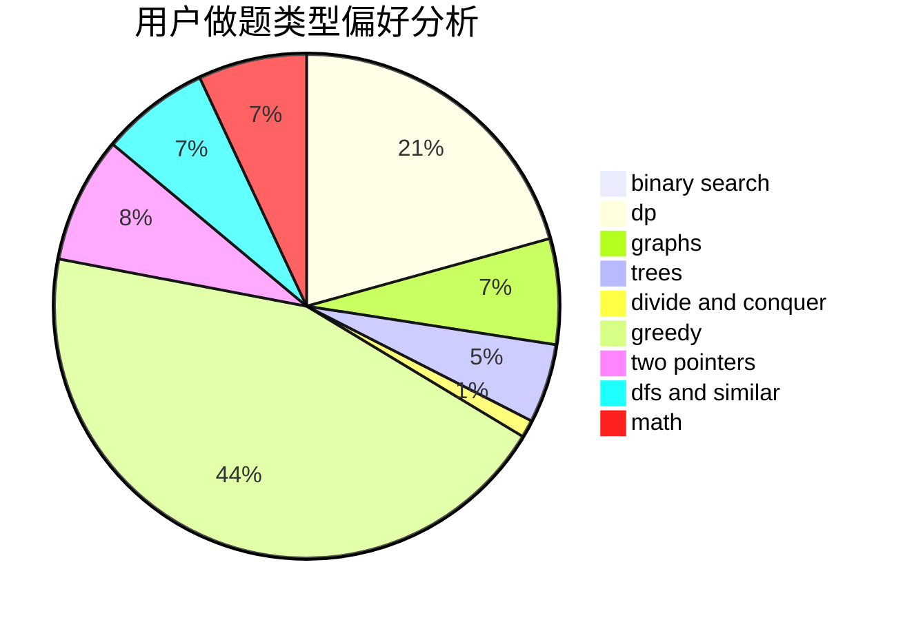

# royo_sea

<!-- tabs:start -->

#### **用户提交结果分析**

#### **用户做题类型偏好分析**

<!-- tabs:end -->
# 推荐题目
[1358F](https://codeforces.com/contest/1358/problem/F)
[18E](https://codeforces.com/contest/18/problem/E)
[13791](https://codeforces.com/contest/1379/problem/1)
[1280E](https://codeforces.com/contest/1280/problem/E)
[811C](https://codeforces.com/contest/811/problem/C)
[30B](https://codeforces.com/contest/30/problem/B)
[986F](https://codeforces.com/contest/986/problem/F)
[1017E](https://codeforces.com/contest/1017/problem/E)
[630A](https://codeforces.com/contest/630/problem/A)
[698B](https://codeforces.com/contest/698/problem/B)
