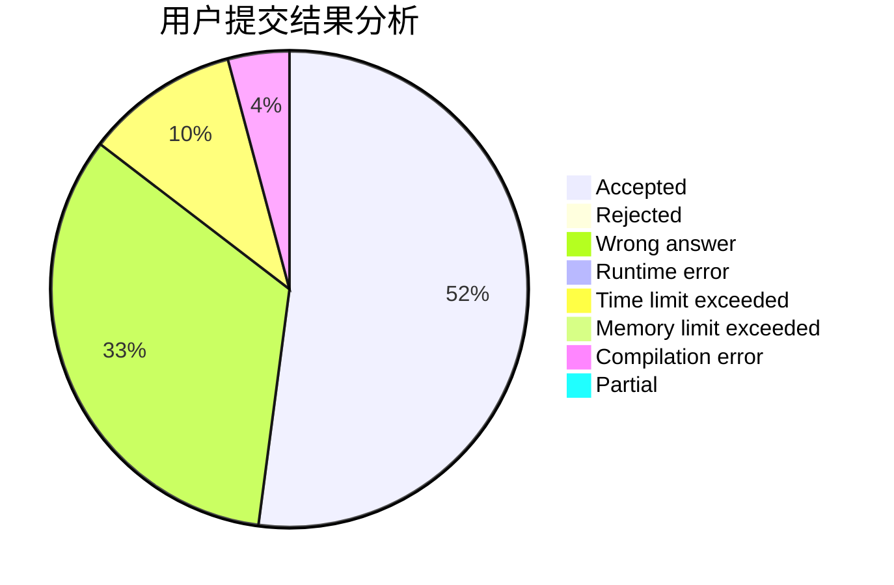
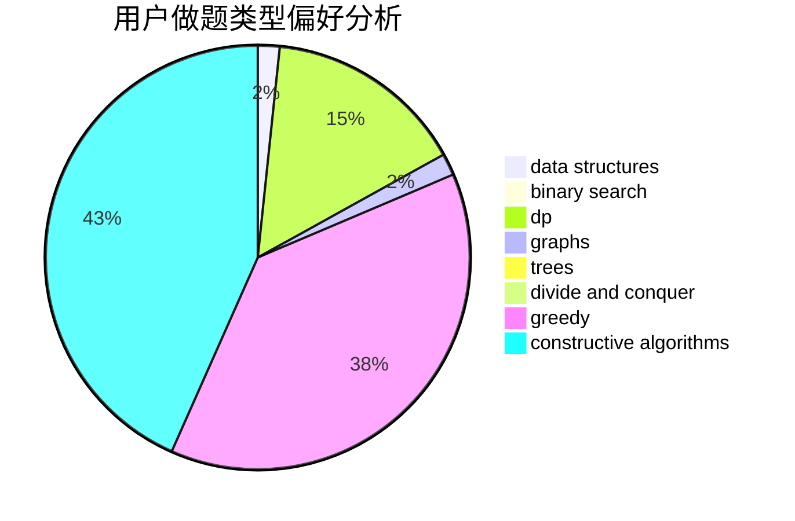
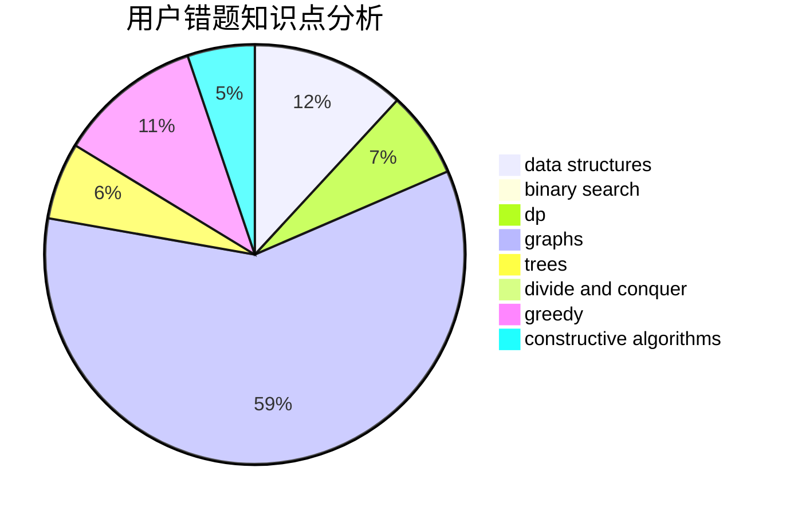

# royo_sea

<!-- tabs:start -->

#### **用户提交结果分析**

#### **用户做题类型偏好分析**

#### **用户错题知识点分析**

<!-- tabs:end -->
# 推荐题目
[1358F](https://codeforces.com/contest/1358/problem/F)		binary search,
                        constructive algorithms,
                        greedy,
                        implementation		  
[18E](https://codeforces.com/contest/18/problem/E)		dp		  
[13791](https://codeforces.com/contest/1379/problem/1)		dsu,graphs,sortings,trees		  
[1280E](https://codeforces.com/contest/1280/problem/E)		math		  
[811C](https://codeforces.com/contest/811/problem/C)		dp,
                        implementation		  
[30B](https://codeforces.com/contest/30/problem/B)		implementation		  
[986F](https://codeforces.com/contest/986/problem/F)		graphs,
                        math,
                        number theory,
                        shortest paths		  
[1017E](https://codeforces.com/contest/1017/problem/E)		geometry,
                        hashing,
                        strings		  
[630A](https://codeforces.com/contest/630/problem/A)		number theory		  
[698B](https://codeforces.com/contest/698/problem/B)		constructive algorithms,
                        dfs and similar,
                        dsu,
                        graphs,
                        trees		  
