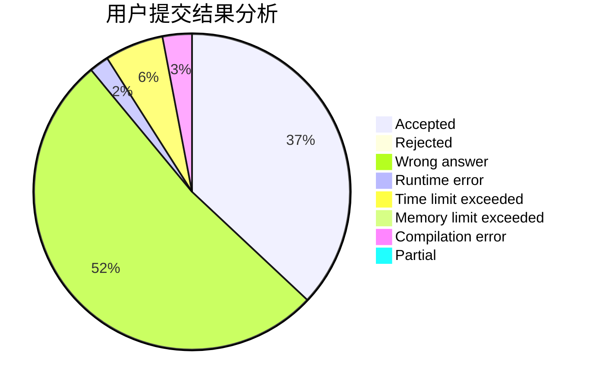
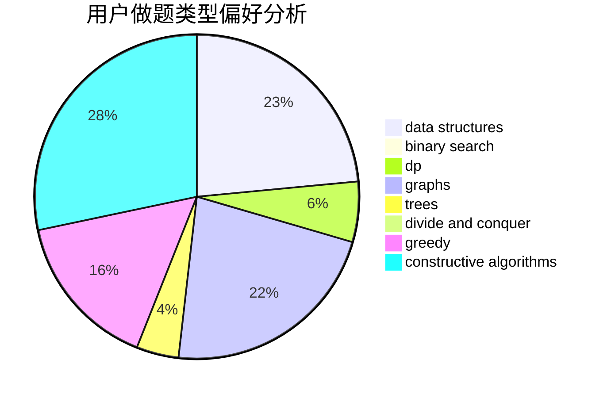
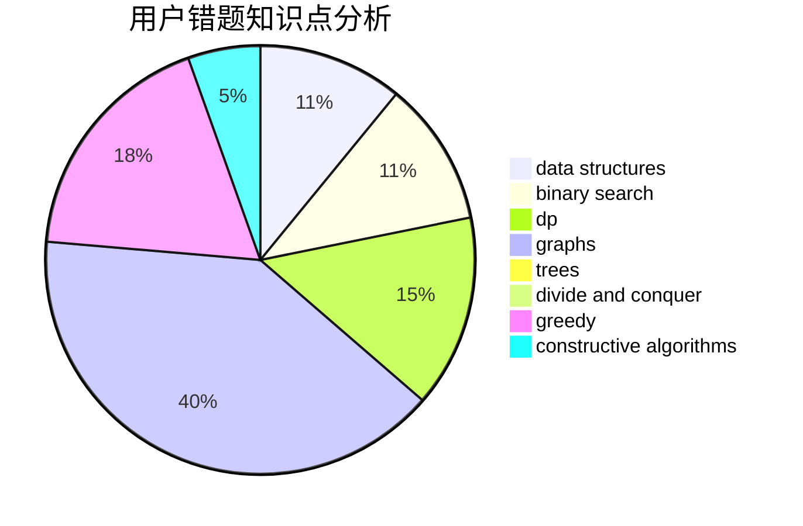

# rqbqbqb

<!-- tabs:start -->

#### **用户提交结果分析**

#### **用户做题类型偏好分析**

#### **用户错题知识点分析**

<!-- tabs:end -->
# 推荐题目
[77B](https://codeforces.com/contest/77/problem/B)		math,
                        probabilities		  
[1161B](https://codeforces.com/contest/1161/problem/B)		dsu,graphs,sortings,trees		  
[339A](https://codeforces.com/contest/339/problem/A)		greedy,
                        implementation,
                        sortings,
                        strings		  
[1077A](https://codeforces.com/contest/1077/problem/A)		math		  
[9B](https://codeforces.com/contest/9/problem/B)		brute force,
                        geometry,
                        implementation		  
[1344B](https://codeforces.com/contest/1344/problem/B)		constructive algorithms,
                        dfs and similar,
                        dsu,
                        graphs		  
[1418D](https://codeforces.com/contest/1418/problem/D)		data structures,
                        implementation		  
[1432A](https://codeforces.com/contest/1432/problem/A)		dsu,graphs,sortings,trees		  
[1239E](https://codeforces.com/contest/1239/problem/E)		dp,
                        implementation		  
[1174D](https://codeforces.com/contest/1174/problem/D)		bitmasks,
                        constructive algorithms		  
