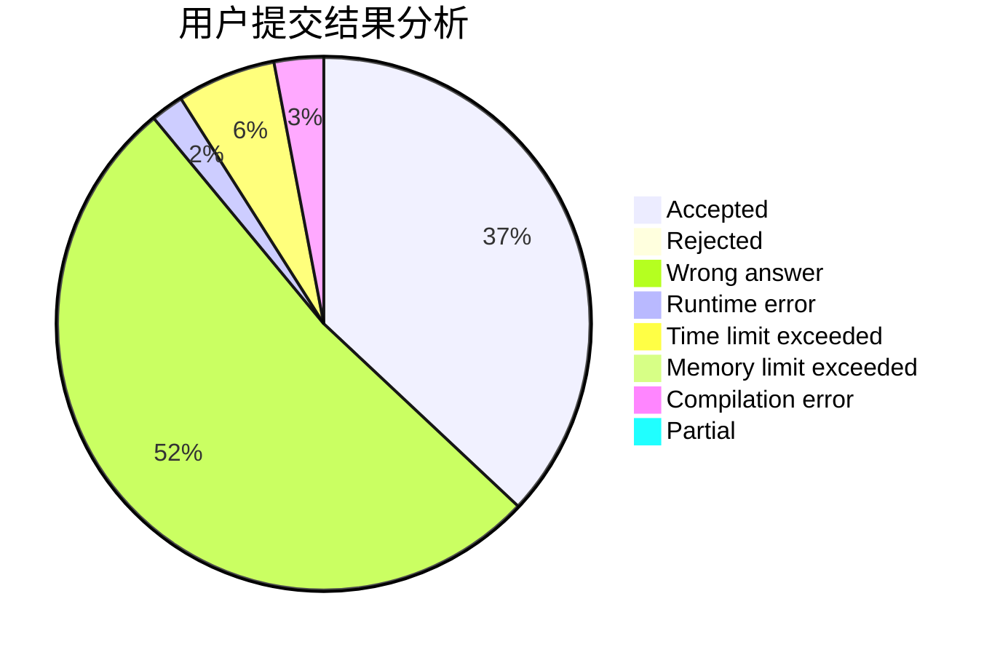
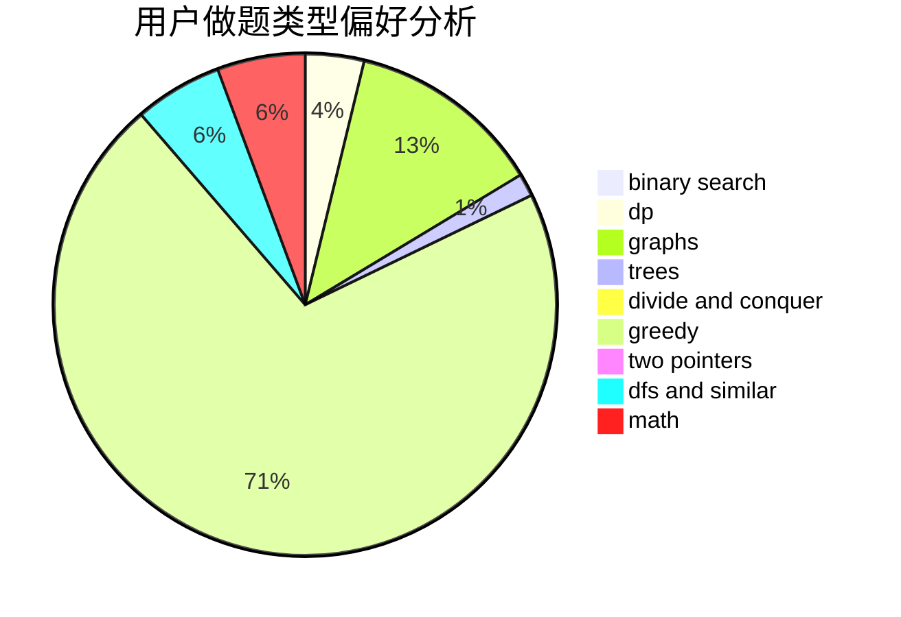

# rqbqbqb

<!-- tabs:start -->

#### **用户提交结果分析**

#### **用户做题类型偏好分析**

<!-- tabs:end -->
# 推荐题目
[77B](https://codeforces.com/contest/77/problem/B)
[1161B](https://codeforces.com/contest/1161/problem/B)
[339A](https://codeforces.com/contest/339/problem/A)
[1077A](https://codeforces.com/contest/1077/problem/A)
[9B](https://codeforces.com/contest/9/problem/B)
[1344B](https://codeforces.com/contest/1344/problem/B)
[1418D](https://codeforces.com/contest/1418/problem/D)
[1432A](https://codeforces.com/contest/1432/problem/A)
[1239E](https://codeforces.com/contest/1239/problem/E)
[1174D](https://codeforces.com/contest/1174/problem/D)
