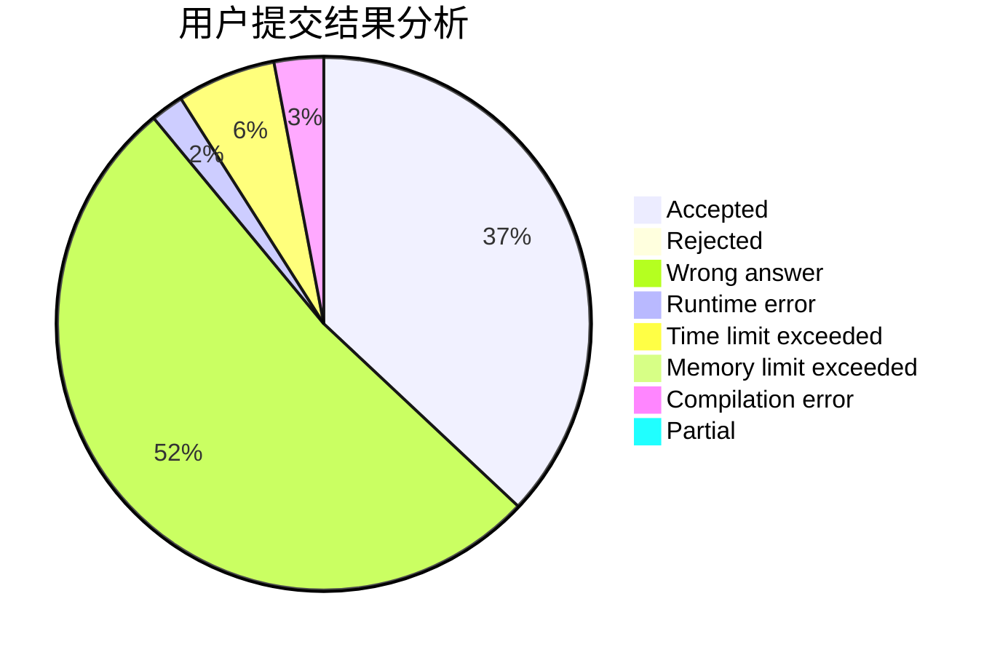
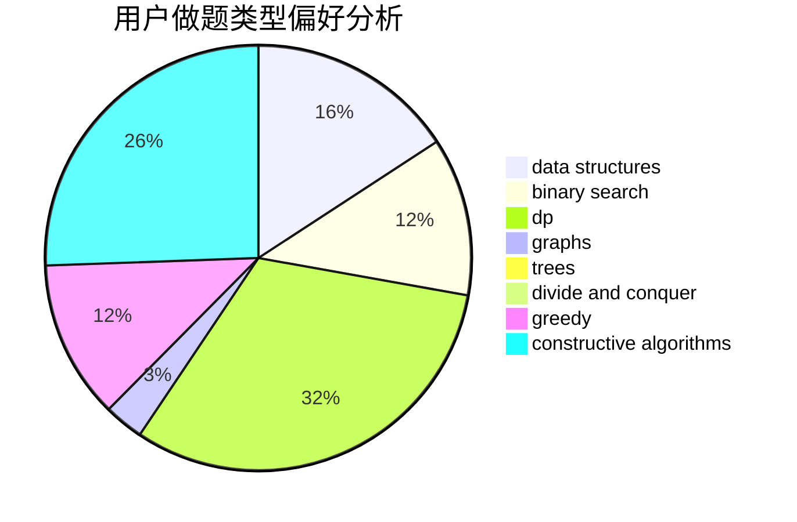
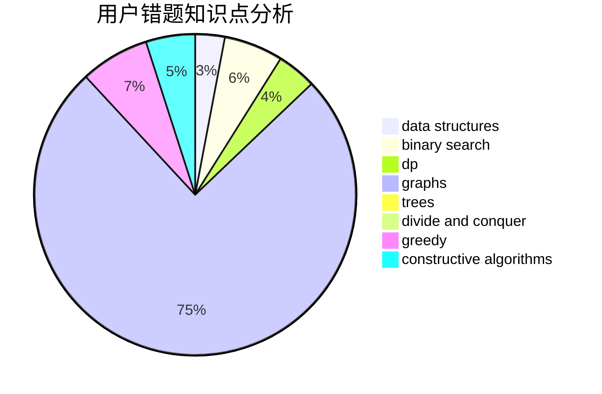

# rqbqbqb

<!-- tabs:start -->

#### **用户提交结果分析**

#### **用户做题类型偏好分析**

#### **用户错题知识点分析**

<!-- tabs:end -->
# 推荐题目
[75D](https://codeforces.com/contest/75/problem/D)		data structures,
                        dp,
                        greedy,
                        implementation,
                        math,
                        trees		  
[1158C](https://codeforces.com/contest/1158/problem/C)		constructive algorithms,
                        data structures,
                        dfs and similar,
                        graphs,
                        greedy,
                        math,
                        sortings		  
[314B](https://codeforces.com/contest/314/problem/B)		binary search,
                        dfs and similar,
                        strings		  
[1076F](https://codeforces.com/contest/1076/problem/F)		dp,
                        greedy		  
[985B](https://codeforces.com/contest/985/problem/B)		implementation		  
[1336F](https://codeforces.com/contest/1336/problem/F)		data structures,
                        divide and conquer,
                        graphs,
                        trees		  
[1407E](https://codeforces.com/contest/1407/problem/E)		constructive algorithms,
                        dfs and similar,
                        dp,
                        graphs,
                        greedy,
                        shortest paths		  
[1423K](https://codeforces.com/contest/1423/problem/K)		binary search,
                        math,
                        number theory,
                        two pointers		  
[1234A](https://codeforces.com/contest/1234/problem/A)		math		  
[1172B](https://codeforces.com/contest/1172/problem/B)		combinatorics,
                        dfs and similar,
                        dp,
                        trees		  
