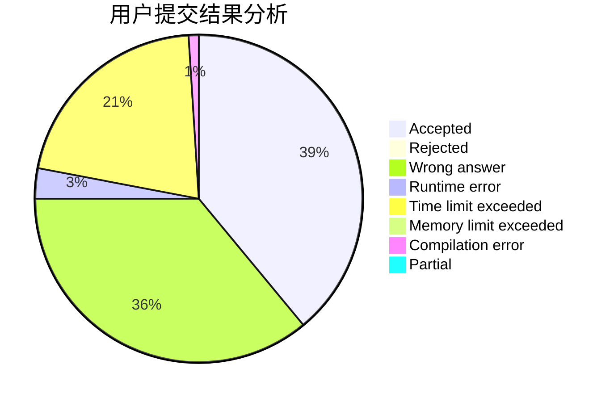
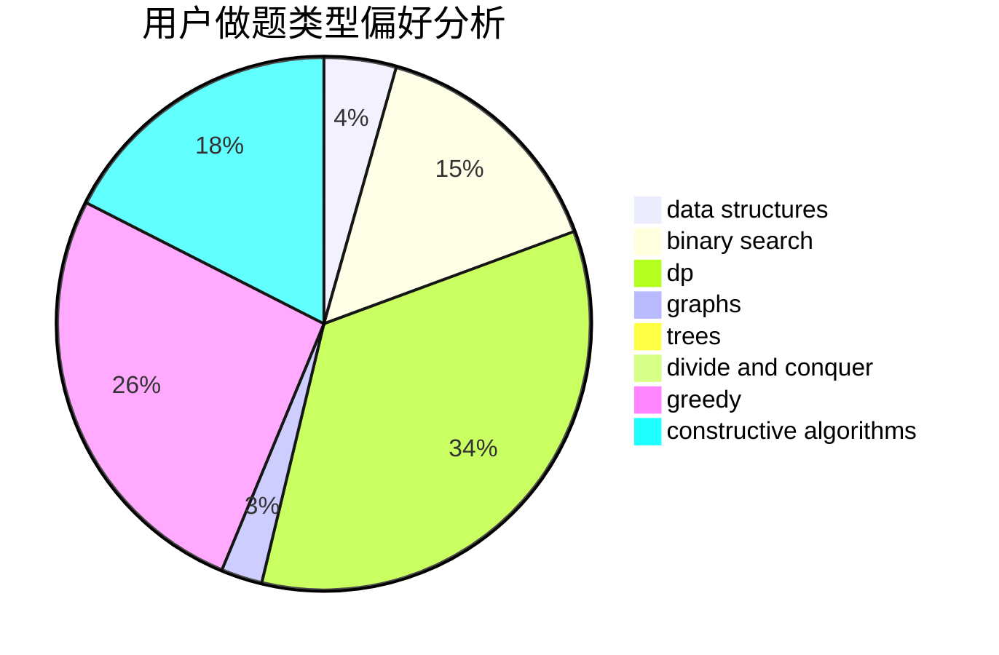
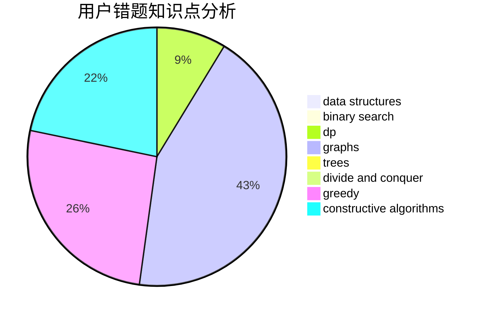

# rqdmap

<!-- tabs:start -->

#### **用户提交结果分析**

#### **用户做题类型偏好分析**

#### **用户错题知识点分析**

<!-- tabs:end -->
# 推荐题目
[1091D](https://codeforces.com/contest/1091/problem/D)		combinatorics,
                        dp,
                        math		  
[1229C](https://codeforces.com/contest/1229/problem/C)		dsu,graphs,sortings,trees		  
[44E](https://codeforces.com/contest/44/problem/E)		dp		  
[825D](https://codeforces.com/contest/825/problem/D)		binary search,
                        greedy,
                        implementation		  
[1393E2](https://codeforces.com/contest/1393E/problem/2)		dp,
                        hashing,
                        implementation,
                        string suffix structures,
                        strings,
                        two pointers		  
[1020E](https://codeforces.com/contest/1020/problem/E)		dsu,graphs,sortings,trees		  
[1146A](https://codeforces.com/contest/1146/problem/A)		implementation,
                        strings		  
[527E](https://codeforces.com/contest/527/problem/E)		dfs and similar,
                        graphs		  
[475A](https://codeforces.com/contest/475/problem/A)		implementation		  
[327A](https://codeforces.com/contest/327/problem/A)		brute force,
                        dp,
                        implementation		  
