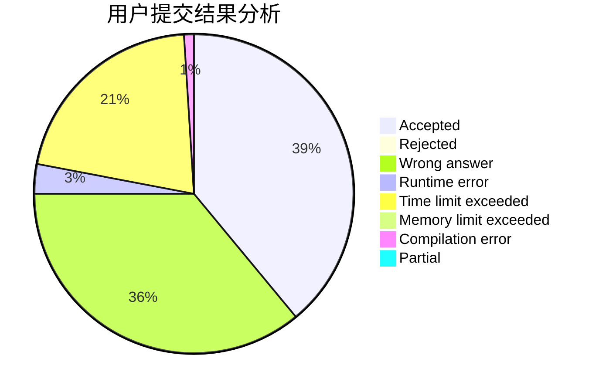
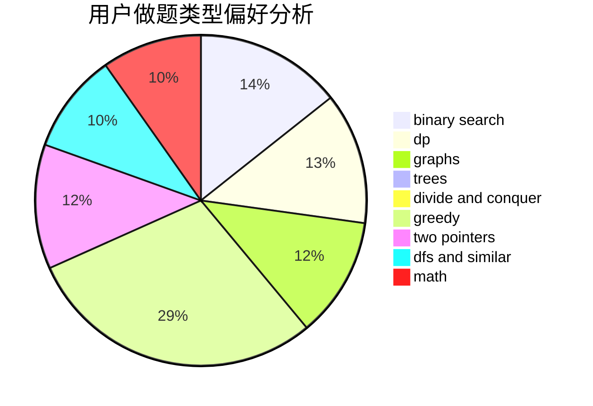

# rqdmap

<!-- tabs:start -->

#### **用户提交结果分析**

#### **用户做题类型偏好分析**

<!-- tabs:end -->
# 推荐题目
[1091G](https://codeforces.com/contest/1091/problem/G)
[1237G](https://codeforces.com/contest/1237/problem/G)
[471D](https://codeforces.com/contest/471/problem/D)
[844A](https://codeforces.com/contest/844/problem/A)
[1401E](https://codeforces.com/contest/1401/problem/E)
[1023C](https://codeforces.com/contest/1023/problem/C)
[1148A](https://codeforces.com/contest/1148/problem/A)
[551E](https://codeforces.com/contest/551/problem/E)
[494A](https://codeforces.com/contest/494/problem/A)
[356B](https://codeforces.com/contest/356/problem/B)
