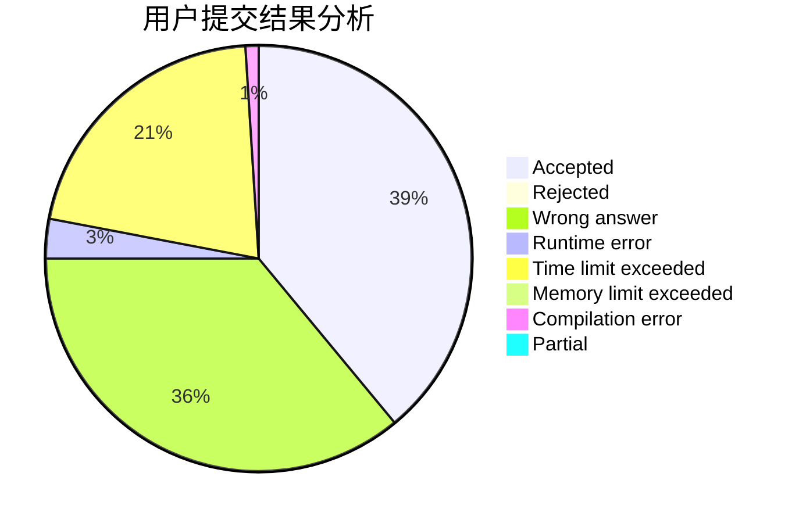
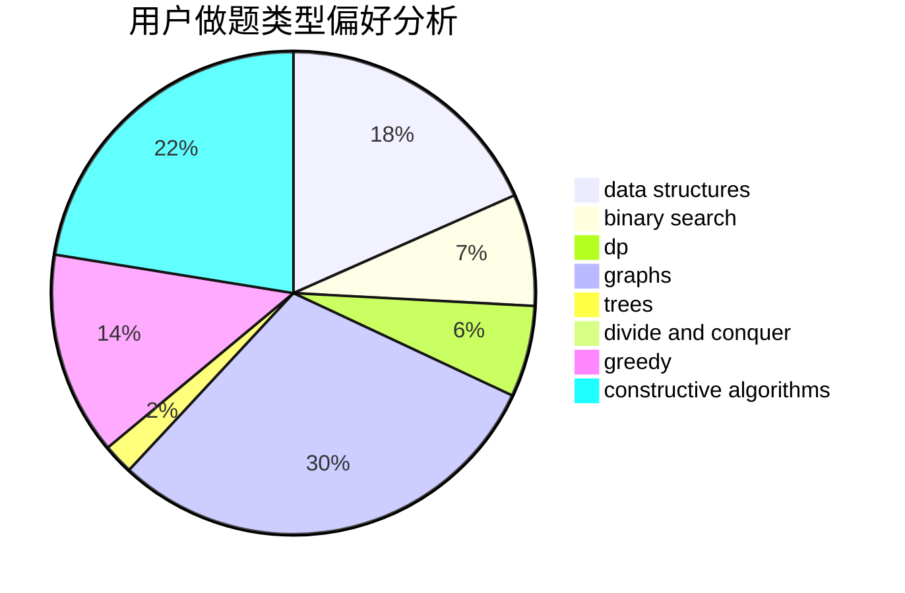

# rqdmap

<!-- tabs:start -->

#### **用户提交结果分析**

#### **用户做题类型偏好分析**

#### **用户错题知识点分析**

<!-- tabs:end -->
# 推荐题目
[1091G](https://codeforces.com/contest/1091/problem/G)		interactive,
                        math,
                        number theory		  
[1237G](https://codeforces.com/contest/1237/problem/G)		data structures,
                        dp,
                        greedy		  
[471D](https://codeforces.com/contest/471/problem/D)		string suffix structures,
                        strings		  
[844A](https://codeforces.com/contest/844/problem/A)		greedy,
                        implementation,
                        strings		  
[1401E](https://codeforces.com/contest/1401/problem/E)		data structures,
                        geometry,
                        implementation,
                        sortings		  
[1023C](https://codeforces.com/contest/1023/problem/C)		greedy		  
[1148A](https://codeforces.com/contest/1148/problem/A)		greedy		  
[551E](https://codeforces.com/contest/551/problem/E)		binary search,
                        data structures,
                        implementation		  
[494A](https://codeforces.com/contest/494/problem/A)		greedy		  
[356B](https://codeforces.com/contest/356/problem/B)		implementation,
                        math		  
