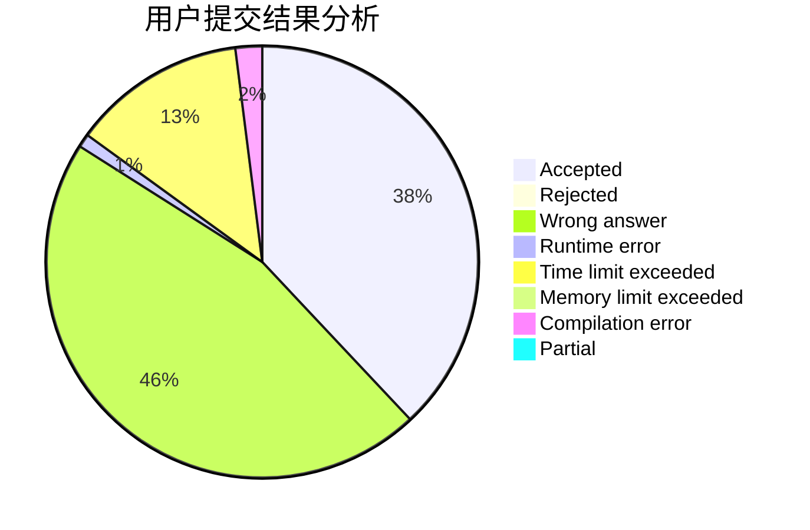
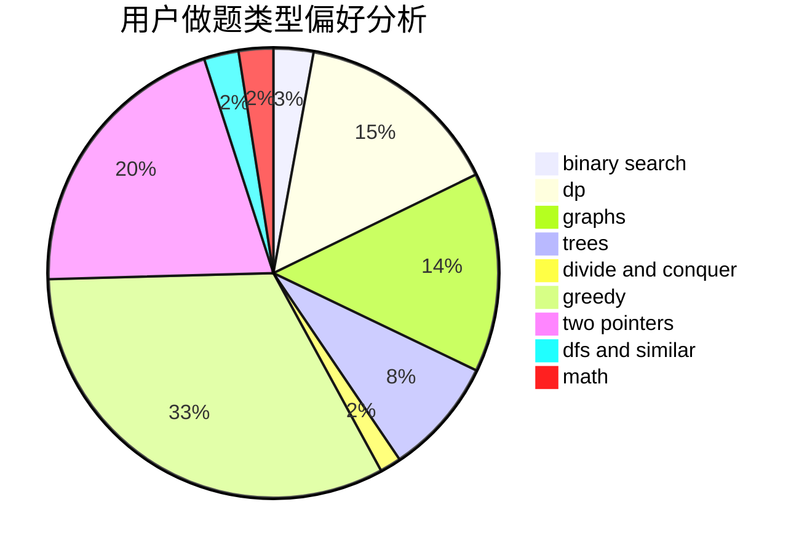

# rsj

<!-- tabs:start -->

#### **用户提交结果分析**

#### **用户做题类型偏好分析**

<!-- tabs:end -->
# 推荐题目
[1489B](https://codeforces.com/contest/1489/problem/B)
[746G](https://codeforces.com/contest/746/problem/G)
[1314E](https://codeforces.com/contest/1314/problem/E)
[962B](https://codeforces.com/contest/962/problem/B)
[152E](https://codeforces.com/contest/152/problem/E)
[1141E](https://codeforces.com/contest/1141/problem/E)
[813F](https://codeforces.com/contest/813/problem/F)
[1030G](https://codeforces.com/contest/1030/problem/G)
[1173A](https://codeforces.com/contest/1173/problem/A)
[724F](https://codeforces.com/contest/724/problem/F)
