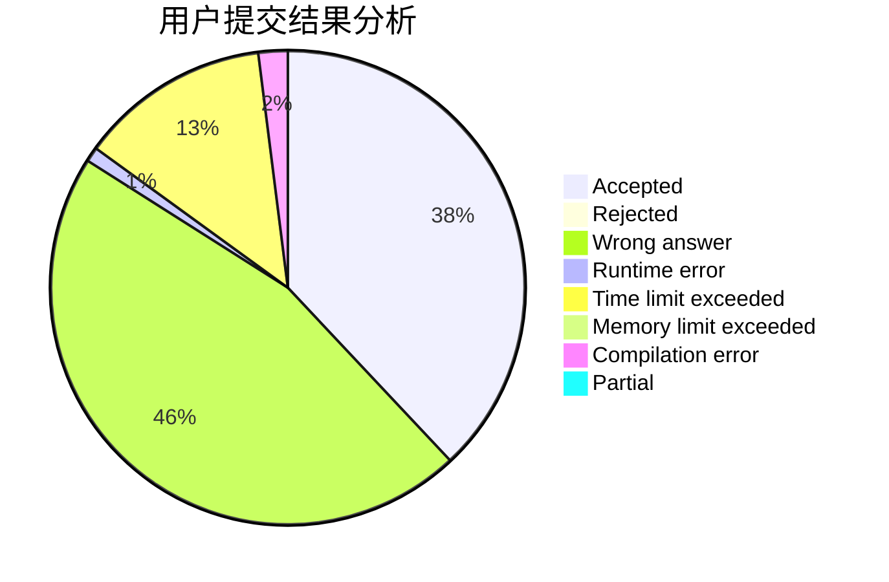
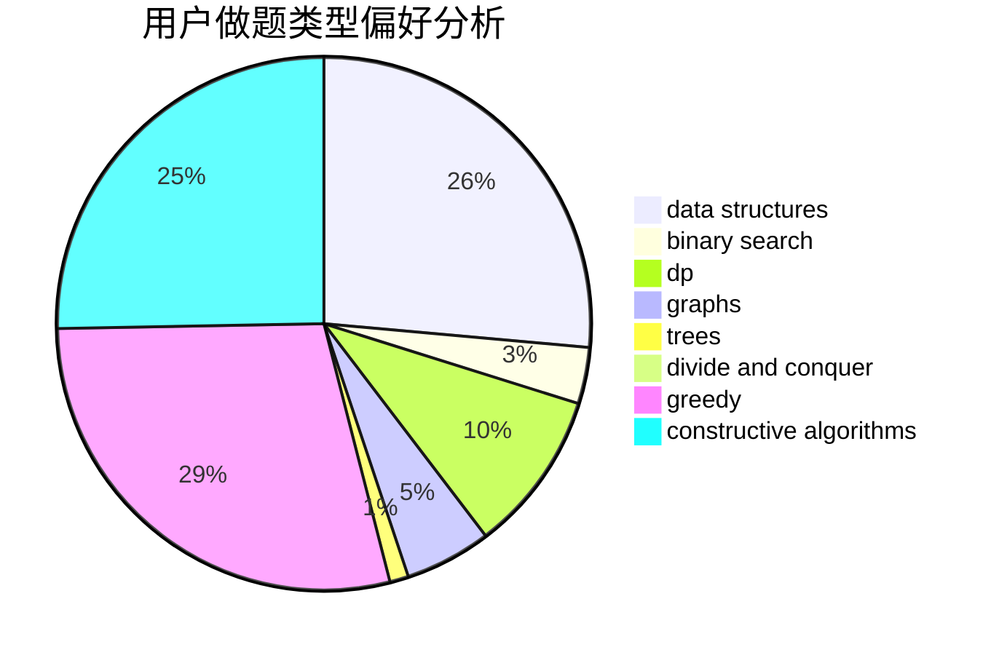
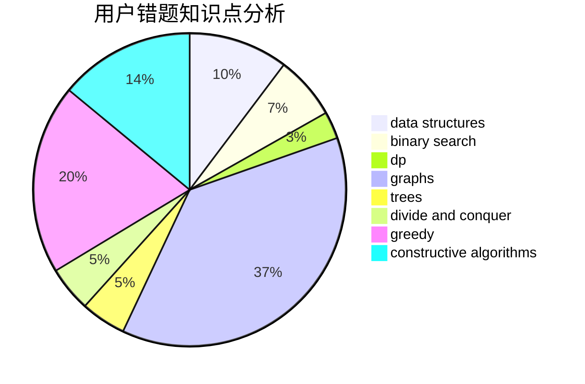

# rsj

<!-- tabs:start -->

#### **用户提交结果分析**

#### **用户做题类型偏好分析**

#### **用户错题知识点分析**

<!-- tabs:end -->
# 推荐题目
[1489B](https://codeforces.com/contest/1489/problem/B)		dsu,graphs,sortings,trees		  
[746G](https://codeforces.com/contest/746/problem/G)		constructive algorithms,
                        graphs,
                        trees		  
[1314E](https://codeforces.com/contest/1314/problem/E)		dsu,graphs,sortings,trees		  
[962B](https://codeforces.com/contest/962/problem/B)		constructive algorithms,
                        greedy,
                        implementation		  
[152E](https://codeforces.com/contest/152/problem/E)		bitmasks,
                        dp,
                        graphs,
                        trees		  
[1141E](https://codeforces.com/contest/1141/problem/E)		math		  
[813F](https://codeforces.com/contest/813/problem/F)		data structures,
                        dsu,
                        graphs		  
[1030G](https://codeforces.com/contest/1030/problem/G)		number theory		  
[1173A](https://codeforces.com/contest/1173/problem/A)		greedy		  
[724F](https://codeforces.com/contest/724/problem/F)		combinatorics,
                        dp,
                        trees		  
