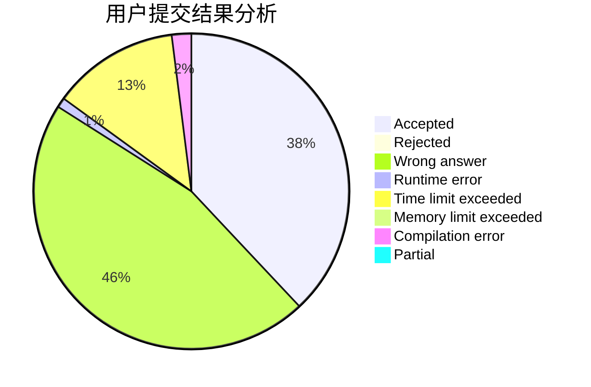
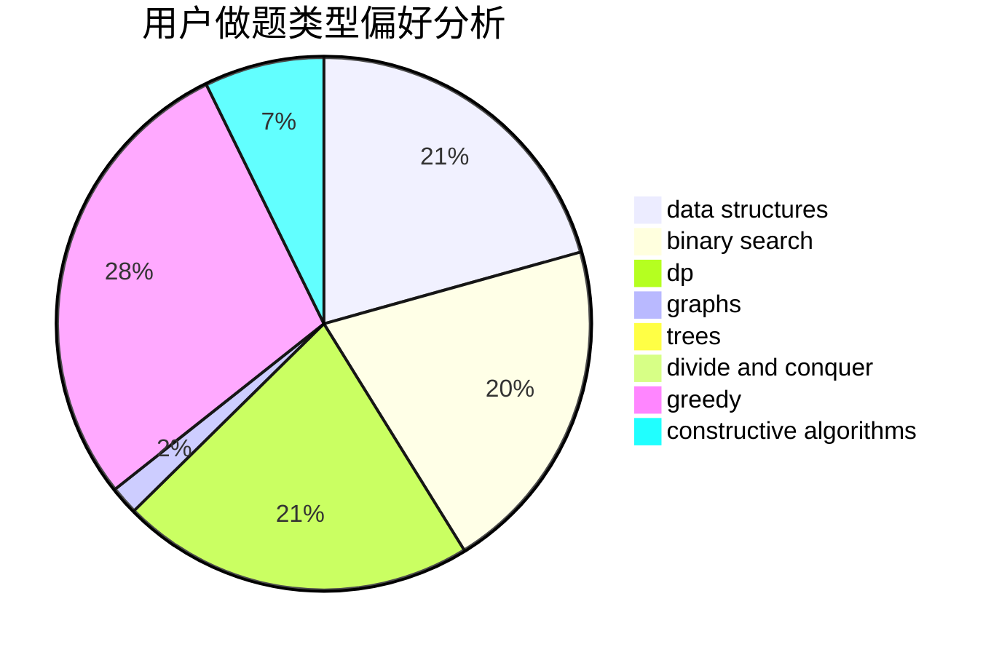
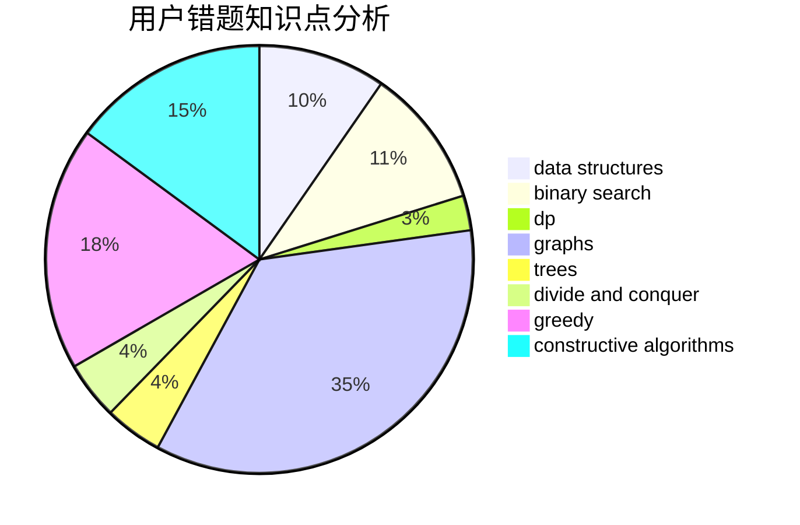

# rsj

<!-- tabs:start -->

#### **用户提交结果分析**

#### **用户做题类型偏好分析**

#### **用户错题知识点分析**

<!-- tabs:end -->
# 推荐题目
[1480E](https://codeforces.com/contest/1480/problem/E)		dsu,graphs,sortings,trees		  
[730A](https://codeforces.com/contest/730/problem/A)		greedy,
                        implementation		  
[1305F](https://codeforces.com/contest/1305/problem/F)		math,
                        number theory,
                        probabilities		  
[940E](https://codeforces.com/contest/940/problem/E)		data structures,
                        dp,
                        greedy,
                        math		  
[1505D](https://codeforces.com/contest/1505/problem/D)		number theory		  
[1140A](https://codeforces.com/contest/1140/problem/A)		implementation		  
[799F](https://codeforces.com/contest/799/problem/F)		data structures		  
[1030C](https://codeforces.com/contest/1030/problem/C)		implementation		  
[1168E](https://codeforces.com/contest/1168/problem/E)		constructive algorithms,
                        math		  
[706A](https://codeforces.com/contest/706/problem/A)		brute force,
                        geometry,
                        implementation		  
