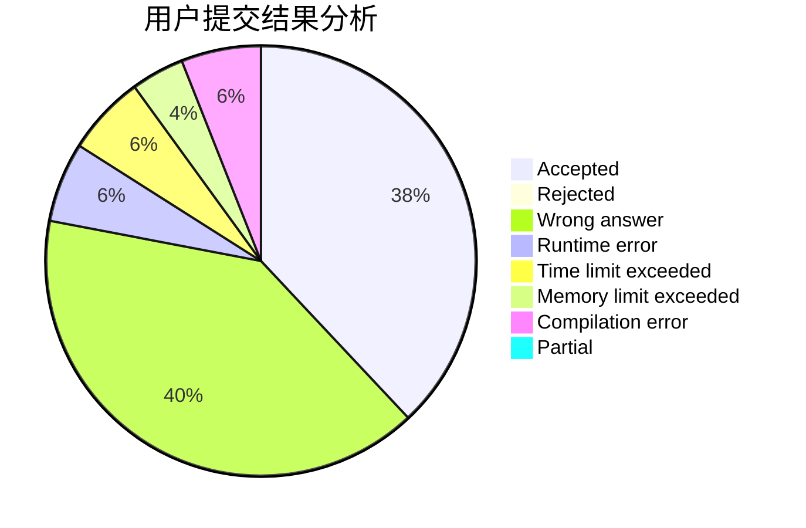
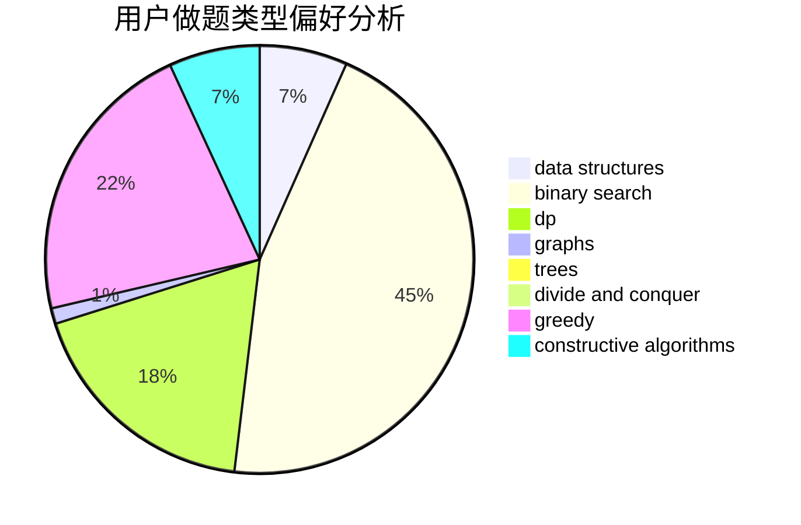
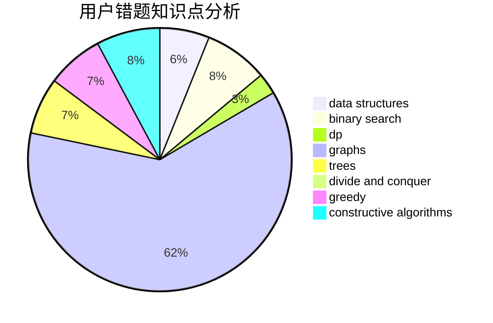

# ruaner_

<!-- tabs:start -->

#### **用户提交结果分析**

#### **用户做题类型偏好分析**

#### **用户错题知识点分析**

<!-- tabs:end -->
# 推荐题目
[13563](https://codeforces.com/contest/1356/problem/3)		dsu,graphs,sortings,trees		  
[1243A](https://codeforces.com/contest/1243/problem/A)		implementation		  
[294B](https://codeforces.com/contest/294/problem/B)		dp,
                        greedy		  
[1063F](https://codeforces.com/contest/1063/problem/F)		data structures,
                        dp,
                        string suffix structures		  
[549E](https://codeforces.com/contest/549/problem/E)		geometry,
                        math		  
[525C](https://codeforces.com/contest/525/problem/C)		greedy,
                        math,
                        sortings		  
[994C](https://codeforces.com/contest/994/problem/C)		dsu,graphs,sortings,trees		  
[883K](https://codeforces.com/contest/883/problem/K)		constructive algorithms,
                        greedy,
                        implementation		  
[1216F](https://codeforces.com/contest/1216/problem/F)		data structures,
                        dp,
                        greedy		  
[1012B](https://codeforces.com/contest/1012/problem/B)		constructive algorithms,
                        dfs and similar,
                        dsu,
                        graphs,
                        matrices		  
