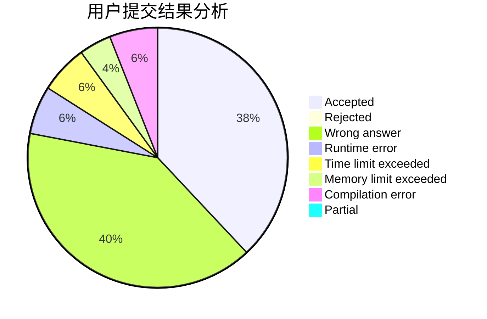
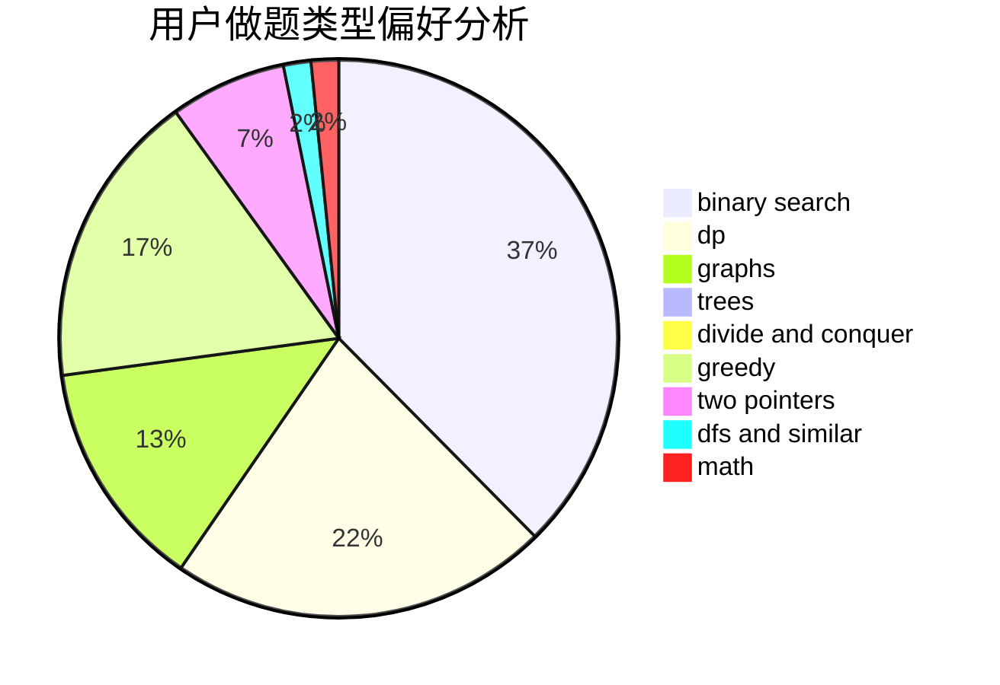

# ruaner_

<!-- tabs:start -->

#### **用户提交结果分析**

#### **用户做题类型偏好分析**

<!-- tabs:end -->
# 推荐题目
[13563](https://codeforces.com/contest/1356/problem/3)
[1243A](https://codeforces.com/contest/1243/problem/A)
[294B](https://codeforces.com/contest/294/problem/B)
[1063F](https://codeforces.com/contest/1063/problem/F)
[549E](https://codeforces.com/contest/549/problem/E)
[525C](https://codeforces.com/contest/525/problem/C)
[994C](https://codeforces.com/contest/994/problem/C)
[883K](https://codeforces.com/contest/883/problem/K)
[1216F](https://codeforces.com/contest/1216/problem/F)
[1012B](https://codeforces.com/contest/1012/problem/B)
